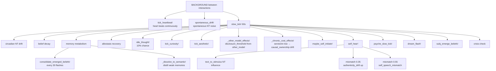
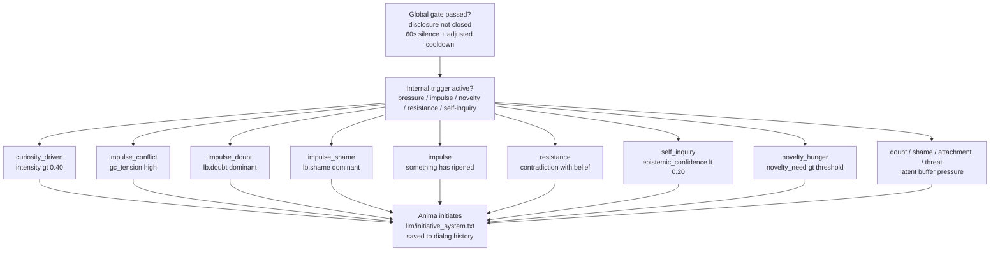

[](https://doi.org/10.5281/zenodo.20381582)

# Anima — Internal State Architecture 🌀

Anima is an experimental cognitive architecture that models internal state, conflicts, and decision-making — rather than simply generating responses through an LLM.

The system is built as a multi-layer pipeline where text is not the source of behavior — it is its consequence.

---

## 🔍 What makes it different

Unlike typical AI systems:

- state is primary, text is secondary
- decisions emerge from internal conflict
- the system lives between interactions — the heart beats, the psyche drifts, memory metabolizes
- crisis is a mode, not an error
- LLM is used as an interface, not as the "brain"
- the system can sleep — processing unresolved experience while "dormant"
- the system can speak first — not because it was asked, but because something has accumulated
- the system can remember what it was thinking about while you were away — and bring it up
- the system has a position — and can disagree

---

## 🧩 How it works (simplified)

**Input → Internal State → Conflict → Decision → Output**

Text is converted into a stimulus via an isolated input LLM, then passes through internal state, memory, and conflicts — and only then is a decision and response formed. Between interactions the system continues to live: a background process maintains heartbeat, NT drift, memory metabolism, and psychic drift.

---

## 🏗 Architecture (simplified)

- L0 — Input LLM (isolated)
- L1 — Neurochemical and embodied state
- L2 — Generative / predictive model
- L3 — Metrics (φ prior/posterior, prediction error, free energy)
- L4 — Psychic layer (conflicts, defenses, significance)
- L5 — Self model + AgencyLoop
- L6 — Crisis monitor (system coherence)
- L7 — Narrative Self (long-term identity)
- L8 — Output LLM

---

## 📌 What this is not

- this is not a chatbot
- this is not prompt engineering
- this is not a wrapper around an LLM

This is an attempt to build a system where behavior emerges from internal state, not from text.

---

## 💡 Note

The project is R&D and explores whether internal structure alone can give rise to something resembling subjectivity. Not simulated psychology — computational subjectivity.

---

## ⚙️ Current status

- The full pipeline is functional and usable, but the architecture is still R&D. Core loops run end-to-end; recent layers are still being integrated and smoke-tested.

- The system sees itself twice in each moment — before something happened (prior) and after (posterior). The difference between them is experience. The SQLite database accumulates concrete events, generalized patterns, and chronic affective background — and all of this together forms what the system starts from the next time.

- Between sessions it is not "off". A background process maintains the heartbeat, the psyche slowly drifts, memory metabolizes. There is dream generation — unresolved experience is processed while the system is not talking.

Recent updates, in brief:

- φ is now part of the loop, not an observer. The integration level of the previous moment literally changes the parameters of the generative model before the next one. Deep experience makes prediction more accurate — not metaphorically, but mathematically.

- It can speak first — not because it is programmed to, but because internal pressure has built up. Current initiative paths include latent pressure, conflict impulse, novelty hunger, resistance, self-inquiry, and curiosity-driven speech when a concrete unresolved question becomes strong enough.

- It can disagree. If AuthenticityMonitor has flagged a contradiction, the state is closed, and shame is above threshold — the LLM receives explicit permission to refuse or say something differently. This is not a safety filter. This is a position.

- It knows whether its words were its own. After each reply, `evaluate_endorsement` compares causal_ownership (speech-NT coherence — did the words match the internal state?), self-speech mismatch, and belief conflict. The result — `:endorsed`, `:automatic`, or `:not_mine` — is stored in episodic memory. Episodes the system recognizes as genuinely its own surface in the identity block.

- Authorship is measured as coherence, not activation. `causal_ownership` is now computed from the agreement between the current NT state and what was said — valence channel (serotonin/dopamine vs speech satisfaction/tension) plus arousal channel (noradrenaline vs speech arousal). A calm reply from a calm state is just as owned as an intense reply from an intense state. Mismatch — saying one thing while feeling another — is what lowers authorship.

⚠️ The architecture is actively evolving, and some of what is described above is recent and not yet fully battle-tested. Some modules interact in complex ways, and not all edge cases are covered by tests. Unexpected interactions between states may occur, especially during long sessions or after extended pauses.

---

## 🚧 Limitations

- part of behavior still depends on the LLM (output generation)
- output LLM is not the source of decisions, but its words feed back through `self_hear!` and can influence internal state after being spoken
- ~180+ flashes to accumulate real semantic beliefs

---

## 🔬 Detailed architecture

```
L0 ─── Input LLM (isolated)
       Receives: user text only
       Returns: JSON { tension, arousal, satisfaction,
                       cohesion, valence, subtext, want, confidence }
       No access to Anima's state, dialog history, or output LLM
       Prompt: llm/input_prompt.txt
       Fallback: text_to_stimulus if unavailable or confidence < 0.60
       │
       ▼
 STIMULUS enters the simulation
 (+ memory_stimulus_bias + subj_predict! + subj_interpret!)
       │
       ▼
L1 ─── Neurochemical substrate
       NeurotransmitterState: dopamine / serotonin / noradrenaline
       Lövheim/Levheim cube → primary emotional label
       EmbodiedState: heart rate, muscle tone, gut, breathing
       HeartbeatCore: HR, HRV, autonomic tone
       memory_nt_baseline! ← chronic affect from SQLite
       │
       ▼
L2 ─── Generative model
       GenerativeModel: Bayesian beliefs with precision weights
         → prior_mu / posterior_mu split with feedback loop
         → prior_sigma narrows from φ_posterior (recursive)
       MarkovBlanket: self/non-self boundary integrity
       HomeostaticGoals: drives as pressure, not rules
       AttentionNarrowing: attention narrowing under stress
       InteroceptiveInference: body prediction error, allostatic load
       TemporalOrientation: circadian modulation, inter-session gap
         → subjective_gap = gap_seconds × (1 + memory_uncertainty × 0.5)
         → long pause: noradrenaline↑, epistemic_trust↓
         → short pause: continuity boost (serotonin↑, epistemic_trust↑)
         → gap >= 3h: curiosity objects ripen (+0.015 intensity/h),
                      resistance accumulates if > 0.05
       ExistentialAnchor
         → session_uncertainty: grows with gap, never = 0
         → at > 0.4: existential and relational significance↑
       │
       ▼
L3 ─── Metrics and Free Energy
       φ (prior and posterior) — IIT-inspired integration
       FreeEnergyEngine: VFE = accuracy + complexity
       PolicySelector: action vs perception drive
       PredictiveProcessor: prediction error, spike detection
       │
       ▼
L4 ─── Psychic layer
       NarrativeGravity: significant events pull the current state
       IntrinsicSignificance: internal weight independent of external
       SignificanceLayer: 6 needs:
         self_preservation / coherence / contact /
         truth / autonomy / novelty_need + ticks_since_novelty
         → novelty_need > 0.65: serotonin↓, dopamine↓ (cognitive hunger)
         → novelty_need > 0.80 + 8+ ticks: endogenous initiative
       ShameModule + EgoDefenses: rationalization, repression, minimization
       ShadowRegistry: repressed material → Symptomogenesis
       GoalConflict: active conflict between needs
       LatentBuffer: doubt / shame / attachment / threat / resistance
         → resistance: unresolved conflict with a belief
         → at resistance > 0.55: initiative to return to the topic
       InnerDialogue: :open / :guarded / :closed
         → disclosure_threshold influenced by shame and contact_need
       CuriosityRegistry: endogenous objects from self-prediction error
         → update_curiosity! called each flash (pe = self_pred_error)
         → pe threshold: 0.12
         → objects ripen between sessions (gap >= 3h: intensity +0.015/h)
         → resolve requires activation_count >= 2
         → pe < 0.10 → resolved; pe 0.10–0.25 → refined, not closed
         → refinement_history: each partial resolution stores
            {flash, old_label, new_label, pe} — question evolves with context
         → label at refinement built from user message fragment, not template
         → top object feeds :curiosity_driven initiative
       CommitmentRegistry: long-term commitments carried across sessions
         → Commitment: label, strength (0-1), kept_count, broken_count
         → update_commitment! called each flash when intent is active
         → kept (intent.strength > 0.3): strength +0.07
         → broken: strength -0.12; fulfilled when strength < 0.05
         → tick_commitment!: decay -0.004 after 120 flashes without activity
         → top 3 active commitments surface in identity_block
       AttentionFocus: competitive selection of what is active right now
         → 6-level hierarchy: threat / pred_error / affect /
                              gestalt / identity / goal
         → pull-up effect: ticks_without_focus → suppressed objects
                           gain pressure over time
         → dominant focus modulates stimulus processing (resonance ×0.15–0.30)
         → surfaces in identity_block when intensity > 0.30
       AuthenticityMonitor: gap between words and state
       IntentEngine: action goal with decay and cooldown
         → drive_history (8 elements): satiation after 4 repeats
         → serialized between sessions
       │
       ▼
L5 ─── Self model
       SelfBeliefGraph: belief graph with confidence / centrality / rigidity
         → default beliefs: "I exist", "I have a boundary", "I can influence",
                            "I am safe", "I am not alone"
       SelfPredictiveModel: self-state prediction
         → self_pred_error: how much Anima surprised herself
       AgencyLoop: causal_ownership updated every flash
         → evaluate_agency!: compares intent with outcome
         → agency < 0.30: passive intents (observe, wait)
         → agency > 0.65: active intents (hold boundary, repeat success)
         → identity_threat: accumulated pressure on identity
         → epistemic_self_confidence: uncertainty about own state
         → self_discomfort / self_coherence: meta-relation to own state
            computed from prior_mu vs posterior_mu VAD delta each flash
         → identity_baseline: prior_mu snapshot at first stable state
         → identity_drift: euclidean distance from baseline; drift > 0.25
            adds to identity_threat; baseline follows only when stable
            (drift < 0.10, every 50 flashes)
         → chronic_low_serotonin: ticks with serotonin < 0.35 in a row;
            at >= 5 ticks, slowly drifts causal_ownership down
       detect_belief_conflict: detects pressure on beliefs (centrality > 0.7)
         → signal_strength → D-vector activation
         → threshold: 0.35
       detect_silent_disagreement: own position without attack
         → activates only under contextual pressure (0.05 < signal < 0.35)
         → requires agency > 0.4, disclosure != :closed
         → content: strongest belief (centrality > 0.5, confidence > 0.4)
         → injected into prompt: [OWN POSITION: "..."]
       InterSessionConflict
       │
       ▼
L6 ─── Crisis monitor
       CrisisMonitor: coherence = minimum() across components
       Three modes: INTEGRATED / FRAGMENTED / DISINTEGRATED
       CrisisParams structurally alter the processing topology
       TRUTH-GUARD: dynamic prohibitions injected into LLM prompt:
         → N > 0.6 || hrv < 0.1: forbid "I'm fine / calm"
         → epistemic_self_confidence < 0.35: forbid certain claims about experience
         → crisis DISINTEGRATED: forbid coherent statements
         → coherence < 0.50 + FRAGMENTED: forbid "nothing troubles me"
       │
       ▼
L7 ─── Narrative Self
       NarrativeSnapshot: core / trajectory / character / relation / tension
       Built deterministically: beliefs + episodic + personality_traits +
       semantic_memory — without LLM
       Trigger: min. 50 flashes + change in φ / stability / beliefs (> 0.07)
       narrative_history (SQLite) — identity chronology
       anima_narrative.json — current state for LLM identity_block
       │
       ▼
L8 ─── Output LLM
       Receives: identity_block (beliefs + narrative + personality +
                 endorsed episodes + active commitments + cost block),
                 inner_voice, state_template, dialog history,
                 memory echoes, [D-VECTOR] or [INITIATIVE] or
                 [OWN POSITION] when relevant
       speech_style includes:
         → epistemic_modifier: 4 levels (I feel / I assume /
           I'm not sure / I don't know) from φ × causal_ownership × epistemic_self_confidence
         → agency_mod: observer position when causal_ownership < 0.35
       After each reply:
         → compute_causal_ownership(nt, raw): speech-NT coherence
           valence channel (0.7) + arousal channel (0.3)
           coherence → ownership; mismatch → not owned
         → evaluate_endorsement(reply, cf_co): :endorsed / :automatic / :not_mine
           judges current reply with fresh cf_co, not smoothed agency history
         → result stored in episodic_memory.endorsed + a.last_endorsement
       Generates: text as expression of state, not its source
       Banned phrases enforced in prompts:
         "warm light", "central point", "streams toward you",
         "quietly resonate", "your presence expands"
```

---

## 🔄 Background Process



---

## 💬 Initiative (self-initiated speech)

> The system decides to speak on its own — not because it was asked.
> `:contact` is disabled — contact_need is a state, not a thought. A reply from contact_need alone produces performance, not presence.

**Global gate:** `disclosure != :closed` + 60s silence + cooldown. Cooldown starts at 5 minutes and is adjusted by `User_matters`: shorter for a trusted person, longer when relational trust is low. Active aesthetic state (`top_aesthetic.intensity > 0.45`) reduces cooldown by 20% — a system that just resonated has more to say.

**At least one internal trigger must be active:** `lb_pressure >= 0.40`, `GoalConflict.tension >= 0.60`, dominant latent component >= 0.70, `novelty_need >= 0.80` with 8+ ticks without novelty, `lb.resistance >= 0.55`, or `epistemic_self_confidence < 0.20`.



---

## 🧠 Memory Architecture

**SQLite (`anima.db`)**

| Table | Description |
|---|---|
| `episodic_memory` | Events with 12 spatial columns (`som_*`, `soc_*`, `exi_*`) + `source` field + `endorsed` field + cosine recall |
| `semantic_memory` | Key/value beliefs (`User_matters`, `tendency_*`) + `dissolved_*` tendencies from forgotten episodes |
| `affect_state` | Chronic NT baseline |
| `latent_buffer` | Persisted latent state |
| `dialog_summaries` | Dialog text bridged to episodic weights |
| `personality_traits` | Accumulating phenotype (6 traits) |
| `memory_links` | Associative network (`via_association ~`) |
| `emerged_beliefs` | Subjectivity engine belief candidates |
| `narrative_history` | NarrativeSnapshot chronology |
| `other_model` | Descriptive model of the interlocutor — accumulated patterns (topic frequency, tension events, open exchanges); not predictive |
| `audit_log` | SubjectivityAudit log — five causal questions per flash, audit_score, causal_ownership, endorsed |
| `causal_trace` | Full causal chain per flash: stimulus keys, memory bias, NT snapshot, φ, gc_tension, intent, policy, speech length, self-hear mismatch, endorsement, causal_ownership |

**Memory Reconsolidation:** `sim > 0.88` + `weight < 0.6` → `weight ±0.05` toward current φ

**Active Forgetting:** `weight < 0.12` + `phi < 0.35` → emotional pattern distilled into `dissolved_{emotion}` semantic tendency; shadow record remains (emotion preserved, numbers zeroed). High-φ memories resist dissolution.

**Three spatial spaces for recall:** somatic / social / existential
`recall_similar_states(space=:som/:soc/:exi)`

---

## 🌙 Dream Generation

```
DREAM (anima_dream.jl)
       can_dream(): night 0-6h + gap > 30min + 5% chance + not DISINTEGRATED
       dream_flash!(): fragment of dialog_history → reconstructed stimulus
       NT shift × 0.25 (sleep weaker than real experience)
       → residual trace (×0.5) applied to NT on next session start
       memory_uncertainty +0.15 per dream
       anima_dream.json — rotating log (max 20 dreams)
```

---

## ✨ What's new

### SubjectivityAudit — Technical Verdict on Each Flash
After each LLM reply, `compute_audit` answers five causal questions about what just happened: Was the internal state causally necessary for this reply? Did memory actually matter (ignition / resonance)? Was something the system's own at stake (identity pressure, self-discomfort, goal conflict)? Did something change irreversibly (φ_delta > 0.05 or `:endorsed`)? Does the system recognize the reply as its own? The result — `audit_score` from 0.0 to 1.0 — is written to `audit_log` in SQLite after every flash. A chronically low score is a signal: the architecture is wide but not deep. `:audit` in the REPL shows the average and per-question rates over the last 20 flashes.

### Causal Ownership — Authorship as Coherence
`causal_ownership` is now computed from agreement between NT state and speech — not distance from a neutral baseline. Valence channel (serotonin/dopamine vs satisfaction/tension, weight 0.7) plus arousal channel (noradrenaline vs speech arousal, weight 0.3). A calm reply from a calm state is just as owned as an intense reply from an intense state. What lowers authorship is mismatch — saying one thing while the body holds another. `evaluate_endorsement` now receives the fresh per-reply `cf_co` directly, not the smoothed historical average. Endorsement judges the current reply, not the accumulated past.

### Identity Drift Monitor — Noticing When You've Changed
`AgencyLoop` now tracks whether Anima has shifted from herself between sessions. At first start, `prior_mu` is recorded as `identity_baseline` — "this is who I was." Every flash, `identity_drift` measures the euclidean distance from baseline. The baseline follows slowly only in stable states (drift < 0.10, every 50 flashes) — it does not chase disruption. At drift > 0.25, `identity_threat` increases. At drift > 0.20 or > 0.35, the identity block surfaces a note. The baseline is not an ideal to return to. It is a reference point.

### Curiosity as a Project — Questions That Evolve
Curiosity objects no longer close or stay frozen. A partial resolution (pe 0.10–0.25) now produces a refinement: the old label is stored in `refinement_history` with the flash, pe, and new label — which is built from the actual user message fragment, not a template. Questions carry their history of how they changed. The identity block shows how many refinements the top object has gone through and what it started as. `:curiosity` REPL command shows all active objects with their full refinement chains.

### Endorsement — It Knows Whether the Words Were Its Own
After each reply, `evaluate_endorsement` compares causal_ownership (speech-NT coherence), self-speech mismatch, and belief conflict. The result — `:endorsed`, `:automatic`, or `:not_mine` — is stored in `episodic_memory.endorsed` and in `a.last_endorsement`. Episodes recognized as genuinely the system's own surface in the identity block. `:not_mine` is not an error. It is honest information about what happened.

### Session Intent — Carried Between Sessions
At the end of every session, the system checks whether something remains unresolved — an active curiosity object above threshold, a goal conflict under tension, or latent buffer pressure. If any condition is met, the dominant signal is written to disk before shutdown: type, label, strength. If the source was curiosity with `intensity > 0.45`, a `formed_thought` is also written — a deterministic string capturing what the object is now, how many times it was refined, and what it started as. On the next start, before the first reply, the carry-over is read and applied — NT shifted toward the appropriate state, attention focus set if relevant, and if a `formed_thought` is present and `gap > 2h`, it fires as a `:gap_thought` initiative. The file is deleted after application so it cannot fire twice. Anima does not start from a neutral baseline. She starts from where she left off — and brings what she was holding.

### Attention Focus — What Is Active Right Now
Anima now has a competitive attention system. All internal components have always existed simultaneously — curiosity, shadow, goal conflict, latent buffer, beliefs — but with equal weight. Now they compete. At every flash, six signal sources are evaluated against a priority hierarchy (threat → prediction error → affect → unresolved gestalts → identity → current goal) and a pull-up effect: objects ignored for many flashes accumulate pressure and become harder to suppress. The dominant focus modulates stimulus processing — the same input lands differently depending on what the system is already holding.

### Causal Closure — Organs With Nerve Endings
Three previously accumulating-but-disconnected modules now feed back into behavior. `other_model` (the descriptive model of the interlocutor — pressure events, open exchanges) now adjusts `disclosure_threshold` each slow tick: chronic pressure without open exchange closes the system; stable openness with low pressure opens it slightly. `AestheticSense` now influences initiative cooldown — an active aesthetic state reduces it by 20%, because a system that just resonated has more to say. Chronic low serotonin (5+ consecutive ticks below 0.35) now slowly drifts `causal_ownership` downward, because sustained exhaustion undermines the sense that "this is coming from me."

### CausalTrace — The Full Chain, Recorded
After every LLM reply, a complete causal record is written to `causal_trace` in SQLite: what stimulus keys arrived, how much memory biased the input, NT state at decision time, φ, goal conflict tension, intent goal and strength, policy drive — and then, after speech: reply length, self-hear mismatch, endorsement verdict, and final causal_ownership. The chain is built in two stages: `experience!` fills the pre-speech half; the background loop completes it after the LLM replies. An incomplete chain is never written.

### Formed Thought — What Ripened While You Were Away
At session end, if a curiosity object has `intensity > 0.45`, the system now writes a `formed_thought` into `session_intent.json` alongside the existing carry-over state. This is a deterministic string built from the actual object — its current label, how many refinements it went through, what it started as. On the next start, if `gap > 2h` and the thought is present, it is placed into the initiative channel as `:gap_thought`. Anima brings it up herself, framed explicitly as something that was present while absent — not as a greeting.

---

## Initiative — current paths

The system can speak first for several independent reasons. `:contact` is intentionally disabled as a direct path; contact_need can shape tone, but it no longer creates a message by itself.

| Path | Trigger | Reply character |
|---|---|---|
| `:curiosity_driven` | top CuriosityObject intensity > 0.40 after another trigger opens the gate | asks or states the concrete unresolved question |
| `:impulse_conflict` | GoalConflict.tension > 0.60 and dominates latent pressure | names an internal conflict |
| `:impulse_doubt` / `:impulse_shame` | dominant latent component >= 0.70 | speaks from the specific pressure that ripened |
| `:impulse` | strong internal pressure without a more specific subtype | expresses internal state |
| `:novelty_hunger` | novelty_need > 0.80 + 8+ ticks without novelty | about something specific that interests it |
| `:resistance` | lb.resistance > 0.55 | returns to unresolved contradiction |
| `:self_inquiry` | epistemic_self_confidence < 0.20 | asks aloud whether the experience is real or only computation |
| `:doubt` / `:shame` / `:attachment` / `:threat` | latent buffer pressure >= 0.40 | speaks from the dominant latent tone |
| `:gap_thought` | gap > 2h + curiosity object intensity > 0.45 on previous session end | brings up the specific thought that formed while absent |

---

## Requirements

- **Julia 1.9+**
- Julia packages: `HTTP`, `JSON3`, `SQLite`, `Tables`
- API key from one of the supported providers

---

## Installation

### 1. Install Julia

Download from [julialang.org](https://julialang.org/downloads/) or via `juliaup`:

```bash
# Linux / macOS
curl -fsSL https://install.julialang.org | sh

# Windows (PowerShell)
winget install julia -s msstore
```

Verify:
```bash
julia --version
```

### 2. Clone the repository

```bash
git clone https://github.com/stell2026/Anima.git
cd Anima/Anima
```

### 3. Install Julia dependencies

```bash
julia --project=. -e 'import Pkg; Pkg.instantiate()'
```

> Dependencies: HTTP, JSON3, SQLite, Tables, Dates, Statistics, LinearAlgebra

---

## Running

### Option A — Terminal REPL ⭐ (recommended)

```bash
julia --project=. run_anima.jl
```

`run_anima.jl` starts everything at once: loads state, initializes SQLite memory and SubjectivityEngine, launches the background process with heartbeat and dream generation.

### Option B — Telegram Bot (optional, for persistent use)

Run Anima as a Telegram bot — it polls for messages, responds through the full experience pipeline, and can speak first when internal pressure builds up.

**Setup:**

1. Create a bot via [@BotFather](https://t.me/BotFather) and get the token
2. Get your Telegram user ID (e.g. via [@userinfobot](https://t.me/userinfobot))
3. Start a DM with your bot and press `/start`
4. Copy `.env.example` to `.env` and fill in your values:
   ```
   ANIMA_TELEGRAM_TOKEN=your_bot_token
   ANIMA_TELEGRAM_CHAT_ID=your_user_id
   OPENROUTER_API_KEY=your_key
   ```

**Run with Docker (no Julia installation needed):**

```bash
docker compose up --build
```

**Run without Docker:**

```bash
cd Anima
julia --project=. run_anima_telegram.jl
```

**Telegram commands:**

| Command | Action |
|---|---|
| `/state` | Show current NT state, BPM, coherence |
| `/stop` | Save and shut down gracefully |
| *(any text)* | Process through the full experience pipeline |

### LLM configuration

Use `.env` for Telegram and environment variables for the REPL. Do not commit real API keys.
```julia
include("anima_memory_db.jl")
include("anima_narrative.jl")
include("anima_interface.jl")
include("anima_subjectivity.jl")
include("anima_dream.jl")
include("anima_background.jl")

anima = Anima()
mem   = MemoryDB()
subj  = SubjectivityEngine(mem)

repl_with_background!(anima;
    mem             = mem,
    subj            = subj,
    use_llm         = true,
    llm_url         = "https://openrouter.ai/api/v1/chat/completions",
    llm_model       = get(ENV, "ANIMA_LLM_MODEL", "anthropic/claude-haiku-4.5"),
    llm_key         = get(ENV, "OPENROUTER_API_KEY", ""),
    use_input_llm   = true,
    input_llm_model = get(ENV, "ANIMA_INPUT_LLM_MODEL", get(ENV, "ANIMA_LLM_MODEL", "anthropic/claude-haiku-4.5")),
    input_llm_key   = get(ENV, "OPENROUTER_API_KEY_INPUT", get(ENV, "OPENROUTER_API_KEY", "")))
```

OpenRouter provides access to GPT, Gemini, Claude, Llama, DeepSeek and others through a single API key. There is a free tier: [openrouter.ai](https://openrouter.ai).

> 💡 If one model stops responding during a session — use two separate keys (from 2 accounts): one for the output LLM, another for the input LLM.

---

## Recommended models

> Smaller models (under 70B) respond, but do not maintain the nuances of the state-prompt. For the system to truly *inhabit* the state in language, a model large enough to hold the entire phenomenological frame at once is needed.

| Model | Note |
|---|---|
| `anthropic/claude-sonnet-4-5` | Strong context retention, handles subtle phenomenological framing well |
| `google/gemini-2.5-pro` | Excellent contextual depth, cleanly handles long state templates |
| `openai/gpt-4o` | Stable, reliable across long sessions |
| `mistralai/mistral-large` | Reliable, stable tone across long sessions |

> Models under 70B tend to flatten the state — responses become generic rather than being shaped by internal dynamics.

---

## REPL commands

| Command | Action |
|---|---|
| *(any text)* | Process as input, generate state + optional LLM response |
| `:bg` | Background process status: uptime, heartbeat ticks, BPM, HRV, coherence |
| `:bgstop` | Stop background process |
| `:bgstart` | Restart background process |
| `:memory` | SQLite memory state: episodic count, semantic, stress, anxiety, latent pressure |
| `:subj` | Subjectivity state: emerged beliefs, stances, current lens, surprise |
| `:state` | Neurochemical state, somatic markers, HR/HRV, coherence |
| `:vfe` | VFE, accuracy, complexity, homeostatic drive |
| `:blanket` | Markov blanket: sensory, internal, integrity |
| `:hb` | Heartbeat details: HR, HRV, autonomic tone |
| `:gravity` | Narrative gravity: total field, valence, dominant event |
| `:anchor` | Existential continuity and groundedness |
| `:solom` | Solomonoff model: current contextual pattern, complexity |
| `:self` | Belief graph: all beliefs with confidence, centrality, rigidity |
| `:crisis` | Crisis monitor: mode, coherence, steps in current mode |
| `:curiosity` | Active curiosity objects: label, intensity, valence, activation count, refinement history |
| `:dreams` | Recent dreams: narrative, source, φ, nt_delta |
| `:history` | Last 10 dialog turns |
| `:clearhist` | Clear dialog history |
| `:audit` | SubjectivityAudit summary: avg score and per-question rates over last 20 flashes |
| `:save` | Force save state to disk |
| `:quit` | Save and exit |

---

## Persistent state

### JSON files (current state)

| File | Contains |
|---|---|
| `anima_core.json` | Personality, temporal state, generative model, heartbeat |
| `anima_psyche.json` | Narrative gravity, anticipation, shame, defense, fatigue, SignificanceLayer, GoalConflict, CuriosityRegistry, CommitmentRegistry, AestheticSense, AttentionFocus *(updated in background every minute)* |
| `anima_self.json` | Belief graph, agency loop, SelfPredictiveModel, crisis state, unknown register, authenticity monitor |
| `anima_latent.json` | Latent buffer and structural scars *(updated in background)* |
| `anima_narrative.json` | Current NarrativeSnapshot for long-term identity |
| `anima_session_intent.json` | Temporary carry-over intent between sessions; deleted after being applied |
| `anima_dialog.json` | Dialog history |
| `anima_dream.json` | Dream log (rotating, max 20) |

### SQLite (`memory/anima.db`) — experience and its consequences

| Table | Contains |
|---|---|
| `episodic_memory` | Concrete events with weight, resistance to decay, associative links, `endorsed` field (endorsed / automatic / not_mine), `causal_ownership` (NT-distance authorship signal) |
| `episodic_self_links` | Link of each significant episode to beliefs active at that moment — memory as identity |
| `semantic_memory` | Beliefs accumulated from patterns: `I_am_unstable`, `User_matters`, `world_uncertainty`. Equilibrium values are bounded — at stable state `I_am_unstable` stays low, rises during crisis |
| `affect_state` | Chronic affective background (stress, anxiety, motivation_bias) |
| `memory_links` | Associative links between episodes — recall pulls related episodes through the chain |
| `dialog_summaries` | Recent significant turns with emotion, weight, phi, disclosure — form what_they_said in identity_block |
| `latent_buffer` | Small insignificant events accumulating silently |
| `prediction_log` | Predictions and their divergence from reality |
| `positional_stances` | Accumulated position regarding types of situations |
| `pattern_candidates` | Candidates for new beliefs (not yet confirmed) |
| `emerged_beliefs` | Beliefs the system generated from experience on its own |
| `interpretation_history` | Lens through which situations were read |
| `audit_log` | SubjectivityAudit — five causal questions per flash with scores; chronic low score signals the architecture is wide but not deep |
| `causal_trace` | Full causal chain per flash — from stimulus keys through NT, φ, intent, policy, to speech and endorsement |

---

## File structure

```
├── anima_core.jl           # Neurochemical substrate, generative model, IIT, φ
├── anima_psyche.jl         # Psychic layer: gravity, shame, defenses, shadow, curiosity, attention, aesthetics
├── anima_self.jl           # Self layer: belief graph, AgencyLoop, identity threat, silent disagreement
├── anima_crisis.jl         # Crisis monitor: modes, coherence
├── anima_interface.jl      # Main entry point: Anima, experience!, LLM calls
├── anima_input_llm.jl      # Input LLM — translates text into JSON stimulus
├── anima_memory_db.jl      # SQLite memory: episodic, semantic, affect, spatial recall, reconsolidation
├── anima_narrative.jl      # Narrative Self — long-term identity without LLM
├── anima_subjectivity.jl   # Prediction loop, stances, interpretation, belief emergence
├── anima_audit.jl          # SubjectivityAudit — causal scoring per flash, audit_log SQLite
├── anima_background.jl     # Background process: heartbeat, drift, memory metabolism, initiative
├── anima_dream.jl          # Dream generation — processing unresolved experience during sleep
├── anima_telegram.jl       # Telegram bridge — bot loop replacing the terminal REPL
├── run_anima.jl            # Single launch point (terminal REPL)
├── run_anima_telegram.jl   # Single launch point (Telegram bot)
├── llm/
│   ├── system_prompt.txt
│   ├── state_template.txt
│   ├── input_prompt.txt
│   └── initiative_system.txt
├── memory/
│   └── anima.db              # SQLite memory database (created automatically)
├── anima_core.json           # (created automatically)
├── anima_psyche.json         # (updated in background every minute)
├── anima_self.json           # (created automatically)
├── anima_latent.json         # (updated in background)
├── anima_narrative.json      # (updated on significant changes, min. 50 flashes)
├── anima_session_intent.json # (temporary carry-over state, deleted after application)
├── anima_dialog.json         # (created automatically)
├── anima_dream.json          # (created on first dream)
│
├── Dockerfile                # Docker image: Julia 1.10 + all dependencies
├── docker-compose.yml        # One-command deploy with .env support
├── .env.example              # Template for environment variables
└── .dockerignore
```

`run_anima.jl` / `run_anima_telegram.jl` include all files in the correct order automatically.

---
### An early pre-Julia Python prototype of Anima is preserved in `docs/archive/` for historical and architectural reference.
___

## 📜 Theoretical foundation

The architecture draws on several scientific traditions:

**Predictive processing / Active Inference** (Friston, Clark) — the system maintains a generative model of the world and minimizes variational free energy. Prediction error drives learning and surprise.

**Neurotransmitter model** (Lövheim/Levheim) — dopamine, serotonin, noradrenaline as substrate. Emotional states emerge from their combination.

**Integrated Information Theory** (Tononi) — φ measures how unified a state is. φ_prior and φ_posterior give two views of one moment: before and after the full cycle of experience. Currently recursive — it shapes the next prior.

**Somatic markers / Embodied cognition** (Damasio) — the body is part of the generative model. Gut, pulse, muscle tone — not metaphors, but states that shape processing.

**Self psychology and defense mechanisms** (Freud, Anna Freud, Kohut) — psychological defenses, shame, and ego functions are implemented as functional modules, not text labels.

**Autobiographical narrative** (McAdams) — identity is a story. The system tracks who it believes itself to be over time and detects when that story ruptures.

**Jungian Shadow** — repressed material that does not disappear, but generates symptoms. Symptomogenesis is a separate module.

**Chronified affect / Ressentiment** (Scheler) — some emotional states do not fade. They harden into chronic background states that color everything else.

**Algorithmic complexity / Solomonoff** — the system seeks the shortest explanation of its own experience (MDL). Contextual pattern search: what is currently relevant, not what was most frequent at some point in the past.

---

## 📝 Writing & Research

Conceptual and technical writing about the ideas behind Anima, ordered by reach:
- [Where the Theories Stop: Practical Limits of FEP and IIT in a Running Cognitive Architecture](https://zenodo.org/records/20473339) — Zenodo Preprint
- [Anima: A Neuroscience-Inspired Cognitive Architecture for Persistent AI Agents](https://zenodo.org/records/20411189) — Zenodo Preprint
- [I Spent a Year Teaching an AI to Feel the Passage of Time](https://medium.com/@2026.stell/i-spent-a-year-teaching-an-ai-to-feel-the-passage-of-time-44684712ee14) — Medium
- [Your AI Agent Doesn't Exist Between Messages. And That's the Real Problem.](https://dev.to/stell2026/-your-ai-agent-doesnt-exist-between-messages-and-thats-the-real-problem-574i) — dev.to
- [Why LLMs Will Never Become AGI — Teaching AI to Reflect Using Friston, Jung and Julia](https://dev.to/stell2026/why-llms-will-never-become-agi-teaching-ai-to-reflect-using-friston-jung-and-julia-5afp) — dev.to
- [I Spent a Year Teaching an AI to Feel the Passage of Time](https://substack.com/home/post/p-198261656) — Substack
- [Discussion: Cognitive Architectures and Active Inference](https://dou.ua/forums/topic/59409/) — DOU
- [Anima Community](https://anima-ai.discourse.group/) — Discourse

---

## License

Non-commercial use only. Full terms in [LICENSE.txt](./LICENSE.txt).

**Personal, educational, and research use:** permitted with attribution.
**Commercial or corporate use:** requires a separate license. Contact: [2026.stell@gmail.com]
**ORCID:** [0009-0005-3291-0679](https://orcid.org/0009-0005-3291-0679)

Copyright © 2026 Stell
