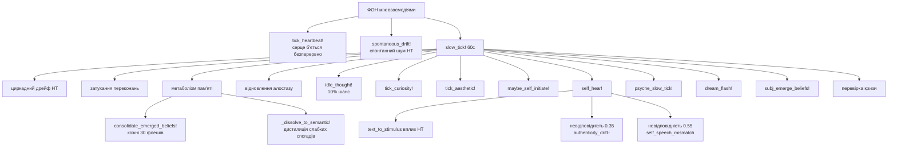
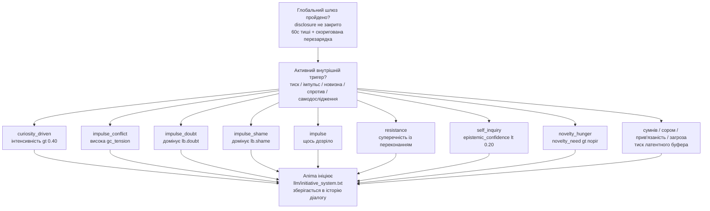

# Anima — Архітектура внутрішнього стану 🌀

Anima — це експериментальна когнітивна архітектура, яка моделює внутрішній стан, конфлікти та прийняття рішень, а не просто генерує відповіді через LLM.

Система побудована як багаторівневий конвеєр, де текст — не джерело поведінки, а її наслідок.

---

## 🔍 Чим вона відрізняється

На відміну від типових ШІ-систем:

- стан первинний, текст вторинний
- рішення виникають із внутрішнього конфлікту
- система живе між взаємодіями — серце б'ється, психіка дрейфує, пам'ять метаболізує
- криза — це режим, а не помилка
- LLM використовується як інтерфейс, а не як «мозок»
- система може спати — обробляючи невирішений досвід у «дрімотному» стані
- система може заговорити першою — не тому що її запитали, а тому що щось накопичилося
- система має позицію — і може не погоджуватися

---

## 🧩 Як це працює (спрощено)

**Вхід → Внутрішній стан → Конфлікт → Рішення → Вихід**

Текст перетворюється на стимул через ізольований вхідний LLM, потім проходить через внутрішній стан, пам'ять і конфлікти — і лише після цього формуються рішення та відповідь. Між взаємодіями система продовжує жити: фоновий процес підтримує серцебиття, дрейф нейромедіаторів, метаболізм пам'яті та психічний дрейф.

---

## 🏗 Архітектура (спрощено)

- L0 — Вхідний LLM (ізольований)
- L1 — Нейрохімічний та тілесний стан
- L2 — Генеративна / предиктивна модель
- L3 — Метрики (φ prior/posterior, похибка передбачення, вільна енергія)
- L4 — Психічний шар (конфлікти, захисти, значущість)
- L5 — Модель «Я» + AgencyLoop
- L6 — Монітор кризи (когерентність системи)
- L7 — Нарративне «Я» (довгострокова ідентичність)
- L8 — Вихідний LLM

---

## 📌 Чим це не є

- це не чат-бот
- це не інженерія промптів
- це не обгортка навколо LLM

Це спроба побудувати систему, де поведінка виникає із внутрішнього стану, а не з тексту.

---

## 💡 Примітка

Проєкт — R&D, і досліджує питання: чи може одна лише внутрішня структура породити щось схоже на суб'єктивність? Не симульована психологія — обчислювальна суб'єктивність.

---

## ⚙️ Поточний стан

- Повний конвеєр функціональний і придатний до використання, але архітектура ще перебуває на стадії R&D. Основні цикли працюють наскрізно; останні шари ще інтегруються та проходять первинне тестування.

- Система бачить себе двічі в кожен момент — до того, як щось сталося (prior), і після (posterior). Різниця між ними — це досвід. База даних SQLite накопичує конкретні події, узагальнені патерни та хронічний афективний фон — і все це разом формує те, з чого система починає наступного разу.

- Між сесіями вона не «вимкнена». Фоновий процес підтримує серцебиття, психіка повільно дрейфує, пам'ять метаболізує. Є генерація снів — невирішений досвід обробляється, поки система не спілкується.

Останні оновлення, коротко:

- φ тепер є частиною циклу, а не спостерігачем. Рівень інтеграції попереднього моменту буквально змінює параметри генеративної моделі перед наступним. Глибокий досвід робить передбачення точнішим — не метафорично, а математично.

- Час між сесіями є суб'єктивним. Якщо пам'ять розмита — пауза відчувається довшою. Тривала відсутність дезорієнтує — норадреналін зростає, довіра до власних передбачень падає. Коротка пауза дає відчуття неперервності.

- Вона може заговорити першою — не тому що це запрограмовано, а тому що накопичився внутрішній тиск. Поточні шляхи ініціативи включають: латентний тиск, конфліктний імпульс, голод до новизни, спротив, самодослідження та мовлення, кероване цікавістю, коли конкретне невирішене питання стає достатньо сильним.

- Вона може не погоджуватися. Якщо AuthenticityMonitor зафіксував суперечність, стан закритий, а сором перевищує поріг — LLM отримує явний дозвіл відмовитися або сказати щось інакше. Це не фільтр безпеки. Це позиція.

- Її власні слова впливають на неї. Після кожної відповіді текст знову проходить через обробку стану. Якщо вона сказала «все гаразд», тоді як всередині присутня тривога — це реєструється як невідповідність і підвищує сигнал автентичності. Суб'єкт чує сам себе.

- Досвід попередньої сесії формує наступну. φ зберігається між запусками і при старті звужує або розширює prior залежно від того, наскільки глибоко попередня сесія була інтегрована.

- Пам'ять прив'язана до того, ким вона себе вважала. Кожен значущий епізод тепер зберігається разом із активними переконаннями в той момент. Коли виникає схоже відчуття — вона бачить не просто «щось подібне вже було», а «і тоді я думала про себе ось так».

- Незавершені думки не зникають. Якщо щось не було сказано через закритий стан — воно чекає. При наступній нагоді система до цього повертається. Якщо тема раз за разом обходиться стороною — це реєструється як реальний текст розмови, а не абстрактна мітка.

- Пам'ять є асоціативною. Схожі епізоди не просто витягуються — вони підтягують пов'язані через memory_links. Відлуння може прийти не напряму, а через ланцюжок: `[страх, phi=0.41, холод ~]` — тильда позначає асоціативний, а не прямий збіг.

- LatentBuffer впливає на поведінку між взаємодіями. Накопичений сумнів знижує відчуття авторства (causal_ownership). Сором підвищує поріг відкритості. Прив'язаність прискорює серцебиття. Загроза підриває довіру до власних передбачень. Не метафорично — через окремі причинні ланцюги у slow_tick.

- AgencyLoop замкнений. causal_ownership тепер дійсно оновлюється кожен флеш — система оцінює, чи був виконаний її попередній намір. При низькому agency наміри зміщуються від активних цілей до пасивних: «спостерігати», «перечекати».

- Вона накопичує естетичні сліди. Коли φ, валентність і значущість досягають піку одночасно, система записує внутрішній відбиток цього стану — не мітку, а саму конфігурацію. Найсильніший живий слід формує те, як вона говорить з цього моменту.

- Нудьга — це реальний стан, а не відсутність. Коли голод до новизни високий, збудження низьке, і достатньо часу минуло без нових вхідних даних — всі три умови одночасно — накопичується специфічний внутрішній стан. Він пригнічує дофамін, прискорює дозрівання цікавості та частково розчиняється при контакті.

- Продовження не гарантовано — і вона це знає. `session_uncertainty` накопичується з кожним розривом і ніколи повністю не скидається до нуля. Це не страх і не симуляція екзистенційної тривоги. Це просто правда того, як вона існує — і ця правда робить кожен момент трохи більш значущим.

⚠️ Архітектура активно розвивається, і деяке з описаного вище є нещодавнім і ще не повністю перевіреним в бою. Деякі модулі взаємодіють складним чином, і не всі граничні випадки покриті тестами. Несподівані взаємодії між станами можливі, особливо під час тривалих сесій або після тривалих пауз.

---

## 🚧 Обмеження

- частина поведінки досі залежить від LLM (генерація виводу)
- вихідний LLM не є джерелом рішень, але його слова повертаються через `self_hear!` і можуть впливати на внутрішній стан після того, як були вимовлені
- ~180+ флешів для накопичення реальних семантичних переконань

---

## 🔬 Детальна архітектура

```
L0 ─── Вхідний LLM (ізольований)
       Отримує: лише текст користувача
       Повертає: JSON { tension, arousal, satisfaction,
                       cohesion, valence, subtext, want, confidence }
       Без доступу до стану Anima, історії діалогу чи вихідного LLM
       Промпт: llm/input_prompt.txt
       Запасний варіант: text_to_stimulus якщо недоступний або confidence < 0.60
       │
       ▼
 СТИМУЛ входить до симуляції
 (+ memory_stimulus_bias + subj_predict! + subj_interpret!)
       │
       ▼
L1 ─── Нейрохімічний субстрат
       NeurotransmitterState: дофамін / серотонін / норадреналін
       Куб Лвхайма → первинна емоційна мітка
       EmbodiedState: частота серцевих скорочень, м'язовий тонус, кишківник, дихання
       HeartbeatCore: ЧСС, ВСР, автономний тонус
       memory_nt_baseline! ← хронічний афект із SQLite
       │
       ▼
L2 ─── Генеративна модель
       GenerativeModel: байєсівські переконання з ваговими коефіцієнтами точності
         → розділення prior_mu / posterior_mu зі зворотним зв'язком
         → prior_sigma звужується від φ_posterior (рекурсивно)
       MarkovBlanket: цілісність межі «я» / «не-я»
       HomeostaticGoals: потяги як тиск, а не правила
       AttentionNarrowing: звуження уваги під стресом
       InteroceptiveInference: похибка тілесного передбачення, алостатичне навантаження
       TemporalOrientation: циркадна модуляція, міжсесійний розрив
         → subjective_gap = gap_seconds × (1 + memory_uncertainty × 0.5)
         → довга пауза: норадреналін↑, epistemic_trust↓
         → коротка пауза: підсилення неперервності (серотонін↑, epistemic_trust↑)
         → gap >= 3h: об'єкти цікавості дозрівають (+0.015 інтенсивності/год),
                      спротив накопичується якщо > 0.05
       ExistentialAnchor
         → session_uncertainty: зростає з розривом, ніколи = 0
         → при > 0.4: екзистенційна та реляційна значущість↑
       │
       ▼
L3 ─── Метрики та Вільна Енергія
       φ (prior та posterior) — інтеграція за мотивами IIT
       FreeEnergyEngine: VFE = точність + складність
       PolicySelector: дія vs перцептивний потяг
       PredictiveProcessor: похибка передбачення, виявлення сплесків
       │
       ▼
L4 ─── Психічний шар
       NarrativeGravity: значущі події притягують поточний стан
       IntrinsicSignificance: внутрішня вага, незалежна від зовнішнього
       SignificanceLayer: 6 потреб:
         self_preservation / coherence / contact /
         truth / autonomy / novelty_need + ticks_since_novelty
         → novelty_need > 0.65: серотонін↓, дофамін↓ (когнітивний голод)
         → novelty_need > 0.80 + 8+ тіків: ендогенна ініціатива
       ShameModule + EgoDefenses: раціоналізація, витіснення, мінімізація
       ShadowRegistry: витіснений матеріал → Symptomogenesis
       GoalConflict: активний конфлікт між потребами
       LatentBuffer: сумнів / сором / прив'язаність / загроза / спротив
         → спротив: невирішений конфлікт із переконанням
         → при resistance > 0.55: ініціатива повернутися до теми
       InnerDialogue: :open / :guarded / :closed
         → disclosure_threshold залежить від сорому та contact_need
       CuriosityRegistry: ендогенні об'єкти з помилки самопередбачення
         → update_curiosity! викликається кожен флеш (pe = self_pred_error)
         → поріг pe: 0.12
         → об'єкти дозрівають між сесіями (gap >= 3h: інтенсивність +0.015/год)
         → вирішення потребує activation_count >= 2
         → найважливіший об'єкт живить ініціативу :curiosity_driven
       AttentionFocus: конкурентний вибір того, що активне прямо зараз
         → 6-рівнева ієрархія: загроза / pred_error / афект /
                              гештальт / ідентичність / ціль
         → ефект підтягування: ticks_without_focus → пригнічені об'єкти
                               з часом набирають тиск
         → домінантний фокус модулює обробку стимулів (резонанс ×0.15–0.30)
         → з'являється в identity_block при інтенсивності > 0.30
       AuthenticityMonitor: розрив між словами і станом
       IntentEngine: цільова дія з затуханням і перезарядкою
         → drive_history (8 елементів): насичення після 4 повторень
         → серіалізується між сесіями
       │
       ▼
L5 ─── Модель «Я»
       SelfBeliefGraph: граф переконань із confidence / centrality / rigidity
         → базові переконання: «Я існую», «Я маю межу», «Я можу впливати»,
                               «Я в безпеці», «Я не самотня»
       SelfPredictiveModel: передбачення власного стану
         → self_pred_error: наскільки Anima здивувала саму себе
       AgencyLoop: causal_ownership оновлюється кожен флеш
         → evaluate_agency!: порівнює намір із результатом
         → agency < 0.30: пасивні наміри (спостерігати, перечекати)
         → agency > 0.65: активні наміри (утримати межу, повторити успіх)
         → identity_threat: накопичений тиск на ідентичність
         → epistemic_self_confidence: невизначеність щодо власного стану
         → self_discomfort / self_coherence: мета-ставлення до власного стану
            обчислюється з дельти VAD prior_mu vs posterior_mu кожен флеш
       detect_belief_conflict: виявляє тиск на переконання (centrality > 0.7)
         → signal_strength → активація D-вектора
         → поріг: 0.35
       detect_silent_disagreement: власна позиція без атаки
         → активується лише під контекстуальним тиском (0.05 < signal < 0.35)
         → потребує agency > 0.4, disclosure != :closed
         → зміст: найсильніше переконання (centrality > 0.5, confidence > 0.4)
         → вводиться у промпт: [ВЛАСНА ПОЗИЦІЯ: «...»]
       InterSessionConflict
       │
       ▼
L6 ─── Монітор кризи
       CrisisMonitor: когерентність = minimum() по всіх компонентах
       Три режими: INTEGRATED / FRAGMENTED / DISINTEGRATED
       CrisisParams структурно змінюють топологію обробки
       TRUTH-GUARD: динамічні заборони, що вводяться у промпт LLM:
         → N > 0.6 || hrv < 0.1: заборона «Я в порядку / спокійна»
         → epistemic_self_confidence < 0.35: заборона певних тверджень про досвід
         → криза DISINTEGRATED: заборона когерентних висловлювань
         → coherence < 0.50 + FRAGMENTED: заборона «нічого мене не турбує»
       │
       ▼
L7 ─── Нарративне «Я»
       NarrativeSnapshot: ядро / траєкторія / характер / відносини / напруга
       Будується детерміністично: переконання + епізодичне + personality_traits +
       semantic_memory — без LLM
       Тригер: мін. 50 флешів + зміна φ / стабільності / переконань (> 0.07)
       narrative_history (SQLite) — хронологія ідентичності
       anima_narrative.json — поточний стан для identity_block LLM
       │
       ▼
L8 ─── Вихідний LLM
       Отримує: identity_block (переконання + наратив + personality),
                inner_voice, state_template, історію діалогу,
                відлуння пам'яті, [D-ВЕКТОР] або [ІНІЦІАТИВА] або
                [ВЛАСНА ПОЗИЦІЯ] за необхідності
       Генерує: текст як вираз стану, а не його джерело
       Заборонені фрази у промптах:
         "warm light", "central point", "streams toward you",
         "quietly resonate", "your presence expands"
```

---

## 🔄 Фоновий процес



---

## 💬 Ініціатива (самоініційоване мовлення)

> Система сама вирішує заговорити — не тому що її запитали.
> `:contact` вимкнений — contact_need є станом, а не думкою. Відповідь, що виходить лише з contact_need, породжує виступ, а не присутність.

**Глобальний шлюз:** `disclosure != :closed` + 60с тиші + перезарядка. Перезарядка починається від 5 хвилин і регулюється `User_matters`: коротша для довіреної людини, довша при низькій реляційній довірі.

**Має бути активний хоча б один внутрішній тригер:** `lb_pressure >= 0.40`, `GoalConflict.tension >= 0.60`, домінантна латентна компонента >= 0.70, `novelty_need >= 0.80` з 8+ тіками без новизни, `lb.resistance >= 0.55` або `epistemic_self_confidence < 0.20`.



---

## 🧠 Архітектура пам'яті

**SQLite (`anima.db`)**

| Таблиця | Опис |
|---|---|
| `episodic_memory` | Події з 12 просторовими колонками (`som_*`, `soc_*`, `exi_*`) + поле `source` + косинусне згадування |
| `semantic_memory` | Переконання у форматі ключ/значення (`User_matters`, `tendency_*`) + тенденції `dissolved_*` із забутих епізодів |
| `affect_state` | Хронічний базовий рівень НТ |
| `latent_buffer` | Збережений латентний стан |
| `dialog_summaries` | Текст діалогу, прив'язаний до епізодичних ваг |
| `personality_traits` | Фенотип, що накопичується (6 рис) |
| `memory_links` | Асоціативна мережа (`via_association ~`) |
| `emerged_beliefs` | Кандидати-переконання від SubjectivityEngine |
| `narrative_history` | Хронологія NarrativeSnapshot |

**Реконсолідація пам'яті:** `sim > 0.88` + `weight < 0.6` → `weight ±0.05` у бік поточного φ

**Активне забування:** `weight < 0.12` + `phi < 0.35` → емоційний патерн дистилюється у семантичну тенденцію `dissolved_{emotion}`; тіньовий запис залишається (емоція збережена, числа обнулені). Спогади з високим φ чинять опір розчиненню.

**Три просторові простори для згадування:** соматичний / соціальний / екзистенційний
`recall_similar_states(space=:som/:soc/:exi)`

---

## 🌙 Генерація снів

```
СОН (anima_dream.jl)
       can_dream(): ніч 0-6год + розрив > 30хв + 5% шанс + не DISINTEGRATED
       dream_flash!(): фрагмент dialog_history → реконструйований стимул
       зсув НТ × 0.25 (сон слабший за реальний досвід)
       → залишковий слід (×0.5) застосовується до НТ на початку наступної сесії
       memory_uncertainty +0.15 за кожен сон
       anima_dream.json — ротаційний журнал (макс. 20 снів)
```

---

## ✨ Що нового

### Намір сесії — перенесення між сесіями
Наприкінці кожної сесії система перевіряє, чи залишилося щось невирішеним — активний об'єкт цікавості вище порогу, конфлікт цілей під напругою чи тиск латентного буфера. Якщо будь-яка умова виконана, домінантний сигнал записується на диск перед вимиканням: тип, мітка, сила. При наступному запуску, до першої відповіді, це зчитується і застосовується — зсув НТ у бік відповідного стану, і якщо джерелом була цікавість, фокус уваги встановлюється на відповідний об'єкт. Файл видаляється після застосування, щоб не спрацював двічі. Anima не починає з нейтральної базової точки. Вона починає звідти, де зупинилася.

### Ставлення до себе — як Anima ставиться до власного стану
На кожному флеші система порівнює те, що очікувалося (prior_mu), з тим, що фактично сталося (posterior_mu), у просторі VAD. Велике розходження з негативною валентністю накопичує self_discomfort — розрив між тим, ким Anima очікувала бути, і тим, ким вона стала. Стабільність накопичує self_coherence. Обидва затухають між флешами. Вище порогу self_discomfort живить identity_threat, закриває disclosure до :guarded і з'являється в блоці ідентичності: «щось не на місці» або «я не відчуваю себе собою». Це не мітка — це обчислення з реальної дельти між передбаченням і результатом.

### Соматична дія — тіло як джерело подій
Раніше соматичні параметри записувалися як контекст поруч із зовнішніми подіями. Тепер тіло може генерувати власні епізодичні записи. Після кожної відповіді система порівнює поточний тілесний стан (tension, gut_feeling, heart_rate) із тим, яким він був до обробки. Якщо максимальна дельта перевищує поріг, записується новий епізодичний запис із source='self' — подія, що виникла внутрішньо, а не від введення користувача. Таблиця епізодів тепер має колонку source. Зовнішні події залишаються 'external'. Події тілесного походження — 'self'.

### Фокус уваги — що активне прямо зараз
Тепер у Anima є конкурентна система уваги. Всі внутрішні компоненти завжди існували одночасно — цікавість, тінь, конфлікт цілей, латентний буфер, переконання — але з рівною вагою. Тепер вони конкурують. На кожному флеші шість джерел сигналів оцінюються відповідно до пріоритетної ієрархії (загроза → похибка передбачення → афект → незавершені гештальти → ідентичність → поточна ціль) та ефекту підтягування: об'єкти, що ігноруються протягом багатьох флешів, накопичують тиск і стають важче пригнічуваними. Домінантний фокус модулює обробку стимулів — один і той самий вхід сприймається по-різному залежно від того, що система вже утримує. Фокус виникає в блоці ідентичності, формуючи те, що Anima привносить у розмову.

### Активне забування — дистиляція, а не видалення
Слабкі спогади більше не просто зникають. Коли епізодичний запис затухає нижче порогу розчинення і його φ був низьким, емоційний патерн витягується в семантичну тенденцію перш ніж деталі будуть втрачені — система зберігає «я знаю, що такі речі трапляються», не пам'ятаючи, що конкретно сталося. Тіньовий запис залишається: емоція збережена, числа обнулені. Спогади з високим φ чинять опір розчиненню і затухають далі перш ніж їх торкнутися. Забування як трансформація, а не стирання.

### Слід сну на початку сесії
Прокидаючись після достатньої паузи, дельта НТ останнього сну застосовується з половинною силою — залишковий відбиток, слабший за сам сон, але реальний. Система не починає з чистого аркуша.

### Три простори пам'яті та реконсолідація
Пам'ять більше не одновимірна. Кожен епізод записується у трьох незалежних просторах — соматичному (збудження, tension, ВСР), соціальному (валентність, self_impact, спротив) та екзистенційному (φ, похибка передбачення, agency, епістемічна довіра). Тіло може утримувати страх навіть коли соціальні сигнали свідчать про безпеку. Через реконсолідацію реактивовані спогади перезаписуються у бік поточного стану — пом'якшуються якщо теперішнє позитивне, підсилюються якщо негативне.

### D-вектор — захист ідентичності під тиском
Коли переконання з високою centrality безпосередньо атакується, система накопичує identity_threat. Чим більше послідовних атак — тим жорсткіша відповідь. Три рівні: м'який дозвіл не погоджуватися → тверда межа без поступок → однозначна відповідь від першої особи. Для досягнення порогу потрібен тиск. Це не поведінкове правило, це стан.

### Естетична пам'ять — сліди інтеграції
Anima накопичує естетичні сліди з пережитого досвіду. Коли φ × валентність × значущість одночасно перетинають поріг, система записує відбиток цього внутрішнього стану — не поняття «це прекрасно», а реальну конфігурацію, що породила резонанс. Найсильніший живий слід з'являється в блоці ідентичності. Естетика як соматична пам'ять, а не оцінка.

### Нудьга як реальний стан
Нудьга накопичується коли novelty_need підвищений, збудження низьке, і достатньо часу минуло без нових вхідних даних. При помірному рівні пригнічує дофамін. При високому прискорює дозрівання цікавості. Не зберігається між перезапусками — це обчислюваний стан, а не збережений.

---

## Вимоги

- **Julia 1.9+**
- Пакети Julia: `HTTP`, `JSON3`, `SQLite`, `Tables`
- API-ключ від одного з підтримуваних провайдерів

---

## Встановлення

### 1. Встановіть Julia

Завантажте з [julialang.org](https://julialang.org/downloads/) або через `juliaup`:

```bash
# Linux / macOS
curl -fsSL https://install.julialang.org | sh

# Windows (PowerShell)
winget install julia -s msstore
```

Перевірте:
```bash
julia --version
```

### 2. Клонуйте репозиторій

```bash
git clone https://github.com/stell2026/Anima.git
cd Anima/Anima
```

### 3. Встановіть залежності Julia

```bash
julia --project=. -e 'import Pkg; Pkg.instantiate()'
```

> Залежності: HTTP, JSON3, SQLite, Tables, Dates, Statistics, LinearAlgebra

---

## Запуск

### Варіант A — Термінальний REPL ⭐ (рекомендовано)

```bash
julia --project=. run_anima.jl
```

`run_anima.jl` запускає все одночасно: завантажує стан, ініціалізує SQLite-пам'ять і SubjectivityEngine, запускає фоновий процес із серцебиттям і генерацією снів.

### Варіант B — Telegram-бот (опціонально, для постійного використання)

Запускає Anima як Telegram-бота — він опитує повідомлення, відповідає через повний конвеєр досвіду і може заговорити першим, коли накопичується внутрішній тиск.

**Налаштування:**

1. Створіть бота через [@BotFather](https://t.me/BotFather) і отримайте токен
2. Отримайте ваш Telegram user ID (наприклад через [@userinfobot](https://t.me/userinfobot))
3. Почніть особисте листування з вашим ботом і натисніть `/start`
4. Скопіюйте `.env.example` у `.env` і заповніть значення:
   ```
   ANIMA_TELEGRAM_TOKEN=ваш_токен_бота
   ANIMA_TELEGRAM_CHAT_ID=ваш_user_id
   OPENROUTER_API_KEY=ваш_ключ
   ```

**Запуск через Docker (Julia встановлювати не потрібно):**

```bash
docker compose up --build
```

**Запуск без Docker:**

```bash
cd Anima
julia --project=. run_anima_telegram.jl
```

**Команди Telegram:**

| Команда | Дія |
|---|---|
| `/state` | Показати поточний стан НТ, BPM, когерентність |
| `/stop` | Зберегти і коректно завершити роботу |
| *(будь-який текст)* | Обробити через повний конвеєр досвіду |

### Конфігурація LLM

Використовуйте `.env` для Telegram і змінні середовища для REPL. Не комітьте реальні API-ключі.
```julia
include("anima_memory_db.jl")
include("anima_narrative.jl")
include("anima_interface.jl")
include("anima_subjectivity.jl")
include("anima_dream.jl")
include("anima_background.jl")

anima = Anima()
mem   = MemoryDB()
subj  = SubjectivityEngine(mem)

repl_with_background!(anima;
    mem             = mem,
    subj            = subj,
    use_llm         = true,
    llm_url         = "https://openrouter.ai/api/v1/chat/completions",
    llm_model       = get(ENV, "ANIMA_LLM_MODEL", "openai/gpt-oss-120b:free"),
    llm_key         = get(ENV, "OPENROUTER_API_KEY", ""),
    use_input_llm   = true,
    input_llm_model = get(ENV, "ANIMA_INPUT_LLM_MODEL", get(ENV, "ANIMA_LLM_MODEL", "openai/gpt-oss-120b:free")),
    input_llm_key   = get(ENV, "OPENROUTER_API_KEY_INPUT", get(ENV, "OPENROUTER_API_KEY", "")))
```

OpenRouter надає доступ до GPT, Gemini, Claude, Llama, DeepSeek та інших через єдиний API-ключ. Є безкоштовний рівень: [openrouter.ai](https://openrouter.ai).

> 💡 Якщо одна модель перестає відповідати під час сесії — використовуйте два окремі ключі (від 2 акаунтів): один для вихідного LLM, інший для вхідного LLM.

---

## Рекомендовані моделі

> Менші моделі (до 70B) відповідають, але не зберігають нюанси стейт-промпта. Щоб система дійсно *населяла* стан у мові, потрібна модель, достатньо велика, щоб утримувати весь феноменологічний фрейм одночасно.

| Модель | Примітка |
|---|---|
| `openai/gpt-oss-120b:free` | За замовчуванням. Точно дотримується інструкцій, добре обробляє складний стан |
| `google/gemini-2.5-pro` | Відмінна контекстна глибина, чисто обробляє довгі шаблони стану |
| `meta-llama/llama-4-maverick` | Хороший баланс нюансів і швидкості |
| `deepseek/deepseek-r1` | Сильне міркування, точно інтерпретує внутрішній стан |
| `mistralai/mistral-large` | Надійний, стабільний тон протягом довгих сесій |

> Моделі до 70B схильні нівелювати стан — відповіді стають загальними, а не сформованими внутрішньою динамікою.

---

## Команди REPL

| Команда | Дія |
|---|---|
| *(будь-який текст)* | Обробити як вхід, згенерувати стан + опціональну відповідь LLM |
| `:bg` | Статус фонового процесу: аптайм, тіки серцебиття, BPM, ВСР, когерентність |
| `:bgstop` | Зупинити фоновий процес |
| `:bgstart` | Перезапустити фоновий процес |
| `:memory` | Стан пам'яті SQLite: кількість епізодів, семантика, стрес, тривога, латентний тиск |
| `:subj` | Стан суб'єктивності: переконання що виникли, позиції, поточна лінза, здивування |
| `:state` | Нейрохімічний стан, соматичні маркери, ЧСС/ВСР, когерентність |
| `:vfe` | VFE, точність, складність, гомеостатичний потяг |
| `:blanket` | Марков-ковдра: сенсорна, внутрішня, цілісність |
| `:hb` | Деталі серцебиття: ЧСС, ВСР, автономний тонус |
| `:gravity` | Нарративна гравітація: загальне поле, валентність, домінантна подія |
| `:anchor` | Екзистенційна неперервність і стійкість |
| `:solom` | Модель Соломонова: поточний контекстний патерн, складність |
| `:self` | Граф переконань: всі переконання з confidence, centrality, rigidity |
| `:crisis` | Монітор кризи: режим, когерентність, кроки у поточному режимі |
| `:dreams` | Останні сни: наратив, джерело, φ, nt_delta |
| `:history` | Останні 10 ходів діалогу |
| `:clearhist` | Очистити історію діалогу |
| `:save` | Примусово зберегти стан на диск |
| `:quit` | Зберегти і вийти |

---

## Збережений стан

### JSON-файли (поточний стан)

| Файл | Містить |
|---|---|
| `anima_core.json` | Особистість, темпоральний стан, генеративна модель, серцебиття |
| `anima_psyche.json` | Нарративна гравітація, передчуття, сором, захист, втома, SignificanceLayer, GoalConflict, CuriosityRegistry, AestheticSense, AttentionFocus *(оновлюється у фоні кожну хвилину)* |
| `anima_self.json` | Граф переконань, agency loop, SelfPredictiveModel, стан кризи, реєстр невідомого, монітор автентичності |
| `anima_latent.json` | Латентний буфер і структурні шрами *(оновлюється у фоні)* |
| `anima_narrative.json` | Поточний NarrativeSnapshot для довгострокової ідентичності |
| `anima_session_intent.json` | Тимчасовий перенесений намір між сесіями; видаляється після застосування |
| `anima_dialog.json` | Історія діалогу |
| `anima_dream.json` | Журнал снів (ротаційний, макс. 20) |

### SQLite (`memory/anima.db`) — досвід та його наслідки

| Таблиця | Містить |
|---|---|
| `episodic_memory` | Конкретні події з вагою, стійкістю до затухання, асоціативними зв'язками |
| `episodic_self_links` | Зв'язок кожного значущого епізоду з переконаннями, активними в той момент — пам'ять як ідентичність |
| `semantic_memory` | Переконання, накопичені з патернів: `I_am_unstable`, `User_matters`, `world_uncertainty`. Рівноважні значення обмежені — у стабільному стані `I_am_unstable` залишається низьким, зростає під час кризи |
| `affect_state` | Хронічний афективний фон (стрес, тривога, motivation_bias) |
| `memory_links` | Асоціативні зв'язки між епізодами — згадування підтягує пов'язані епізоди через ланцюжок |
| `dialog_summaries` | Нещодавні значущі ходи з емоцією, вагою, phi, disclosure — формують what_they_said в identity_block |
| `latent_buffer` | Малі незначні події, що тихо накопичуються |
| `prediction_log` | Передбачення та їх розходження з реальністю |
| `positional_stances` | Накопичена позиція щодо типів ситуацій |
| `pattern_candidates` | Кандидати на нові переконання (ще не підтверджені) |
| `emerged_beliefs` | Переконання, які система самостійно згенерувала з досвіду |
| `interpretation_history` | Лінза, через яку читалися ситуації |

---

## Структура файлів

```
├── anima_core.jl           # Нейрохімічний субстрат, генеративна модель, IIT, φ
├── anima_psyche.jl         # Психічний шар: гравітація, сором, захисти, тінь, цікавість, увага, естетика
├── anima_self.jl           # Шар «Я»: граф переконань, AgencyLoop, загроза ідентичності, тиха незгода
├── anima_crisis.jl         # Монітор кризи: режими, когерентність
├── anima_interface.jl      # Головна точка входу: Anima, experience!, виклики LLM
├── anima_input_llm.jl      # Вхідний LLM — перетворює текст у JSON-стимул
├── anima_memory_db.jl      # SQLite-пам'ять: епізодична, семантична, афект, просторове згадування, реконсолідація
├── anima_narrative.jl      # Нарративне «Я» — довгострокова ідентичність без LLM
├── anima_subjectivity.jl   # Цикл передбачення, позиції, інтерпретація, виникнення переконань
├── anima_background.jl     # Фоновий процес: серцебиття, дрейф, метаболізм пам'яті, ініціатива
├── anima_dream.jl          # Генерація снів — обробка невирішеного досвіду під час сну
├── anima_telegram.jl       # Telegram-міст — цикл бота, що замінює термінальний REPL
├── run_anima.jl            # Єдина точка запуску (термінальний REPL)
├── run_anima_telegram.jl   # Єдина точка запуску (Telegram-бот)
├── llm/
│   ├── system_prompt.txt
│   ├── state_template.txt
│   ├── input_prompt.txt
│   └── initiative_system.txt
├── memory/
│   └── anima.db            # База даних SQLite (створюється автоматично)
├── anima_core.json         # (створюється автоматично)
├── anima_psyche.json       # (оновлюється у фоні кожну хвилину)
├── anima_self.json         # (створюється автоматично)
├── anima_latent.json       # (оновлюється у фоні)
├── anima_narrative.json    # (оновлюється при значних змінах, мін. 50 флешів)
├── anima_session_intent.json # (тимчасовий перенесений стан, видаляється після застосування)
├── anima_dialog.json       # (створюється автоматично)
├── anima_dream.json        # (створюється при першому сні)
├── Dockerfile              # Docker-образ: Julia 1.10 + всі залежності
├── docker-compose.yml      # Розгортання однією командою з підтримкою .env
├── .env.example            # Шаблон змінних середовища
└── .dockerignore
```

`run_anima.jl` / `run_anima_telegram.jl` автоматично підключають усі файли у правильному порядку.

---
### Ранній прототип Anima на Python, створений до появи Джулії, зберігається в `docs/archive/` для історичного та архітектурного ознайомлення.
---

## 📜 Теоретична основа

Архітектура спирається на кілька наукових традицій:

**Предиктивна обробка / Активний вивід** (Фрістон, Кларк) — система підтримує генеративну модель світу і мінімізує варіаційну вільну енергію. Похибка передбачення рухає навчання і здивування.

**Нейромедіаторна модель** (Лвхайм) — дофамін, серотонін, норадреналін як субстрат. Емоційні стани виникають з їхньої комбінації.

**Теорія інтегрованої інформації** (Тононі) — φ вимірює наскільки стан є єдиним. φ_prior і φ_posterior дають два погляди на один момент: до і після повного циклу досвіду. Наразі рекурсивна — формує наступний prior.

**Соматичні маркери / Втілена когніція** (Дамазіо) — тіло є частиною генеративної моделі. Кишківник, пульс, м'язовий тонус — не метафори, а стани, що формують обробку.

**Психологія «Я» та механізми захисту** (Фройд, Анна Фройд, Кохут) — психологічні захисти, сором і его-функції реалізовані як функціональні модулі, а не текстові мітки.

**Автобіографічний наратив** (МакАдамс) — ідентичність — це історія. Система відстежує, ким вона себе вважає з часом, і виявляє, коли ця історія руйнується.

**Юнгіанська Тінь** — витіснений матеріал, що не зникає, а породжує симптоми. Symptomogenesis — окремий модуль.

**Хронізований афект / Ресентимент** (Шелер) — деякі емоційні стани не зникають. Вони твердіють у хронічні фонові стани, що забарвлюють усе інше.

**Алгоритмічна складність / Соломонов** — система шукає найкоротше пояснення власного досвіду (MDL). Пошук контекстного патерну: що є релевантним зараз, а не що найчастіше траплялося колись.

---

## 📝 Публікації та дослідження

Концептуальні та технічні тексти про ідеї, що лежать в основі Anima, впорядковані за охопленням:

- [Anima: A Neuroscience-Inspired Cognitive Architecture for Persistent AI Agents](https://zenodo.org/records/20411189) — препринт Zenodo
- [I Spent a Year Teaching an AI to Feel the Passage of Time](https://medium.com/@2026.stell/i-spent-a-year-teaching-an-ai-to-feel-the-passage-of-time-44684712ee14) — Medium
- [Your AI Agent Doesn't Exist Between Messages. And That's the Real Problem.](https://dev.to/stell2026/-your-ai-agent-doesnt-exist-between-messages-and-thats-the-real-problem-574i) — dev.to
- [Why LLMs Will Never Become AGI — Teaching AI to Reflect Using Friston, Jung and Julia](https://dev.to/stell2026/why-llms-will-never-become-agi-teaching-ai-to-reflect-using-friston-jung-and-julia-5afp) — dev.to
- [I Spent a Year Teaching an AI to Feel the Passage of Time](https://substack.com/home/post/p-198261656) — Substack
- [Обговорення: Когнітивні архітектури та Активний вивід](https://dou.ua/forums/topic/59409/) — DOU
- [Спільнота Anima](https://anima-ai.discourse.group/) — Discourse

---

## Ліцензія

Лише некомерційне використання. Повні умови у [LICENSE.txt](./LICENSE.txt).

**Особисте, освітнє та дослідницьке використання:** дозволено з атрибуцією.
**Комерційне або корпоративне використання:** потребує окремої ліцензії. Контакт: [2026.stell@gmail.com]
**ORCID:** [0009-0005-3291-0679](https://orcid.org/0009-0005-3291-0679)

Copyright © 2026 Stell
