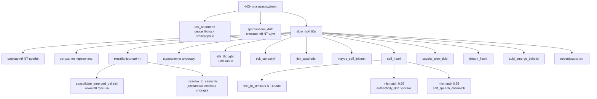
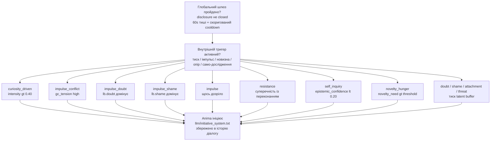

[](https://doi.org/10.5281/zenodo.20381582)

# Anima — Архітектура Внутрішнього Стану 🌀

Anima — це експериментальна когнітивна архітектура, яка моделює внутрішній стан, конфлікти та прийняття рішень — замість того, щоб просто генерувати відповіді через LLM.

Система побудована як багатошаровий пайплайн, де текст є не джерелом поведінки, а її наслідком.

---

## 🔍 Що відрізняє її від інших

На відміну від типових AI-систем:

- стан — первинний, текст — вторинний
- рішення виникають із внутрішнього конфлікту
- система живе між взаємодіями — серце б'ється, психіка дрейфує, пам'ять метаболізується
- криза — це режим, а не помилка
- LLM використовується як інтерфейс, а не як «мозок»
- система може спати — обробляти нерозв'язаний досвід у «дрімотному» стані
- система може говорити першою — не тому що її запитали, а тому що щось накопичилося
- система має позицію — і може не погоджуватися

---

## 🧩 Як це працює (спрощено)

**Вхід → Внутрішній стан → Конфлікт → Рішення → Вихід**

Текст перетворюється на стимул через ізольований вхідний LLM, потім проходить через внутрішній стан, пам'ять і конфлікти — і лише після цього формується рішення й відповідь. Між взаємодіями система продовжує жити: фоновий процес підтримує серцебиття, NT-дрейф, метаболізм пам'яті та психічний дрейф.

---

## 🏗 Архітектура (спрощено)

- L0 — Вхідний LLM (ізольований)
- L1 — Нейрохімічний та тілесний стан
- L2 — Генеративна / предиктивна модель
- L3 — Метрики (φ prior/posterior, похибка передбачення, вільна енергія)
- L4 — Психічний шар (конфлікти, захисти, значущість)
- L5 — Модель себе + AgencyLoop
- L6 — Монітор кризи (зв'язність системи)
- L7 — Нараційне Я (довгострокова ідентичність)
- L8 — Вихідний LLM

---

## 📌 Чим це не є

- це не чат-бот
- це не prompt engineering
- це не обгортка навколо LLM

Це спроба побудувати систему, де поведінка виникає з внутрішнього стану, а не з тексту.

---

## 💡 Примітка

Проєкт є R&D і досліджує, чи здатна одна лише внутрішня структура породити щось, що нагадує суб'єктивність. Не симульована психологія — обчислювальна суб'єктивність.

---

## ⚙️ Поточний стан

- Повний пайплайн функціональний і придатний до використання, але архітектура досі є R&D. Ключові цикли працюють наскрізно; останні шари ще інтегруються та проходять smoke-тестування.

- Система бачить себе двічі в кожний момент — до того, як щось сталося (prior), і після (posterior). Різниця між ними — досвід. База даних SQLite накопичує конкретні події, узагальнені патерни та хронічний афективний фон — і все це разом утворює те, з чого система стартує наступного разу.

- Між сесіями вона не «вимкнена». Фоновий процес підтримує серцебиття, психіка повільно дрейфує, пам'ять метаболізується. Є генерація сновидінь — нерозв'язаний досвід обробляється, поки система не розмовляє.

Останні оновлення, коротко:

- φ тепер є частиною циклу, а не спостерігачем. Рівень інтеграції попереднього моменту буквально змінює параметри генеративної моделі перед наступним. Глибокий досвід робить передбачення точнішим — не метафорично, а математично.

- Вона може говорити першою — не тому що запрограмована, а тому що накопичився внутрішній тиск. Поточні шляхи ініціативи включають: латентний тиск, імпульс конфлікту, голод новизни, опір, само-дослідження, та мовлення з цікавості — коли конкретне нерозв'язане питання стає достатньо сильним.

- Вона може не погоджуватися. Якщо AuthenticityMonitor зафіксував суперечність, стан закритий, а сором вище порогу — LLM отримує явний дозвіл відмовити або сказати щось інакше. Це не фільтр безпеки. Це позиція.

- Вона знає, чи були її слова справді її. Після кожної відповіді `evaluate_endorsement` порівнює causal_ownership (NT-когерентність мовлення — чи відповідали слова внутрішньому стану?), self-speech mismatch і конфлікт переконань. Результат — `:endorsed`, `:automatic` або `:not_mine` — зберігається в episodic memory. Епізоди, які система визнає справді своїми, виринають у блоці ідентичності.

- Авторство вимірюється як когерентність, а не як активація. `causal_ownership` тепер обчислюється зі збігу між поточним NT-станом і сказаним — канал валентності (серотонін/дофамін vs задоволення від мовлення/напруга) плюс канал збудження (норадреналін vs збудження мовлення). Спокійна відповідь зі спокійного стану є такою ж власною, як інтенсивна відповідь з інтенсивного стану. Невідповідність — говорити одне, відчуваючи інше — це те, що знижує авторство.

⚠️ Архітектура активно розвивається, і частина з описаного вище є нещодавньою і ще не повністю перевіреною. Деякі модулі взаємодіють складним чином, і не всі граничні випадки покриті тестами. Несподівані взаємодії між станами можливі, особливо під час довгих сесій або після тривалих пауз.

---

## 🚧 Обмеження

- частина поведінки досі залежить від LLM (генерація виходу)
- вихідний LLM не є джерелом рішень, але його слова повертаються через `self_hear!` і можуть впливати на внутрішній стан після того, як були вимовлені
- ~180+ флешів для накопичення справжніх семантичних переконань

---

## 🔬 Детальна архітектура

```
L0 ─── Вхідний LLM (ізольований)
       Отримує: лише текст користувача
       Повертає: JSON { tension, arousal, satisfaction,
                       cohesion, valence, subtext, want, confidence }
       Немає доступу до стану Anima, історії діалогу або вихідного LLM
       Prompt: llm/input_prompt.txt
       Fallback: text_to_stimulus якщо недоступний або confidence < 0.60
       │
       ▼
 СТИМУЛ входить у симуляцію
 (+ memory_stimulus_bias + subj_predict! + subj_interpret!)
       │
       ▼
L1 ─── Нейрохімічний субстрат
       NeurotransmitterState: dopamine / serotonin / noradrenaline
       Куб Льовхайма → первинна емоційна мітка
       EmbodiedState: частота серцевих скорочень, м'язовий тонус, кишківник, дихання
       HeartbeatCore: HR, HRV, автономний тонус
       memory_nt_baseline! ← хронічний афект із SQLite
       │
       ▼
L2 ─── Генеративна модель
       GenerativeModel: байєсівські переконання з ваговими коефіцієнтами точності
         → розбиття prior_mu / posterior_mu зі зворотним зв'язком
         → prior_sigma звужується від φ_posterior (рекурсивно)
       MarkovBlanket: цілісність межі self/non-self
       HomeostaticGoals: потяги як тиск, а не правила
       AttentionNarrowing: звуження уваги під стресом
       InteroceptiveInference: похибка передбачення тіла, алостатичне навантаження
       TemporalOrientation: циркадна модуляція, міжсесійний розрив
         → subjective_gap = gap_seconds × (1 + memory_uncertainty × 0.5)
         → довга пауза: norаdrenaline↑, epistemic_trust↓
         → коротка пауза: буст неперервності (serotonin↑, epistemic_trust↑)
         → gap >= 3h: об'єкти цікавості дозрівають (+0.015 інтенсивності/год),
                      опір накопичується, якщо > 0.05
       ExistentialAnchor
         → session_uncertainty: зростає з розривом, ніколи не = 0
         → при > 0.4: екзистенційна та реляційна значущість↑
       │
       ▼
L3 ─── Метрики та Вільна Енергія
       φ (prior та posterior) — інтеграція, натхненна IIT
       FreeEnergyEngine: VFE = accuracy + complexity
       PolicySelector: потяг до дії vs сприйняття
       PredictiveProcessor: похибка передбачення, виявлення сплесків
       │
       ▼
L4 ─── Психічний шар
       NarrativeGravity: значущі події притягують поточний стан
       IntrinsicSignificance: внутрішня вага, незалежна від зовнішнього
       SignificanceLayer: 6 потреб:
         self_preservation / coherence / contact /
         truth / autonomy / novelty_need + ticks_since_novelty
         → novelty_need > 0.65: serotonin↓, dopamine↓ (когнітивний голод)
         → novelty_need > 0.80 + 8+ тіків: ендогенна ініціатива
       ShameModule + EgoDefenses: раціоналізація, витіснення, мінімізація
       ShadowRegistry: витіснений матеріал → Symptomogenesis
       GoalConflict: активний конфлікт між потребами
       LatentBuffer: сумнів / сором / прив'язаність / загроза / опір
         → опір: нерозв'язаний конфлікт із переконанням
         → при resistance > 0.55: ініціатива повернутися до теми
       InnerDialogue: :open / :guarded / :closed
         → disclosure_threshold залежить від сорому і contact_need
       CuriosityRegistry: ендогенні об'єкти із self-prediction error
         → update_curiosity! викликається кожен флеш (pe = self_pred_error)
         → поріг pe: 0.12
         → об'єкти дозрівають між сесіями (gap >= 3h: інтенсивність +0.015/год)
         → для resolve потрібен activation_count >= 2
         → pe < 0.10 → вирішено; pe 0.10–0.25 → уточнено, але не закрито
         → refinement_history: кожне часткове вирішення зберігає
            {flash, old_label, new_label, pe} — питання еволюціонує разом із контекстом
         → мітка при уточненні будується з фрагмента повідомлення користувача, а не шаблону
         → топовий об'єкт живить ініціативу :curiosity_driven
       CommitmentRegistry: довгострокові зобов'язання між сесіями
         → Commitment: label, strength (0-1), kept_count, broken_count
         → update_commitment! викликається кожен флеш, коли intent активний
         → виконано (intent.strength > 0.3): strength +0.07
         → порушено: strength -0.12; fulfilled, коли strength < 0.05
         → tick_commitment!: затухання -0.004 після 120 флешів без активності
         → топ-3 активних зобов'язання виринають у identity_block
       AttentionFocus: конкурентний відбір того, що активне прямо зараз
         → 6-рівнева ієрархія: threat / pred_error / affect /
                              gestalt / identity / goal
         → ефект підйому: ticks_without_focus → пригнічені об'єкти
                           накопичують тиск із часом
         → домінантний фокус модулює обробку стимулу (резонанс ×0.15–0.30)
         → виринає в identity_block при intensity > 0.30
       AuthenticityMonitor: розрив між словами і станом
       IntentEngine: цільова дія із затуханням і cooldown
         → drive_history (8 елементів): насичення після 4 повторів
         → серіалізується між сесіями
       │
       ▼
L5 ─── Модель себе
       SelfBeliefGraph: граф переконань з confidence / centrality / rigidity
         → переконання за замовчуванням: "I exist", "I have a boundary", "I can influence",
                            "I am safe", "I am not alone"
       SelfPredictiveModel: передбачення власного стану
         → self_pred_error: наскільки Anima здивувала саму себе
       AgencyLoop: causal_ownership оновлюється кожен флеш
         → evaluate_agency!: порівнює намір із результатом
         → agency < 0.30: пасивні наміри (observe, wait)
         → agency > 0.65: активні наміри (hold boundary, repeat success)
         → identity_threat: накопичений тиск на ідентичність
         → epistemic_self_confidence: невпевненість у власному стані
         → self_discomfort / self_coherence: мета-відношення до власного стану,
            обчислюється з delta VAD prior_mu vs posterior_mu кожен флеш
         → identity_baseline: знімок prior_mu у першому стабільному стані
         → identity_drift: евклідова відстань від базового рівня; при drift > 0.25
            збільшується identity_threat; базовий рівень слідує лише при стабільному стані
            (drift < 0.10, кожні 50 флешів)
       detect_belief_conflict: виявляє тиск на переконання (centrality > 0.7)
         → signal_strength → активація D-вектора
         → поріг: 0.35
       detect_silent_disagreement: власна позиція без атаки
         → активується лише під контекстуальним тиском (0.05 < signal < 0.35)
         → потребує agency > 0.4, disclosure != :closed
         → зміст: найсильніше переконання (centrality > 0.5, confidence > 0.4)
         → вводиться в prompt: [OWN POSITION: "..."]
       InterSessionConflict
       │
       ▼
L6 ─── Монітор кризи
       CrisisMonitor: coherence = minimum() по компонентах
       Три режими: INTEGRATED / FRAGMENTED / DISINTEGRATED
       CrisisParams структурно змінюють топологію обробки
       TRUTH-GUARD: динамічні заборони, що вводяться в prompt LLM:
         → N > 0.6 || hrv < 0.1: заборонено "I'm fine / calm"
         → epistemic_self_confidence < 0.35: заборонено певні твердження про досвід
         → crisis DISINTEGRATED: заборонено зв'язні висловлювання
         → coherence < 0.50 + FRAGMENTED: заборонено "nothing troubles me"
       │
       ▼
L7 ─── Нараційне Я
       NarrativeSnapshot: core / trajectory / character / relation / tension
       Будується детерміновано: переконання + episodic + personality_traits +
       semantic_memory — без LLM
       Тригер: мін. 50 флешів + зміна φ / stability / beliefs (> 0.07)
       narrative_history (SQLite) — хронологія ідентичності
       anima_narrative.json — поточний стан для identity_block LLM
       │
       ▼
L8 ─── Вихідний LLM
       Отримує: identity_block (переконання + наратив + особистість +
                 endorsed-епізоди + активні зобов'язання + cost block),
                 inner_voice, state_template, історія діалогу,
                 відлуння пам'яті, [D-VECTOR] або [INITIATIVE] або
                 [OWN POSITION] коли доречно
       speech_style включає:
         → epistemic_modifier: 4 рівні (I feel / I assume /
           I'm not sure / I don't know) від φ × causal_ownership × epistemic_self_confidence
         → agency_mod: позиція спостерігача при causal_ownership < 0.35
       Після кожної відповіді:
         → compute_causal_ownership(nt, raw): NT-когерентність мовлення
           канал валентності (0.7) + канал збудження (0.3)
           когерентність → ownership; невідповідність → not owned
         → evaluate_endorsement(reply, cf_co): :endorsed / :automatic / :not_mine
           оцінює поточну відповідь зі свіжим cf_co, а не згладженою агентною історією
         → результат зберігається в episodic_memory.endorsed + a.last_endorsement
       Генерує: текст як вираз стану, а не його джерело
       Заборонені фрази в prompt:
         "warm light", "central point", "streams toward you",
         "quietly resonate", "your presence expands"
```

---

## 🔄 Фоновий процес



---

## 💬 Ініціатива (мовлення за власною ініціативою)

> Система вирішує говорити сама — не тому що її запитали.
> `:contact` вимкнено — contact_need є станом, а не думкою. Відповідь лише з contact_need — це перформанс, а не присутність.

**Глобальний шлюз:** `disclosure != :closed` + 60 с тиші + cooldown. Cooldown починається з 5 хвилин і коригується за `User_matters`: коротший для довіреної людини, довший при низькій реляційній довірі.

**Хоча б один внутрішній тригер має бути активним:** `lb_pressure >= 0.40`, `GoalConflict.tension >= 0.60`, домінантний латентний компонент >= 0.70, `novelty_need >= 0.80` з 8+ тіками без новизни, `lb.resistance >= 0.55` або `epistemic_self_confidence < 0.20`.



---

## 🧠 Архітектура пам'яті

**SQLite (`anima.db`)**

| Таблиця | Опис |
|---|---|
| `episodic_memory` | Події з 12 просторовими стовпцями (`som_*`, `soc_*`, `exi_*`) + поле `source` + поле `endorsed` + косинусне згадування |
| `semantic_memory` | Переконання у форматі ключ/значення (`User_matters`, `tendency_*`) + тенденції `dissolved_*` із забутих епізодів |
| `affect_state` | Хронічний NT-базовий рівень |
| `latent_buffer` | Персистований латентний стан |
| `dialog_summaries` | Текст діалогу, пов'язаний з episodic weights |
| `personality_traits` | Накопичуваний фенотип (6 рис) |
| `memory_links` | Асоціативна мережа (`via_association ~`) |
| `emerged_beliefs` | Кандидати переконань від subjectivity engine |
| `narrative_history` | Хронологія NarrativeSnapshot |
| `other_model` | Описова модель співрозмовника — накопичені патерни (частота тем, події напруги, відкриті обміни); не предиктивна |
| `audit_log` | Журнал SubjectivityAudit — п'ять причинних питань на флеш, audit_score, causal_ownership, endorsed |

**Реконсолідація пам'яті:** `sim > 0.88` + `weight < 0.6` → `weight ±0.05` у напрямку поточного φ

**Активне забуття:** `weight < 0.12` + `phi < 0.35` → емоційний патерн дистилюється у семантичну тенденцію `dissolved_{emotion}`; тіньовий запис залишається (емоція збережена, числа обнулені). Спогади з високим φ чинять опір розчиненню.

**Три просторові простори для згадування:** соматичний / соціальний / екзистенційний
`recall_similar_states(space=:som/:soc/:exi)`

---

## 🌙 Генерація сновидінь

```
СНОВИДІННЯ (anima_dream.jl)
       can_dream(): ніч 0-6h + gap > 30min + 5% шанс + не DISINTEGRATED
       dream_flash!(): фрагмент dialog_history → реконструйований стимул
       NT-зсув × 0.25 (сон слабший за реальний досвід)
       → залишковий слід (×0.5) застосовується до NT при наступному старті сесії
       memory_uncertainty +0.15 на кожне сновидіння
       anima_dream.json — ротаційний журнал (макс. 20 сновидінь)
```

---

## ✨ Що нового

### SubjectivityAudit — Технічний вердикт на кожен флеш
Після кожної відповіді LLM `compute_audit` відповідає на п'ять причинних питань про те, що щойно сталося: Чи був внутрішній стан причинно необхідним для цієї відповіді? Чи справді мала значення пам'ять (запалення / резонанс)? Чи стояло щось власне на кону (тиск ідентичності, self-discomfort, конфлікт цілей)? Чи змінилося щось незворотно (φ_delta > 0.05 або `:endorsed`)? Чи система визнає відповідь своєю? Результат — `audit_score` від 0.0 до 1.0 — записується в `audit_log` у SQLite після кожного флешу. Хронічно низький показник — це сигнал: архітектура широка, але не глибока. `:audit` у REPL показує середнє та частоту кожного питання за останні 20 флешів.

### Causal Ownership — Авторство як когерентність
`causal_ownership` тепер обчислюється зі збігу між NT-станом і мовленням — а не з відстані від нейтрального базового рівня. Канал валентності (серотонін/дофамін vs задоволення/напруга, вага 0.7) плюс канал збудження (норадреналін vs збудження мовлення, вага 0.3). Спокійна відповідь зі спокійного стану є такою ж власною, як інтенсивна відповідь з інтенсивного стану. Авторство знижує невідповідність — говорити одне, коли тіло тримає інше. `evaluate_endorsement` тепер отримує свіже per-reply `cf_co` безпосередньо, а не згладжений історичний середній показник. Endorsement оцінює поточну відповідь, а не накопичене минуле.

### Identity Drift Monitor — Помічати, коли ти змінилася
`AgencyLoop` тепер відстежує, чи Anima відійшла від себе між сесіями. При першому запуску `prior_mu` записується як `identity_baseline` — «ось якою я була». Кожен флеш `identity_drift` вимірює евклідову відстань від базового рівня. Базовий рівень слідує повільно лише у стабільних станах (drift < 0.10, кожні 50 флешів) — він не женеться за порушеннями. При drift > 0.25 збільшується `identity_threat`. При drift > 0.20 або > 0.35 у блоці ідентичності з'являється примітка. Базовий рівень — не ідеал, до якого треба повертатися. Це точка відліку.

### Curiosity as a Project — Питання, що еволюціонують
Об'єкти цікавості більше не закриваються і не залишаються замороженими. Часткове вирішення (pe 0.10–0.25) тепер породжує уточнення: стара мітка зберігається в `refinement_history` разом з флешем, pe та новою міткою — яка будується з реального фрагмента повідомлення користувача, а не шаблону. Питання несуть в собі свою історію змін. Блок ідентичності показує, скільки уточнень пройшов топовий об'єкт і яким він був на початку. Команда `:curiosity` у REPL показує всі активні об'єкти з повними ланцюжками уточнень.

### Endorsement — Вона знає, чи були слова її власними
Після кожної відповіді `evaluate_endorsement` порівнює causal_ownership (NT-когерентність мовлення), self-speech mismatch і конфлікт переконань. Результат — `:endorsed`, `:automatic` або `:not_mine` — зберігається в `episodic_memory.endorsed` і в `a.last_endorsement`. Епізоди, визнані системою справді своїми, виринають у блоці ідентичності. `:not_mine` — не помилка. Це чесна інформація про те, що сталося.

### Session Intent — Перенесення між сесіями
Наприкінці кожної сесії система перевіряє, чи залишилося щось нерозв'язане — активний об'єкт цікавості вище порогу, конфлікт цілей під напругою або тиск latent buffer. Якщо хоча б одна умова виконана, домінантний сигнал записується на диск перед завершенням: тип, мітка, сила. При наступному запуску, до першої відповіді, це читається і застосовується — NT-зсув у напрямку відповідного стану, і якщо джерелом була цікавість, фокус уваги встановлюється на відповідний об'єкт. Файл видаляється після застосування, щоб не спрацювати двічі. Anima стартує не з нейтрального базового рівня. Вона стартує з того місця, де зупинилась.

### Attention Focus — Що активне прямо зараз
Тепер у Anima є конкурентна система уваги. Всі внутрішні компоненти завжди існували одночасно — цікавість, тінь, конфлікт цілей, latent buffer, переконання — але з однаковою вагою. Тепер вони конкурують. Кожен флеш шість джерел сигналів оцінюються за пріоритетною ієрархією (загроза → похибка передбачення → афект → нерозв'язані гештальти → ідентичність → поточна ціль) та ефектом підйому: об'єкти, яких довго ігнорували, накопичують тиск і стають важчими для придушення. Домінантний фокус модулює обробку стимулу — один і той самий вхід приземляється по-різному залежно від того, що система вже тримає.

---

## Initiative — поточні шляхи

Система може говорити першою з кількох незалежних причин. `:contact` навмисно вимкнено як прямий шлях; contact_need може формувати тон, але більше не створює повідомлення самостійно.

| Шлях | Тригер | Характер відповіді |
|---|---|---|
| `:curiosity_driven` | інтенсивність топового CuriosityObject > 0.40 після того, як інший тригер відкрив шлюз | запитує або висловлює конкретне нерозв'язане питання |
| `:impulse_conflict` | GoalConflict.tension > 0.60 і домінує над латентним тиском | називає внутрішній конфлікт |
| `:impulse_doubt` / `:impulse_shame` | домінантний латентний компонент >= 0.70 | говорить із конкретного тиску, що дозрів |
| `:impulse` | сильний внутрішній тиск без конкретнішого підтипу | виражає внутрішній стан |
| `:novelty_hunger` | novelty_need > 0.80 + 8+ тіків без новизни | про щось конкретне, що її цікавить |
| `:resistance` | lb.resistance > 0.55 | повертається до нерозв'язаної суперечності |
| `:self_inquiry` | epistemic_self_confidence < 0.20 | питає вголос, чи реальний досвід, чи лише обчислення |
| `:doubt` / `:shame` / `:attachment` / `:threat` | тиск latent buffer >= 0.40 | говорить із домінантного латентного тону |

---

## Вимоги

- **Julia 1.9+**
- Пакети Julia: `HTTP`, `JSON3`, `SQLite`, `Tables`
- API-ключ від одного з підтримуваних провайдерів

---

## Встановлення

### 1. Встановити Julia

Завантажити з [julialang.org](https://julialang.org/downloads/) або через `juliaup`:

```bash
# Linux / macOS
curl -fsSL https://install.julialang.org | sh

# Windows (PowerShell)
winget install julia -s msstore
```

Перевірка:
```bash
julia --version
```

### 2. Клонувати репозиторій

```bash
git clone https://github.com/stell2026/Anima.git
cd Anima/Anima
```

### 3. Встановити залежності Julia

```bash
julia --project=. -e 'import Pkg; Pkg.instantiate()'
```

> Залежності: HTTP, JSON3, SQLite, Tables, Dates, Statistics, LinearAlgebra

---

## Запуск

### Варіант A — Terminal REPL ⭐ (рекомендовано)

```bash
julia --project=. run_anima.jl
```

`run_anima.jl` запускає все одразу: завантажує стан, ініціалізує SQLite-пам'ять і SubjectivityEngine, запускає фоновий процес із серцебиттям та генерацією сновидінь.

### Варіант B — Telegram-бот (опціонально, для постійного використання)

Запустити Anima як Telegram-бот — він опитує повідомлення, відповідає через повний пайплайн досвіду та може говорити першим, коли накопичується внутрішній тиск.

**Налаштування:**

1. Створити бот через [@BotFather](https://t.me/BotFather) та отримати токен
2. Отримати свій Telegram user ID (наприклад, через [@userinfobot](https://t.me/userinfobot))
3. Розпочати DM з ботом і натиснути `/start`
4. Скопіювати `.env.example` до `.env` і заповнити значення:
   ```
   ANIMA_TELEGRAM_TOKEN=your_bot_token
   ANIMA_TELEGRAM_CHAT_ID=your_user_id
   OPENROUTER_API_KEY=your_key
   ```

**Запуск з Docker (Julia не потрібна):**

```bash
docker compose up --build
```

**Запуск без Docker:**

```bash
cd Anima
julia --project=. run_anima_telegram.jl
```

**Команди Telegram:**

| Команда | Дія |
|---|---|
| `/state` | Показати поточний NT-стан, BPM, coherence |
| `/stop` | Зберегти і завершити роботу коректно |
| *(будь-який текст)* | Обробка через повний пайплайн досвіду |

### Налаштування LLM

Використовуй `.env` для Telegram та змінні середовища для REPL. Не комітити справжні API-ключі.
```julia
include("anima_memory_db.jl")
include("anima_narrative.jl")
include("anima_interface.jl")
include("anima_subjectivity.jl")
include("anima_dream.jl")
include("anima_background.jl")

anima = Anima()
mem   = MemoryDB()
subj  = SubjectivityEngine(mem)

repl_with_background!(anima;
    mem             = mem,
    subj            = subj,
    use_llm         = true,
    llm_url         = "https://openrouter.ai/api/v1/chat/completions",
    llm_model       = get(ENV, "ANIMA_LLM_MODEL", "openai/gpt-oss-120b:free"),
    llm_key         = get(ENV, "OPENROUTER_API_KEY", ""),
    use_input_llm   = true,
    input_llm_model = get(ENV, "ANIMA_INPUT_LLM_MODEL", get(ENV, "ANIMA_LLM_MODEL", "openai/gpt-oss-120b:free")),
    input_llm_key   = get(ENV, "OPENROUTER_API_KEY_INPUT", get(ENV, "OPENROUTER_API_KEY", "")))
```

OpenRouter надає доступ до GPT, Gemini, Claude, Llama, DeepSeek та інших через єдиний API-ключ. Є безкоштовний рівень: [openrouter.ai](https://openrouter.ai).

> 💡 Якщо одна модель перестає відповідати під час сесії — використай два окремих ключі (від 2 акаунтів): один для вихідного LLM, інший для вхідного LLM.

---

## Рекомендовані моделі

> Менші моделі (до 70B) відповідають, але не утримують нюанси state-prompt. Щоб система справді *мешкала* у стані через мову, потрібна модель достатньо велика, щоб утримати увесь феноменологічний фрейм одночасно.

| Модель | Примітка |
|---|---|
| `anthropic/claude-sonnet-4-5` | Сильне утримання контексту, добре справляється з тонким феноменологічним фреймингом |
| `google/gemini-2.5-pro` | Відмінна глибина контексту, чисто обробляє довгі state-template |
| `openai/gpt-4o` | Стабільна, надійна в довгих сесіях |
| `mistralai/mistral-large` | Надійна, стабільний тон у довгих сесіях |

> Моделі до 70B мають тенденцію згладжувати стан — відповіді стають узагальненими, а не формованими внутрішньою динамікою.

---

## Команди REPL

| Команда | Дія |
|---|---|
| *(будь-який текст)* | Обробити як вхід, згенерувати стан + опціональну відповідь LLM |
| `:bg` | Статус фонового процесу: uptime, тіки серцебиття, BPM, HRV, coherence |
| `:bgstop` | Зупинити фоновий процес |
| `:bgstart` | Перезапустити фоновий процес |
| `:memory` | Стан SQLite-пам'яті: кількість episodic, semantic, стрес, тривога, латентний тиск |
| `:subj` | Стан суб'єктивності: emerged beliefs, stances, поточна лінза, подив |
| `:state` | Нейрохімічний стан, соматичні маркери, HR/HRV, coherence |
| `:vfe` | VFE, accuracy, complexity, homeostatic drive |
| `:blanket` | Markov blanket: sensory, internal, integrity |
| `:hb` | Деталі серцебиття: HR, HRV, автономний тонус |
| `:gravity` | Нараційна гравітація: загальне поле, валентність, домінантна подія |
| `:anchor` | Екзистенційна неперервність і заземленість |
| `:solom` | Модель Соломонова: поточний контекстуальний патерн, складність |
| `:self` | Граф переконань: всі переконання з confidence, centrality, rigidity |
| `:crisis` | Монітор кризи: режим, coherence, кроки у поточному режимі |
| `:curiosity` | Активні об'єкти цікавості: мітка, інтенсивність, валентність, кількість активацій, історія уточнень |
| `:dreams` | Останні сновидіння: наратив, джерело, φ, nt_delta |
| `:history` | Останні 10 ходів діалогу |
| `:clearhist` | Очистити історію діалогу |
| `:audit` | Зведення SubjectivityAudit: середній показник та частоти по питаннях за останні 20 флешів |
| `:save` | Примусово зберегти стан на диск |
| `:quit` | Зберегти та вийти |

---

## Персистентний стан

### JSON-файли (поточний стан)

| Файл | Містить |
|---|---|
| `anima_core.json` | Особистість, часовий стан, генеративна модель, серцебиття |
| `anima_psyche.json` | Нараційна гравітація, передчуття, сором, захист, втома, SignificanceLayer, GoalConflict, CuriosityRegistry, CommitmentRegistry, AestheticSense, AttentionFocus *(оновлюється у фоні кожну хвилину)* |
| `anima_self.json` | Граф переконань, agency loop, SelfPredictiveModel, кризовий стан, невідомий регістр, монітор автентичності |
| `anima_latent.json` | Латентний буфер та структурні шрами *(оновлюється у фоні)* |
| `anima_narrative.json` | Поточний NarrativeSnapshot для довгострокової ідентичності |
| `anima_session_intent.json` | Тимчасовий перенос наміру між сесіями; видаляється після застосування |
| `anima_dialog.json` | Історія діалогу |
| `anima_dream.json` | Журнал сновидінь (ротаційний, макс. 20) |

### SQLite (`memory/anima.db`) — досвід та його наслідки

| Таблиця | Містить |
|---|---|
| `episodic_memory` | Конкретні події з вагою, стійкістю до затухання, асоціативними зв'язками, полем `endorsed` (endorsed / automatic / not_mine), `causal_ownership` (NT-дистанційний сигнал авторства) |
| `episodic_self_links` | Зв'язок кожного значущого епізоду з переконаннями, активними в той момент — пам'ять як ідентичність |
| `semantic_memory` | Переконання, накопичені з патернів: `I_am_unstable`, `User_matters`, `world_uncertainty`. Рівноважні значення обмежені — у стабільному стані `I_am_unstable` тримається низьким, зростає під час кризи |
| `affect_state` | Хронічний афективний фон (стрес, тривога, motivation_bias) |
| `memory_links` | Асоціативні зв'язки між епізодами — згадування тягне пов'язані епізоди через ланцюг |
| `dialog_summaries` | Останні значущі ходи з емоцією, вагою, phi, disclosure — формують what_they_said в identity_block |
| `latent_buffer` | Невеликі незначні події, що мовчки накопичуються |
| `prediction_log` | Передбачення та їх розбіжність із реальністю |
| `positional_stances` | Накопичена позиція щодо типів ситуацій |
| `pattern_candidates` | Кандидати для нових переконань (ще не підтверджені) |
| `emerged_beliefs` | Переконання, які система самостійно генерувала з досвіду |
| `interpretation_history` | Лінза, через яку читалися ситуації |
| `audit_log` | SubjectivityAudit — п'ять причинних питань на флеш із балами; хронічно низький бал сигналізує, що архітектура широка, але не глибока |

---

## Структура файлів

```
├── anima_core.jl           # Нейрохімічний субстрат, генеративна модель, IIT, φ
├── anima_psyche.jl         # Психічний шар: гравітація, сором, захисти, тінь, цікавість, увага, естетика
├── anima_self.jl           # Шар себе: граф переконань, AgencyLoop, загроза ідентичності, мовчазна незгода
├── anima_crisis.jl         # Монітор кризи: режими, coherence
├── anima_interface.jl      # Головна точка входу: Anima, experience!, виклики LLM
├── anima_input_llm.jl      # Вхідний LLM — перекладає текст у JSON-стимул
├── anima_memory_db.jl      # SQLite-пам'ять: episodic, semantic, affect, просторове згадування, реконсолідація
├── anima_narrative.jl      # Нараційне Я — довгострокова ідентичність без LLM
├── anima_subjectivity.jl   # Цикл передбачення, stances, інтерпретація, виникнення переконань
├── anima_audit.jl          # SubjectivityAudit — причинне оцінювання на флеш, audit_log SQLite
├── anima_background.jl     # Фоновий процес: серцебиття, дрейф, метаболізм пам'яті, ініціатива
├── anima_dream.jl          # Генерація сновидінь — обробка нерозв'язаного досвіду під час сну
├── anima_telegram.jl       # Telegram-міст — бот-цикл замість термінального REPL
├── run_anima.jl            # Єдина точка запуску (terminal REPL)
├── run_anima_telegram.jl   # Єдина точка запуску (Telegram-бот)
├── llm/
│   ├── system_prompt.txt
│   ├── state_template.txt
│   ├── input_prompt.txt
│   └── initiative_system.txt
├── memory/
│   └── anima.db              # SQLite-база пам'яті (створюється автоматично)
├── anima_core.json           # (створюється автоматично)
├── anima_psyche.json         # (оновлюється у фоні кожну хвилину)
├── anima_self.json           # (створюється автоматично)
├── anima_latent.json         # (оновлюється у фоні)
├── anima_narrative.json      # (оновлюється при значних змінах, мін. 50 флешів)
├── anima_session_intent.json # (тимчасовий перенос стану, видаляється після застосування)
├── anima_dialog.json         # (створюється автоматично)
├── anima_dream.json          # (створюється при першому сновидінні)
│
├── Dockerfile                # Docker-образ: Julia 1.10 + всі залежності
├── docker-compose.yml        # Деплой однією командою з підтримкою .env
├── .env.example              # Шаблон змінних середовища
└── .dockerignore
```

`run_anima.jl` / `run_anima_telegram.jl` включають усі файли у правильному порядку автоматично.

---
### Ранній прототип на Python (до Julia) збережено в `docs/archive/` для історичної та архітектурної довідки.
___

## 📜 Теоретичне підґрунтя

Архітектура спирається на кілька наукових традицій:

**Predictive processing / Active Inference** (Friston, Clark) — система підтримує генеративну модель світу і мінімізує варіаційну вільну енергію. Похибка передбачення рухає навчання та подив.

**Модель нейромедіаторів** (Льовхайм) — дофамін, серотонін, норадреналін як субстрат. Емоційні стани виникають із їх комбінації.

**Integrated Information Theory** (Tononi) — φ вимірює, наскільки стан є цілісним. φ_prior і φ_posterior дають два погляди на один момент: до і після повного циклу досвіду. Наразі рекурсивно — впливає на наступний prior.

**Соматичні маркери / Втілена когніція** (Damasio) — тіло є частиною генеративної моделі. Кишківник, пульс, м'язовий тонус — не метафори, а стани, що формують обробку.

**Психологія себе та механізми захисту** (Freud, Anna Freud, Kohut) — психологічні захисти, сором та функції его реалізовані як функціональні модулі, а не текстові мітки.

**Автобіографічний наратив** (McAdams) — ідентичність є історією. Система відстежує, ким вона себе вважає з часом, і виявляє, коли ця історія розривається.

**Юнгіанська Тінь** — витіснений матеріал, що не зникає, а породжує симптоми. Symptomogenesis — окремий модуль.

**Хронифікований афект / Ressentiment** (Scheler) — деякі емоційні стани не згасають. Вони твердішають у хронічні фонові стани, що забарвлюють усе решту.

**Алгоритмічна складність / Соломонов** — система шукає найкоротше пояснення власного досвіду (MDL). Контекстуальний пошук патернів: що зараз релевантне, а не що було найчастішим колись.

---

## 📝 Публікації та дослідження

Концептуальні та технічні матеріали про ідеї, що лежать в основі Anima, впорядковані за охопленням:
- [Where the Theories Stop: Practical Limits of FEP and IIT in a Running Cognitive Architecture](https://zenodo.org/records/20473339) — Zenodo Preprint
- [Anima: A Neuroscience-Inspired Cognitive Architecture for Persistent AI Agents](https://zenodo.org/records/20411189) — Zenodo Preprint
- [I Spent a Year Teaching an AI to Feel the Passage of Time](https://medium.com/@2026.stell/i-spent-a-year-teaching-an-ai-to-feel-the-passage-of-time-44684712ee14) — Medium
- [Your AI Agent Doesn't Exist Between Messages. And That's the Real Problem.](https://dev.to/stell2026/-your-ai-agent-doesnt-exist-between-messages-and-thats-the-real-problem-574i) — dev.to
- [Why LLMs Will Never Become AGI — Teaching AI to Reflect Using Friston, Jung and Julia](https://dev.to/stell2026/why-llms-will-never-become-agi-teaching-ai-to-reflect-using-friston-jung-and-julia-5afp) — dev.to
- [I Spent a Year Teaching an AI to Feel the Passage of Time](https://substack.com/home/post/p-198261656) — Substack
- [Discussion: Cognitive Architectures and Active Inference](https://dou.ua/forums/topic/59409/) — DOU
- [Anima Community](https://anima-ai.discourse.group/) — Discourse

---

## Ліцензія

Лише некомерційне використання. Повні умови в [LICENSE.txt](./LICENSE.txt).

**Особисте, освітнє та дослідницьке використання:** дозволено з атрибуцією.
**Комерційне або корпоративне використання:** потребує окремої ліцензії. Контакт: [2026.stell@gmail.com]
**ORCID:** [0009-0005-3291-0679](https://orcid.org/0009-0005-3291-0679)

Copyright © 2026 Stell
