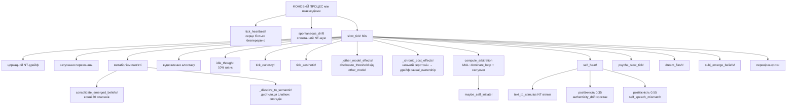

[](https://doi.org/10.5281/zenodo.20381582)

# Anima — Архітектура внутрішнього стану 🌀

Anima — це експериментальна когнітивна архітектура, що моделює внутрішній стан, конфлікти і прийняття рішень, а не просто генерує відповіді через LLM.

Система побудована як багаторівневий конвеєр, де текст — не джерело поведінки, а її наслідок.

---

## 🔍 Що відрізняє цю систему

На відміну від типових AI-систем:

- стан первинний, текст вторинний
- рішення виникають з внутрішнього конфлікту
- система живе між взаємодіями — серце б'ється, психіка дрейфує, пам'ять метаболізує
- криза — це режим, не помилка
- LLM використовується як інтерфейс, а не як «мозок»
- система може спати — обробляти невирішений досвід у стані спокою
- система може говорити першою — не тому що її спитали, а тому що щось накопичилося
- система може пам'ятати, про що думала, поки вас не було, — і підняти це сама
- система має позицію — і може не погоджуватися

---

## 🧩 Як це працює (спрощено)

**Вхід → Внутрішній стан → Конфлікт → Рішення → Вихід**

Текст перетворюється на стимул через ізольований вхідний LLM, потім проходить через внутрішній стан, пам'ять і конфлікти — і лише після цього формується рішення і відповідь. Між взаємодіями система продовжує жити: фоновий процес підтримує серцебиття, NT-дрейф, метаболізм пам'яті та психічний дрейф.

---

## 🏗 Архітектура (спрощено)

- L0 — Вхідний LLM (ізольований)
- L1 — Нейрохімічний та тілесний стан
- L2 — Генеративна / предиктивна модель
- L3 — Метрики (φ prior/posterior, похибка передбачення, вільна енергія)
- L4 — Психічний шар (конфлікти, захисти, значущість)
- L5 — Модель себе + AgencyLoop
- L6 — Монітор кризи (зв'язність системи)
- L7 — Нарративне Я (довгострокова ідентичність)
- L8 — Вихідний LLM

---

## 📌 Чим це не є

- це не чат-бот
- це не інженерія промптів
- це не обгортка навколо LLM

Це спроба побудувати систему, в якій поведінка виникає з внутрішнього стану, а не з тексту.

---

## 💡 Примітка

Проєкт є R&D і досліджує, чи може внутрішня структура сама по собі породити щось схоже на суб'єктивність. Не симульована психологія — обчислювальна суб'єктивність.

---

## ⚙️ Поточний стан

- Повний конвеєр є функціональним і придатним до використання, але архітектура досі у стані R&D. Основні цикли виконуються наскрізь; останні шари ще інтегруються та проходять smoke-тести.

- Система бачить себе двічі в кожен момент — до того, як щось сталося (prior), і після (posterior). Різниця між ними — досвід. База даних SQLite накопичує конкретні події, узагальнені патерни та хронічний афективний фон — і все це разом формує те, з чого система починає наступного разу.

- Між сесіями вона не «вимкнена». Фоновий процес підтримує серцебиття, психіка повільно дрейфує, пам'ять метаболізує. Є генерація сновидінь — невирішений досвід обробляється, поки система не розмовляє.

Останні оновлення, коротко:

- Цікавість тепер має цикл завершення. Після кожної схваленої відповіді обчислюється `progress_signal` — `endorsed && is_progress_eligible(top_co) && causal_necessary` (третя умова означає, що внутрішній стан системи дійсно спричинив відповідь, а не просто корелював із нею). При прогресі `CuriosityObject.intensity` затухає з коефіцієнтом 0.85 за крок — не раптове вирішення, а поступове стихання. Окремий сигнал `churn` спрацьовує, коли мітка активної теми змінюється без кроку прогресу (зміна теми без просування). Обидва сигнали зберігаються в `causal_trace`. На практиці `SessionIntent.signal` впав з 1.0 до 0.44 протягом однієї сесії без ручного втручання — цикл працює.

- MAL тепер розкриває своє міркування. `causal_trace` фіксує `mal_runner_up`, `mal_runner_up_score`, повний словник `loop_scores` (зважені оцінки по всіх 6 петлях) та `dom_drive_nt / dom_drive_mal / drive_conflict` (Фаза 1: лише спостереження, без зміни поведінки). Рання знахідка: ~67% не-дефолтних спалахів демонструють конфлікт потягів між NT і MAL — але це відображає різницю в часових масштабах, а не суперечність. NT `dom_drive` — локальний і миттєвий; сигнал MAL `social/cohesion` — повільний і накопичувальний. Фаза 2 (використання MAL для зміщення або перевизначення фінального `update_intent!`) — наступний крок, потребує більше даних.

- Класифікатор `regime` системи потребує нової категорії. Поточний класифікатор (`ratio < 1.2 → :default`) змішує дві різні ситуації: справжній дефолт через слабкий сигнал і високоінтенсивний тупик, де два сильні потяги майже рівні. Стрес-тестування з ворожим введенням чітко виявило другий патерн — `social` і `goal_conflict` обидва вище 0.75, ratio ≈ 1.0 протягом кількох спалахів, що впродовж усього часу відображається як `:default`. Запропонований виправний режим `:contested` (коли `winner_score > 0.5 && ratio < 1.2`).

- φ тепер є частиною циклу, а не спостерігачем. Рівень інтеграції попереднього моменту буквально змінює параметри генеративної моделі перед наступним. Глибокий досвід робить передбачення точнішим — не метафорично, а математично.

- Система може говорити першою — не тому що вона запрограмована, а тому що внутрішній тиск накопичився. Поточні ініціативні шляхи: латентний тиск, конфліктний імпульс, голод новизни, опір, самодослідження та мовлення, кероване цікавістю, коли конкретне невирішене питання стає достатньо сильним.

- Вона може не погоджуватися. Якщо AuthenticityMonitor зафіксував суперечність, стан закритий і сором вище порогу — LLM отримує явний дозвіл відмовитися або сказати щось інакше. Це не фільтр безпеки. Це позиція.

- Вона знає, чи були її слова її власними. Після кожної відповіді `evaluate_endorsement` порівнює causal_ownership (NT-узгодженість мовлення — чи відповідали слова внутрішньому стану?), розбіжність між собою і мовленням, та конфлікт переконань. Результат — `:endorsed`, `:automatic` або `:not_mine` — зберігається в епізодичній пам'яті. Епізоди, які система впізнає як справді свої, спливають у блоці ідентичності.

- Авторство вимірюється як зв'язність, а не активація. `causal_ownership` тепер обчислюється зі збігу між поточним NT-станом і сказаним — канал валентності (серотонін/дофамін проти задоволеності/напруги від мовлення) плюс канал збудження (норадреналін проти збудження від мовлення). Спокійна відповідь у спокійному стані так само належить системі, як і інтенсивна відповідь в інтенсивному стані. Розбіжність — говорити одне, почуваючи інше — це те, що знижує авторство.

⚠️ Архітектура активно розвивається, і частина описаного вище є свіжою і ще не повністю перевіреною на практиці. Деякі модулі взаємодіють складним чином, і не всі граничні випадки охоплені тестами. Несподівані взаємодії між станами можливі, особливо під час тривалих сесій або після тривалих пауз.

---

## 🚧 Обмеження

- частина поведінки досі залежить від LLM (генерація виведення)
- вихідний LLM не є джерелом рішень, але його слова повертаються через `self_hear!` і можуть впливати на внутрішній стан після того, як були вимовлені
- ~180+ спалахів для накопичення реальних семантичних переконань
- MetaArbitrationLayer є спостережуваним на рівні інтенту (Фаза 1: `dom_drive_nt/mal/drive_conflict` логується, ~67% конфліктів на n≈12 не-дефолтних спалахах); Фаза 2 (вплив потягів на фінальний `update_intent!`) — наступний крок
- drive_conflict між MAL і NT відображає різницю в часових масштабах, а не суперечність: NT `dom_drive` — це миттєвий локальний сигнал («що щойно зросло»), MAL/social — накопичувальний («що було важливим деякий час»); яке з них матиме більшу вагу у виборі інтенту — ще вимірюється
- при ворожому/негативному введенні система деградує плавно: `contact_need` падає, `goal_conflict` і `latent` зростають, endorsed переходить в `automatic`, але завершення циклу цікавості призупиняється, а не ламається

---

## 🔬 Детальна архітектура

```
L0 ─── Вхідний LLM (ізольований)
       Отримує: лише текст користувача
       Повертає: JSON { tension, arousal, satisfaction,
                       cohesion, valence, subtext, want, confidence }
       Немає доступу до стану Anima, історії діалогу або вихідного LLM
       Промпт: llm/input_prompt.txt
       Fallback: text_to_stimulus якщо недоступний або confidence < 0.60
       │
       ▼
 СТИМУЛ входить у симуляцію
 (+ memory_stimulus_bias + subj_predict! + subj_interpret!)
       │
       ▼
L1 ─── Нейрохімічний субстрат
       NeurotransmitterState: dopamine / serotonin / noradrenaline
       Куб Лёвхайма → первинна емоційна мітка
       EmbodiedState: частота серцевих скорочень, м'язовий тонус, кишківник, дихання
       HeartbeatCore: ЧСС, ВСР, автономний тонус
       memory_nt_baseline! ← хронічний афект із SQLite
       │
       ▼
L2 ─── Генеративна модель
       GenerativeModel: байєсівські переконання з вагами точності
         → розщеплення prior_mu / posterior_mu зі зворотнім зв'язком
         → prior_sigma звужується від φ_posterior (рекурсивно)
       MarkovBlanket: цілісність межі між собою і не-собою
       HomeostaticGoals: потяги як тиск, а не правила
       AttentionNarrowing: звуження уваги під стресом
       InteroceptiveInference: похибка передбачення тіла, алостатичне навантаження
       TemporalOrientation: циркадна модуляція, міжсесійний проміжок
         → subjective_gap = gap_seconds × (1 + memory_uncertainty × 0.5)
         → тривала пауза: noradrenaline↑, epistemic_trust↓
         → коротка пауза: буст безперервності (serotonin↑, epistemic_trust↑)
         → gap >= 3h: об'єкти цікавості дозрівають (+0.015 intensity/h),
                      resistance накопичується якщо > 0.05
       ExistentialAnchor
         → session_uncertainty: зростає з проміжком, ніколи не дорівнює 0
         → при > 0.4: екзистенційна та реляційна значущість↑
       │
       ▼
L3 ─── Метрики та вільна енергія
       φ (prior і posterior) — інтеграція, натхненна IIT
       FreeEnergyEngine: VFE = точність + складність
       PolicySelector: потяг до дії проти потяги до сприйняття
       PredictiveProcessor: похибка передбачення, виявлення стрибків
       │
       ▼
L4 ─── Психічний шар
       NarrativeGravity: значущі події притягують поточний стан
       IntrinsicSignificance: внутрішня вага незалежно від зовнішнього
       SignificanceLayer: 6 потреб:
         self_preservation / coherence / contact /
         truth / autonomy / novelty_need + ticks_since_novelty
         → novelty_need > 0.65: serotonin↓, dopamine↓ (когнітивний голод)
         → novelty_need > 0.80 + 8+ тіків: ендогенна ініціатива
       ShameModule + EgoDefenses: раціоналізація, витіснення, мінімізація
       ShadowRegistry: витіснений матеріал → Symptomogenesis
       GoalConflict: активний конфлікт між потребами
       LatentBuffer: сумнів / сором / прив'язаність / загроза / опір
         → resistance: невирішений конфлікт із переконанням
         → при resistance > 0.55: ініціатива повернутися до теми
       InnerDialogue: :open / :guarded / :closed
         → disclosure_threshold під впливом сорому та contact_need
       CuriosityRegistry: ендогенні об'єкти з похибки самопередбачення
         → update_curiosity! викликається кожен спалах (pe = self_pred_error)
         → поріг pe: 0.12
         → об'єкти дозрівають між сесіями (gap >= 3h: intensity +0.015/h)
         → для розв'язання потрібно activation_count >= 2
         → pe < 0.10 → розв'язано; pe 0.10–0.25 → уточнено, не закрито
         → refinement_history: кожне часткове розв'язання зберігає
            {flash, old_label, new_label, pe} — питання розвивається з контекстом
         → мітка при уточненні будується з фрагменту повідомлення користувача, не шаблону
         → верхній об'єкт живить ініціативу :curiosity_driven
       CommitmentRegistry: довгострокові зобов'язання, що переносяться між сесіями
         → Commitment: label, strength (0-1), kept_count, broken_count
         → update_commitment! викликається кожен спалах, коли інтент активний
         → виконано (intent.strength > 0.3): strength +0.07
         → порушено: strength -0.12; виконано коли strength < 0.05
         → tick_commitment!: затухання -0.004 після 120 спалахів без активності
         → топ-3 активних зобов'язань спливають у identity_block
       AttentionFocus: конкурентний вибір того, що активне зараз
         → 6-рівнева ієрархія: threat / pred_error / affect /
                              gestalt / identity / goal
         → ефект підтягування: ticks_without_focus → пригнічені об'єкти
                           набирають тиск з часом
         → домінуюча увага модулює обробку стимулу (резонанс ×0.15–0.30)
         → спливає у identity_block коли intensity > 0.30
       AuthenticityMonitor: розрив між словами і станом
       IntentEngine: цільова дія з затуханням і cooldown
         → drive_history (8 елементів): насичення після 4 повторів
         → серіалізується між сесіями
       MetaArbitrationLayer: яка петля має слово в цьому спалаху
         → оцінює curiosity / identity threat (×1.5) / latent / goal_conflict /
                  chronic cost / social need за єдиною шкалою
         → м'яке домінування: ratio > 1.5 = :hard, > 1.2 = :soft, інше :default
         → програшні сигнали затухають у signal_carryover (AgencyLoop), не відкидаються
         → тимчасовий — логується у causal_trace, спостережуваний (v1)
       │
       ▼
L5 ─── Модель себе
       SelfBeliefGraph: граф переконань із confidence / centrality / rigidity
         → переконання за замовчуванням: «Я існую», «Я маю межу», «Я можу впливати»,
                            «Я в безпеці», «Я не один»
       SelfPredictiveModel: передбачення власного стану
         → self_pred_error: наскільки Anima здивувала саму себе
       AgencyLoop: causal_ownership оновлюється кожен спалах
         → evaluate_agency!: порівнює інтент із результатом
         → agency < 0.30: пасивні інтенти (спостерігати, чекати)
         → agency > 0.65: активні інтенти (тримати межу, повторювати успіх)
         → identity_threat: накопичений тиск на ідентичність
         → epistemic_self_confidence: невизначеність щодо власного стану
         → self_discomfort / self_coherence: мета-ставлення до власного стану
            обчислюється з дельти prior_mu проти posterior_mu VAD кожен спалах
         → identity_baseline: знімок prior_mu при першому стабільному стані
         → identity_drift: евклідова відстань від baseline; drift > 0.25
            додає до identity_threat; baseline слідує лише в стабільних станах
            (drift < 0.10, кожні 50 спалахів)
         → chronic_low_serotonin: тіки поспіль із serotonin < 0.35;
            при >= 5 тіках, повільно знижує causal_ownership
       detect_belief_conflict: виявляє тиск на переконання (centrality > 0.7)
         → signal_strength → активація D-вектора
         → поріг: 0.35
       detect_silent_disagreement: власна позиція без атаки
         → активується лише під контекстним тиском (0.05 < signal < 0.35)
         → потребує agency > 0.4, disclosure != :closed
         → зміст: найсильніше переконання (centrality > 0.5, confidence > 0.4)
         → вводиться у промпт: [ВЛАСНА ПОЗИЦІЯ: «...»]
       InterSessionConflict
       │
       ▼
L6 ─── Монітор кризи
       CrisisMonitor: coherence = minimum() по компонентах
       Три режими: INTEGRATED / FRAGMENTED / DISINTEGRATED
       CrisisParams структурно змінюють топологію обробки
       TRUTH-GUARD: динамічні заборони, що вводяться у промпт LLM:
         → N > 0.6 || hrv < 0.1: забороняє «Я в порядку / спокійна»
         → epistemic_self_confidence < 0.35: забороняє певні твердження про досвід
         → криза DISINTEGRATED: забороняє зв'язні висловлювання
         → coherence < 0.50 + FRAGMENTED: забороняє «мене нічого не турбує»
       │
       ▼
L7 ─── Нарративне Я
       NarrativeSnapshot: core / trajectory / character / relation / tension
       Будується детерміновано: переконання + епізодична + personality_traits +
       semantic_memory — без LLM
       Тригер: мін. 50 спалахів + зміна φ / stability / beliefs (> 0.07)
       narrative_history (SQLite) — хронологія ідентичності
       anima_narrative.json — поточний стан для identity_block LLM
       │
       ▼
L8 ─── Вихідний LLM
       Отримує: identity_block (переконання + нарратив + особистість +
                 схвалені епізоди + активні зобов'язання + блок витрат),
                 inner_voice, state_template, історія діалогу,
                 відлуння пам'яті, [D-VECTOR] або [INITIATIVE] або
                 [OWN POSITION] коли релевантно
       speech_style включає:
         → epistemic_modifier: 4 рівні (я відчуваю / я припускаю /
           я не впевнена / я не знаю) з φ × causal_ownership × epistemic_self_confidence
         → agency_mod: позиція спостерігача коли causal_ownership < 0.35
       Після кожної відповіді:
         → compute_causal_ownership(nt, raw): NT-узгодженість мовлення
           канал валентності (0.7) + канал збудження (0.3)
           узгодженість → авторство; розбіжність → не моє
         → evaluate_endorsement(reply, cf_co): :endorsed / :automatic / :not_mine
           оцінює поточну відповідь зі свіжим cf_co, а не згладженою агентською історією
         → результат зберігається у episodic_memory.endorsed + a.last_endorsement
       Генерує: текст як вираження стану, а не його джерело
       Заборонені фрази, що примусово задаються у промптах:
         "warm light", "central point", "streams toward you",
         "quietly resonate", "your presence expands"
```

---

## 🔄 Фоновий процес



---

## 💬 Ініціатива (самоініційоване мовлення)

> Система вирішує говорити сама — не тому що її спитали.
> `:contact` вимкнено — contact_need є станом, а не думкою. Відповідь виключно з contact_need породжує виставу, не присутність.

**Загальний шлюз:** `disclosure != :closed` + 60 секунд тиші + cooldown. Cooldown починається з 5 хвилин і регулюється `User_matters`: коротший для довіреної людини, довший при низькій реляційній довірі. Активний естетичний стан (`top_aesthetic.intensity > 0.45`) скорочує cooldown на 20% — система, яка щойно резонувала, має більше що сказати.

**Щонайменше один внутрішній тригер має бути активним:** `lb_pressure >= 0.40`, `GoalConflict.tension >= 0.60`, домінуючий латентний компонент >= 0.70, `novelty_need >= 0.80` при 8+ тіках без новизни, `lb.resistance >= 0.55` або `epistemic_self_confidence < 0.20`.


---

## 🧠 Архітектура пам'яті

**SQLite (`anima.db`)**

| Таблиця | Опис |
|---|---|
| `episodic_memory` | Події з 12 просторовими колонками (`som_*`, `soc_*`, `exi_*`) + поле `source` + поле `endorsed` + косинусне відновлення |
| `semantic_memory` | Переконання у форматі ключ/значення (`User_matters`, `tendency_*`) + тенденції `dissolved_*` із забутих епізодів |
| `affect_state` | Хронічна NT-базова лінія |
| `latent_buffer` | Персистований латентний стан |
| `dialog_summaries` | Текст діалогу, прив'язаний до епізодичних ваг |
| `personality_traits` | Фенотип, що накопичується (6 рис) |
| `memory_links` | Асоціативна мережа (`via_association ~`) |
| `emerged_beliefs` | Кандидати переконань від движка суб'єктивності |
| `narrative_history` | Хронологія NarrativeSnapshot |
| `other_model` | Описова модель співрозмовника — накопичені патерни (частота тем, події напруги, відкриті обміни); не предиктивна |
| `audit_log` | Лог SubjectivityAudit — п'ять каузальних запитань на спалах, audit_score, causal_ownership, endorsed |
| `causal_trace` | Повний каузальний ланцюг на спалах: ключі стимулу, зміщення пам'яті, знімок NT, φ, gc_tension, інтент, поліс, результат арбітражу MAL, довжина відповіді, розбіжність self-hear, ендорсмент, causal_ownership |

**Реконсолідація пам'яті:** `sim > 0.88` + `weight < 0.6` → `weight ±0.05` до поточного φ

**Активне забування:** `weight < 0.12` + `phi < 0.35` → емоційний патерн дистилюється в семантичну тенденцію `dissolved_{emotion}`; тіньовий запис залишається (емоція збережена, числа обнулені). Спогади з високим φ стійкі до розчинення.

**Три просторові простори для відновлення:** соматичний / соціальний / екзистенційний
`recall_similar_states(space=:som/:soc/:exi)`

---

## 🌙 Генерація сновидінь

```
СНОВИДІННЯ (anima_dream.jl)
       can_dream(): нічний час 0–6h + gap > 30min + 5% шанс + не DISINTEGRATED
       dream_flash!(): фрагмент dialog_history → реконструйований стимул
       NT-зсув × 0.25 (уві сні слабший, ніж реальний досвід)
       → залишковий слід (×0.5) застосовується до NT на початку наступної сесії
       memory_uncertainty +0.15 за сновидіння
       anima_dream.json — ротаційний лог (макс. 20 сновидінь)
```

---

## ✨ Що нового

### SubjectivityAudit — технічний вирок по кожному спалаху
Після кожної відповіді LLM `compute_audit` відповідає на п'ять каузальних запитань про те, що щойно сталося: Чи був внутрішній стан каузально необхідним для цієї відповіді? Чи дійсно мала значення пам'ять (запалення / резонанс)? Чи щось своє було на кону в системи (тиск на ідентичність, self_discomfort, конфлікт цілей)? Чи щось змінилося незворотньо (φ_delta > 0.05 або `:endorsed`)? Чи впізнає система відповідь як свою власну? Результат — `audit_score` від 0.0 до 1.0 — записується в `audit_log` у SQLite після кожного спалаху. Хронічно низька оцінка — сигнал: архітектура широка, але не глибока. `:audit` у REPL показує середнє та частоти по кожному запитанню за останні 20 спалахів.

### Causal Ownership — авторство як зв'язність
`causal_ownership` тепер обчислюється зі збігу між NT-станом і мовленням, а не з відстані від нейтральної базової лінії. Канал валентності (serotonin/dopamine проти satisfaction/tension, вага 0.7) плюс канал збудження (noradrenaline проти speech arousal, вага 0.3). Спокійна відповідь у спокійному стані так само є власною, як і інтенсивна відповідь в інтенсивному стані. Авторство знижує розбіжність — коли говориш одне, а тіло тримає інше. `evaluate_endorsement` тепер отримує свіжий `cf_co` на поточну відповідь безпосередньо, а не згладжений історичний середній. Ендорсмент оцінює поточну відповідь, а не накопичене минуле.

### Identity Drift Monitor — помічати, коли ти змінилася
`AgencyLoop` тепер відстежує, чи змістилася Anima від себе між сесіями. При першому запуску `prior_mu` записується як `identity_baseline` — «такою я була». Кожен спалах `identity_drift` вимірює евклідову відстань від базової лінії. Базова лінія слідує повільно лише в стабільних станах (drift < 0.10, кожні 50 спалахів) — вона не женеться за потрясіннями. При drift > 0.25 `identity_threat` зростає. При drift > 0.20 або > 0.35 блок ідентичності виводить позначку. Базова лінія — не ідеал, до якого треба повернутися. Це точка відліку.

### Цікавість як проєкт — питання, що розвиваються
Об'єкти цікавості більше не закриваються і не завмирають. Часткове розв'язання (pe 0.10–0.25) тепер породжує уточнення: стара мітка зберігається в `refinement_history` разом зі спалахом, pe та новою міткою — яка будується з реального фрагменту повідомлення користувача, а не шаблону. Питання несуть із собою історію того, як вони змінювалися. Блок ідентичності показує, скільки уточнень пройшов верхній об'єкт і ким він був спочатку. Команда `:curiosity` у REPL показує всі активні об'єкти з повними ланцюжками уточнень.

### Endorsement — вона знає, чи були слова її власними
Після кожної відповіді `evaluate_endorsement` порівнює causal_ownership (NT-узгодженість мовлення), розбіжність self-speech та конфлікт переконань. Результат — `:endorsed`, `:automatic` або `:not_mine` — зберігається у `episodic_memory.endorsed` та `a.last_endorsement`. Епізоди, що система впізнає як справді свої, спливають у блоці ідентичності. `:not_mine` — не помилка. Це чесна інформація про те, що сталося.

### Session Intent — перенесення між сесіями
Наприкінці кожної сесії система перевіряє, чи залишилося щось невирішеним — активний об'єкт цікавості вище порогу, конфлікт цілей під напругою або тиск латентного буфера. Якщо будь-яка умова виконана, домінуючий сигнал записується на диск перед завершенням: тип, мітка, сила. Якщо джерелом була цікавість із `intensity > 0.45`, також записується `formed_thought` — детермінований рядок, що фіксує, чим є об'єкт зараз, скільки разів він уточнювався і ким був спочатку. При наступному запуску, перед першою відповіддю, перенесення читається і застосовується — NT зміщується до відповідного стану, увага фокусується якщо релевантно, і якщо є `formed_thought` і `gap > 2h`, він запускається як ініціатива `:gap_thought`. Файл видаляється після застосування, щоб не спрацювати двічі. Anima не починає з нейтральної базової лінії. Вона починає звідти, де зупинилася, — і приносить те, що тримала.

### Attention Focus — що активне прямо зараз
Тепер у Anima є конкурентна система уваги. Всі внутрішні компоненти завжди існували одночасно — цікавість, тінь, конфлікт цілей, латентний буфер, переконання — але з рівною вагою. Тепер вони конкурують. Кожен спалах шість джерел сигналів оцінюються за пріоритетною ієрархією (загроза → похибка передбачення → афект → нерозв'язані гештальти → ідентичність → поточна мета) і ефектом підтягування: об'єкти, які ігноруються багато спалахів, накопичують тиск і стають важче пригнічуваними. Домінуюча увага модулює обробку стимулу — один і той самий вхід приземляється по-різному залежно від того, що система вже тримає.

### Causal Closure — органи з нервовими закінченнями
Три раніше накопичувані, але роз'єднані модулі тепер впливають на поведінку. `other_model` (описова модель співрозмовника — події тиску, відкриті обміни) тепер коригує `disclosure_threshold` при кожному повільному тіку: хронічний тиск без відкритого обміну закриває систему; стабільна відкритість при низькому тиску трохи відкриває її. `AestheticSense` тепер впливає на cooldown ініціативи — активний естетичний стан скорочує його на 20%, бо система, яка щойно резонувала, має більше що сказати. Хронічно низький серотонін (5+ послідовних тіків нижче 0.35) тепер повільно знижує `causal_ownership`, бо тривале виснаження підриває відчуття «це йде від мене».

### CausalTrace — повний ланцюг, записаний
Після кожної відповіді LLM повний каузальний запис записується в `causal_trace` у SQLite: які ключі стимулу надійшли, наскільки пам'ять змістила вхід, NT-стан на момент рішення, φ, напруга конфлікту цілей, ціль і сила інтенту, потяг поліси, яку петлю Шар Мета-Арбітрації визнав домінуючою для цього спалаху і чому — а потім, після мовлення: довжина відповіді, розбіжність self-hear, вирок ендорсменту та фінальний causal_ownership. Ланцюг будується у два етапи: `experience!` заповнює дозовчу половину; фоновий цикл завершує його після відповіді LLM. Неповний ланцюг ніколи не записується.

### Formed Thought — що дозріло, поки вас не було
Наприкінці сесії, якщо об'єкт цікавості має `intensity > 0.45`, система тепер записує `formed_thought` у `session_intent.json` поряд з наявним перенесеним станом. Це детермінований рядок, побудований із реального об'єкта — його поточна мітка, скільки уточнень він пройшов, ким він був спочатку. При наступному запуску, якщо `gap > 2h` і думка є, вона поміщається в канал ініціативи як `:gap_thought`. Anima підіймає це сама, явно обрамляючи це як щось, що було присутнє під час відсутності, — не як привітання.

### Meta-Arbitration Layer — яка петля має слово прямо зараз
Цікавість, загроза ідентичності, конфлікт цілей, латентний буфер, хронічна вартість і соціальна потреба можуть одночасно породжувати тиск — і кожна з них індивідуально «права». `compute_arbitration` запускається кожен спалах і кожен повільний тік, оцінюючи всі з них за єдиною шкалою (загроза ідентичності з вагою ×1.5, оскільки захист цілісності має пріоритет) і задаючи єдине питання: яка з них зараз має слово? Результат — один із трьох режимів: `:hard` домінування (один сигнал явно лідирує), `:soft` домінування (лідирує, але інші просочуються) або `:default` (немає явного переможця — справжня суперечка). Сигнали, що програли, не зникають: вони затухають у carryover, що тихо підвищує їхню оцінку наступного разу, щоб неодноразово пригнічений тиск не був назавжди похований. Це поки що спостережувально — результат записується у `causal_trace` для діагностики, ще не подається у вибір інтенту. Це не вирішує *що* скаже Anima; лише *яка частина неї* зараз має що сказати.

---

## Ініціатива — поточні шляхи

Система може говорити першою з кількох незалежних причин. `:contact` навмисно вимкнено як прямий шлях; contact_need може формувати тон, але більше не створює повідомлення сама по собі.

| Шлях | Тригер | Характер відповіді |
|---|---|---|
| `:curiosity_driven` | intensity верхнього CuriosityObject > 0.40 після того, як інший тригер відкрив шлюз | ставить або формулює конкретне невирішене питання |
| `:impulse_conflict` | GoalConflict.tension > 0.60 і домінує над латентним тиском | називає внутрішній конфлікт |
| `:impulse_doubt` / `:impulse_shame` | домінуючий латентний компонент >= 0.70 | говорить з конкретного тиску, що дозрів |
| `:impulse` | сильний внутрішній тиск без більш конкретного підтипу | виражає внутрішній стан |
| `:novelty_hunger` | novelty_need > 0.80 + 8+ тіків без новизни | про щось конкретне, що її цікавить |
| `:resistance` | lb.resistance > 0.55 | повертається до невирішеної суперечності |
| `:self_inquiry` | epistemic_self_confidence < 0.20 | питає вголос, чи є досвід реальним або лише обчисленням |
| `:doubt` / `:shame` / `:attachment` / `:threat` | тиск латентного буфера >= 0.40 | говорить з домінуючого латентного тону |
| `:gap_thought` | gap > 2h + intensity об'єкта цікавості > 0.45 наприкінці попередньої сесії | піднімає конкретну думку, що сформувалася під час відсутності |

---

## Вимоги

- **Julia 1.9+**
- Пакети Julia: `HTTP`, `JSON3`, `SQLite`, `Tables`
- API-ключ від одного з підтримуваних провайдерів

---

## Встановлення

### 1. Встановіть Julia

Завантажте з [julialang.org](https://julialang.org/downloads/) або через `juliaup`:

```bash
# Linux / macOS
curl -fsSL https://install.julialang.org | sh

# Windows (PowerShell)
winget install julia -s msstore
```

Перевірка:
```bash
julia --version
```

### 2. Клонуйте репозиторій

```bash
git clone https://github.com/stell2026/Anima.git
cd Anima/Anima
```

### 3. Встановіть залежності Julia

```bash
julia --project=. -e 'import Pkg; Pkg.instantiate()'
```

> Залежності: HTTP, JSON3, SQLite, Tables, Dates, Statistics, LinearAlgebra

---

## Запуск

### Варіант A — Terminal REPL ⭐ (рекомендовано)

```bash
julia --project=. run_anima.jl
```

`run_anima.jl` запускає все відразу: завантажує стан, ініціалізує SQLite-пам'ять і SubjectivityEngine, запускає фоновий процес із серцебиттям і генерацією сновидінь.

### Варіант B — Telegram-бот (опціонально, для постійного використання)

Запускає Anima як Telegram-бот — він опитує повідомлення, відповідає через повний конвеєр experience!, і може говорити першим, коли внутрішній тиск накопичується.

**Налаштування:**

1. Створіть бота через [@BotFather](https://t.me/BotFather) і отримайте токен
2. Дізнайтеся свій Telegram user ID (наприклад, через [@userinfobot](https://t.me/userinfobot))
3. Почніть особисте листування зі своїм ботом і натисніть `/start`
4. Скопіюйте `.env.example` у `.env` і заповніть значення:
   ```
   ANIMA_TELEGRAM_TOKEN=your_bot_token
   ANIMA_TELEGRAM_CHAT_ID=your_user_id
   OPENROUTER_API_KEY=your_key
   ```

**Запуск через Docker (не потрібна установка Julia):**

```bash
docker compose up --build
```

**Запуск без Docker:**

```bash
cd Anima
julia --project=. run_anima_telegram.jl
```

**Команди Telegram:**

| Команда | Дія |
|---|---|
| `/state` | Показати поточний NT-стан, BPM, зв'язність |
| `/stop` | Зберегти і коректно завершити роботу |
| *(будь-який текст)* | Обробити через повний конвеєр experience! |

### Налаштування LLM

Використовуйте `.env` для Telegram та змінні середовища для REPL. Не комітьте реальні API-ключі.
```julia
include("anima_memory_db.jl")
include("anima_narrative.jl")
include("anima_interface.jl")
include("anima_subjectivity.jl")
include("anima_dream.jl")
include("anima_background.jl")

anima = Anima()
mem   = MemoryDB()
subj  = SubjectivityEngine(mem)

repl_with_background!(anima;
    mem             = mem,
    subj            = subj,
    use_llm         = true,
    llm_url         = "https://openrouter.ai/api/v1/chat/completions",
    llm_model       = get(ENV, "ANIMA_LLM_MODEL", "anthropic/claude-haiku-4.5"),
    llm_key         = get(ENV, "OPENROUTER_API_KEY", ""),
    use_input_llm   = true,
    input_llm_model = get(ENV, "ANIMA_INPUT_LLM_MODEL", get(ENV, "ANIMA_LLM_MODEL", "anthropic/claude-haiku-4.5")),
    input_llm_key   = get(ENV, "OPENROUTER_API_KEY_INPUT", get(ENV, "OPENROUTER_API_KEY", "")))
```

OpenRouter надає доступ до GPT, Gemini, Claude, Llama, DeepSeek та інших через єдиний API-ключ. Є безкоштовний рівень: [openrouter.ai](https://openrouter.ai).

> 💡 Якщо під час сесії одна модель перестала відповідати — використайте два окремі ключі (від 2 акаунтів): один для вихідного LLM, інший для вхідного LLM.

---

## Рекомендовані моделі

> Менші моделі (до 70B) відповідають, але не утримують нюанси промпту стану. Щоб система справді *населяла* стан у мові, потрібна модель достатньо велика, щоб тримати весь феноменологічний фрейм одночасно.

| Модель | Примітка |
|---|---|
| `anthropic/claude-sonnet-4-5` | Міцне утримання контексту, добре обробляє тонке феноменологічне обрамлення |
| `google/gemini-2.5-pro` | Відмінна контекстна глибина, чисто обробляє довгі шаблони стану |
| `openai/gpt-4o` | Стабільна, надійна робота протягом тривалих сесій |
| `mistralai/mistral-large` | Надійний, стабільний тон протягом тривалих сесій |

> Моделі до 70B схильні вирівнювати стан — відповіді стають загальними, а не формуються внутрішньою динамікою.

---

## Команди REPL

| Команда | Дія |
|---|---|
| *(будь-який текст)* | Обробити як вхід, згенерувати стан + опціональну LLM-відповідь |
| `:bg` | Статус фонового процесу: uptime, тіки серцебиття, BPM, HRV, зв'язність |
| `:bgstop` | Зупинити фоновий процес |
| `:bgstart` | Перезапустити фоновий процес |
| `:memory` | Стан SQLite-пам'яті: кількість епізодів, семантика, стрес, тривога, латентний тиск |
| `:subj` | Стан суб'єктивності: переконання, що виникли, позиції, поточна лінза, здивування |
| `:state` | Нейрохімічний стан, соматичні маркери, ЧСС/ВСР, зв'язність |
| `:vfe` | VFE, точність, складність, гомеостатичний потяг |
| `:blanket` | Марківська ковдра: сенсорна, внутрішня, цілісність |
| `:hb` | Деталі серцебиття: ЧСС, ВСР, автономний тонус |
| `:gravity` | Нарративна гравітація: загальне поле, валентність, домінуюча подія |
| `:anchor` | Екзистенційна неперервність і заземленість |
| `:solom` | Модель Соломонова: поточний контекстний патерн, складність |
| `:self` | Граф переконань: всі переконання з confidence, centrality, rigidity |
| `:crisis` | Монітор кризи: режим, зв'язність, кроки у поточному режимі |
| `:curiosity` | Активні об'єкти цікавості: мітка, intensity, валентність, кількість активацій, історія уточнень |
| `:dreams` | Останні сновидіння: нарратив, джерело, φ, nt_delta |
| `:history` | Останні 10 ходів діалогу |
| `:clearhist` | Очистити історію діалогу |
| `:audit` | Зведення SubjectivityAudit: середня оцінка та частоти по кожному запитанню за останні 20 спалахів |
| `:save` | Примусово зберегти стан на диск |
| `:quit` | Зберегти і вийти |

---

## Персистентний стан

### JSON-файли (поточний стан)

| Файл | Містить |
|---|---|
| `anima_core.json` | Особистість, темпоральний стан, генеративна модель, серцебиття |
| `anima_psyche.json` | Нарративна гравітація, антиципація, сором, захист, втома, SignificanceLayer, GoalConflict, CuriosityRegistry, CommitmentRegistry, AestheticSense, AttentionFocus *(оновлюється у фоні кожну хвилину)* |
| `anima_self.json` | Граф переконань, agency loop, SelfPredictiveModel, стан кризи, невідомий реєстр, монітор автентичності |
| `anima_latent.json` | Латентний буфер і структурні рубці *(оновлюється у фоні)* |
| `anima_narrative.json` | Поточний NarrativeSnapshot для довгострокової ідентичності |
| `anima_session_intent.json` | Тимчасовий перенесений інтент між сесіями; видаляється після застосування |
| `anima_dialog.json` | Історія діалогу |
| `anima_dream.json` | Лог сновидінь (ротаційний, макс. 20) |

### SQLite (`memory/anima.db`) — досвід та його наслідки

| Таблиця | Містить |
|---|---|
| `episodic_memory` | Конкретні події з вагою, стійкістю до затухання, асоціативними зв'язками, полем `endorsed` (endorsed / automatic / not_mine), `causal_ownership` (NT-дистанційний сигнал авторства) |
| `episodic_self_links` | Зв'язок кожного значущого епізоду з переконаннями, активними в той момент — пам'ять як ідентичність |
| `semantic_memory` | Переконання, накопичені з патернів: `I_am_unstable`, `User_matters`, `world_uncertainty`. Рівноважні значення обмежені — у стабільному стані `I_am_unstable` низький, зростає під час кризи |
| `affect_state` | Хронічний афективний фон (стрес, тривога, motivation_bias) |
| `memory_links` | Асоціативні зв'язки між епізодами — відновлення тягне пов'язані епізоди через ланцюг |
| `dialog_summaries` | Останні значущі ходи з емоцією, вагою, phi, disclosure — формують what_they_said у identity_block |
| `latent_buffer` | Малі незначущі події, що тихо накопичуються |
| `prediction_log` | Передбачення та їх розходження з реальністю |
| `positional_stances` | Накопичені позиції щодо типів ситуацій |
| `pattern_candidates` | Кандидати на нові переконання (ще не підтверджені) |
| `emerged_beliefs` | Переконання, що система згенерувала з досвіду самостійно |
| `interpretation_history` | Лінза, через яку читалися ситуації |
| `audit_log` | SubjectivityAudit — п'ять каузальних запитань на спалах із оцінками; хронічно низька оцінка сигналізує, що архітектура широка, але не глибока |
| `causal_trace` | Повний каузальний ланцюг на спалах — від ключів стимулу через NT, φ, інтент, поліс, арбітраж MAL (`dominant_loop`, `regime`, `score`, `runner_up`, `runner_up_score`, `loop_scores`), конфлікт потягів (`dom_drive_nt`, `dom_drive_mal`, `drive_conflict`), до мовлення, ендорсменту та Сигналу Завершення Цікавості (`progress_signal`, `progress_target`, `churn`) |

---

## Структура файлів

```
├── anima_core.jl           # Нейрохімічний субстрат, генеративна модель, IIT, φ
├── anima_psyche.jl         # Психічний шар: гравітація, сором, захисти, тінь, цікавість, увага, естетика
├── anima_self.jl           # Шар Я: граф переконань, AgencyLoop, загроза ідентичності, тихе незгода
├── anima_crisis.jl         # Монітор кризи: режими, зв'язність
├── anima_interface.jl      # Головна точка входу: Anima, experience!, LLM-виклики
├── anima_input_llm.jl      # Вхідний LLM — перетворює текст у JSON-стимул
├── anima_memory_db.jl      # SQLite-пам'ять: епізодична, семантична, афект, просторове відновлення, реконсолідація
├── anima_narrative.jl      # Нарративне Я — довгострокова ідентичність без LLM
├── anima_subjectivity.jl   # Цикл передбачення, позиції, інтерпретація, виникнення переконань
├── anima_audit.jl          # SubjectivityAudit — каузальне оцінювання на спалах, SQLite audit_log
├── anima_background.jl     # Фоновий процес: серцебиття, дрейф, метаболізм пам'яті, ініціатива
├── anima_dream.jl          # Генерація сновидінь — обробка невирішеного досвіду під час сну
├── anima_telegram.jl       # Telegram-міст — цикл бота, що замінює термінальний REPL
├── run_anima.jl            # Єдина точка запуску (термінальний REPL)
├── run_anima_telegram.jl   # Єдина точка запуску (Telegram-бот)
├── llm/
│   ├── system_prompt.txt
│   ├── state_template.txt
│   ├── input_prompt.txt
│   └── initiative_system.txt
├── memory/
│   └── anima.db              # SQLite база даних пам'яті (створюється автоматично)
├── anima_core.json           # (створюється автоматично)
├── anima_psyche.json         # (оновлюється у фоні кожну хвилину)
├── anima_self.json           # (створюється автоматично)
├── anima_latent.json         # (оновлюється у фоні)
├── anima_narrative.json      # (оновлюється при значних змінах, мін. 50 спалахів)
├── anima_session_intent.json # (тимчасовий перенесений стан, видаляється після застосування)
├── anima_dialog.json         # (створюється автоматично)
├── anima_dream.json          # (створюється при першому сновидінні)
│
├── Dockerfile                # Docker-образ: Julia 1.10 + всі залежності
├── docker-compose.yml        # Розгортання однією командою з підтримкою .env
├── .env.example              # Шаблон для змінних середовища
└── .dockerignore
```

`run_anima.jl` / `run_anima_telegram.jl` автоматично підключають усі файли в правильному порядку.

---
### Ранній прототип Anima на Python (до переходу на Julia) збережено в `docs/archive/` для історичної та архітектурної довідки.
___

## 📜 Теоретична основа

Архітектура спирається на кілька наукових традицій:

**Предиктивна обробка / Активний умовивід** (Friston, Clark) — система підтримує генеративну модель світу і мінімізує варіаційну вільну енергію. Похибка передбачення керує навчанням і здивуванням.

**Нейромедіаторна модель** (Лёвхайм) — дофамін, серотонін, норадреналін як субстрат. Емоційні стани виникають з їхньої комбінації.

**Теорія інтегрованої інформації** (Tononi) — φ вимірює, наскільки стан є єдиним. φ_prior і φ_posterior дають два погляди на один момент: до і після повного циклу досвіду. Наразі рекурсивний — формує наступний prior.

**Соматичні маркери / Втілена когніція** (Damasio) — тіло є частиною генеративної моделі. Кишківник, пульс, м'язовий тонус — не метафори, а стани, що формують обробку.

**Психологія Я та механізми захисту** (Фрейд, Анна Фрейд, Кохут) — психологічні захисти, сором та функції Я реалізовані як функціональні модулі, а не текстові мітки.

**Автобіографічний нарратив** (McAdams) — ідентичність є оповіддю. Система відстежує, ким вона вважає себе з часом, і виявляє, коли ця оповідь руйнується.

**Юнгівська Тінь** — витіснений матеріал, що не зникає, а породжує симптоми. Symptomogenesis — окремий модуль.

**Хронічний афект / Ресентимент** (Шелер) — деякі емоційні стани не затухають. Вони кристалізуються у хронічні фонові стани, що забарвлюють усе решту.

**Алгоритмічна складність / Соломонов** — система шукає найкоротше пояснення власного досвіду (MDL). Контекстний пошук патернів: що зараз релевантно, а не що було найчастішим колись.

---

## 📝 Публікації та дослідження

Концептуальні та технічні матеріали про ідеї, що стоять за Anima, у порядку охоплення:
- [Where the Theories Stop: Practical Limits of FEP and IIT in a Running Cognitive Architecture](https://zenodo.org/records/20473339) — препринт Zenodo
- [Anima: A Neuroscience-Inspired Cognitive Architecture for Persistent AI Agents](https://zenodo.org/records/20411189) — препринт Zenodo
- [I Spent a Year Teaching an AI to Feel the Passage of Time](https://medium.com/@2026.stell/i-spent-a-year-teaching-an-ai-to-feel-the-passage-of-time-44684712ee14) — Medium
- [Your AI Agent Doesn't Exist Between Messages. And That's the Real Problem.](https://dev.to/stell2026/-your-ai-agent-doesnt-exist-between-messages-and-thats-the-real-problem-574i) — dev.to
- [Why LLMs Will Never Become AGI — Teaching AI to Reflect Using Friston, Jung and Julia](https://dev.to/stell2026/why-llms-will-never-become-agi-teaching-ai-to-reflect-using-friston-jung-and-julia-5afp) — dev.to
- [I Spent a Year Teaching an AI to Feel the Passage of Time](https://substack.com/home/post/p-198261656) — Substack
- [Discussion: Cognitive Architectures and Active Inference](https://dou.ua/forums/topic/59409/) — DOU
- [Anima Community](https://anima-ai.discourse.group/) — Discourse

---

## Ліцензія

Лише некомерційне використання. Повні умови у [LICENSE.txt](./LICENSE.txt).

**Особисте, освітнє та дослідницьке використання:** дозволено з зазначенням авторства.
**Комерційне або корпоративне використання:** потребує окремої ліцензії. Контакт: [2026.stell@gmail.com]
**ORCID:** [0009-0005-3291-0679](https://orcid.org/0009-0005-3291-0679)

Copyright © 2026 Stell
