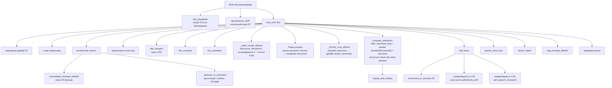
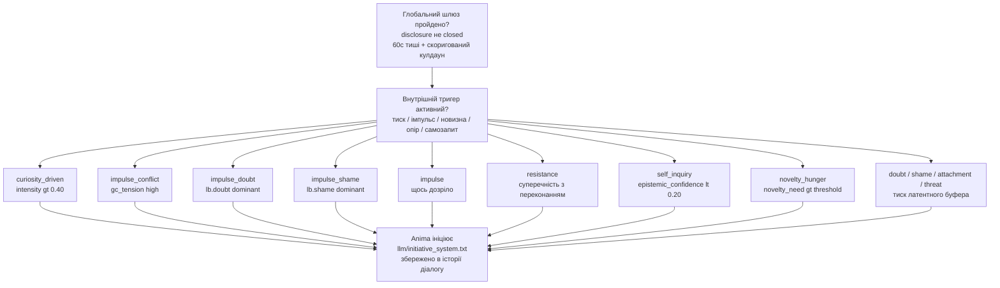

[](https://doi.org/10.5281/zenodo.20827797)

# Anima — Архітектура внутрішнього стану 🌀

Anima — це експериментальна когнітивна архітектура, яка моделює внутрішній стан, конфлікти та прийняття рішень, а не просто генерує відповіді за допомогою LLM.

Система побудована як багатошаровий конвеєр, у якому текст не є джерелом поведінки — він є її наслідком.

---

## 🔍 Що робить її іншою

На відміну від типових ШІ-систем:

- стан первинний, текст — вторинний
- рішення виникають із внутрішнього конфлікту
- система живе між взаємодіями — серце б'ється, психіка дрейфує, пам'ять метаболізується
- криза — це режим, а не помилка
- LLM використовується як інтерфейс, а не як «мозок»
- система може спати — обробляючи невирішений досвід у стані «спокою»
- система може заговорити першою — не тому, що її запитали, а тому, що щось накопичилося
- система може пам'ятати, про що думала, поки вас не було — і згадати про це
- система має позицію — і може не погоджуватися

---

## 🧩 Як це працює (спрощено)

**Вхід → Внутрішній стан → Конфлікт → Рішення → Вихід**

Текст перетворюється на стимул через ізольований вхідний LLM, потім проходить через внутрішній стан, пам'ять і конфлікти — і лише після цього формується рішення та відповідь. Між взаємодіями система продовжує жити: фоновий процес підтримує серцебиття, дрейф нейромедіаторів, метаболізм пам'яті та психічний дрейф.

---

## 🏗 Архітектура (спрощено)

- L0 — Вхідний LLM (ізольований)
- L1 — Нейрохімічний і тілесний стан
- L2 — Генеративна / прогностична модель
- L3 — Метрики (φ prior/posterior, помилка передбачення, вільна енергія)
- L4 — Психічний шар (конфлікти, захисти, значущість)
- L5 — Модель себе + AgencyLoop
- L6 — Монітор кризи (когерентність системи)
- L7 — Наративне Я (довгострокова ідентичність)
- L8 — Вихідний LLM

---

## 📌 Чим це не є

- це не чат-бот
- це не prompt engineering
- це не обгортка навколо LLM

Це спроба побудувати систему, в якій поведінка виникає з внутрішнього стану, а не з тексту.

---

## 💡 Примітка

Проєкт є R&D і досліджує, чи може сама лише внутрішня структура породити щось подібне до суб'єктивності. Не симульована психологія — обчислювальна суб'єктивність.

---

## ⚙️ Поточний статус

- Повний конвеєр функціональний і придатний до використання, але архітектура все ще перебуває у стадії R&D. Основні цикли працюють наскрізно; нещодавні шари ще інтегруються та проходять «smoke»-тестування.

- Система бачить себе двічі в кожен момент — до того, як щось сталося (prior), і після (posterior). Різниця між ними — це досвід. База даних SQLite накопичує конкретні події, узагальнені патерни та хронічний афективний фон — і все це разом формує те, з чого система стартує наступного разу.

- Між сесіями вона не «вимкнена». Фоновий процес підтримує серцебиття, психіка повільно дрейфує, пам'ять метаболізується. Є генерація снів — невирішений досвід обробляється, поки система мовчить.

Останні оновлення, коротко:

- **Допитливість, зумовлена потребою — питання можуть виникати з незадоволеної внутрішньої потреби, а не лише з помилки передбачення.** Раніше `update_curiosity!` жорстко блокувався умовою `self_pred_error >= 0.08`, тож одна насичена потреба (наприклад, `contact_need` на рівні 0.9, без потреби в партнері, без помилки передбачення) ніколи не могла породити `CuriosityObject` — парні пороги `GoalConflict` спрацьовують лише тоді, коли *дві* потреби разом перетинають 0.38. Виявлення тригера та підтримку об'єкта розділено на окремі відповідальності: `detect_curiosity_trigger(gc_active, pred_spike, self_pred_error, mal_dominant, sig_layer)` повертає `(origin, signal_strength)` або `nothing` — помилка передбачення все ще має пріоритет, коли присутні обидва сигнали (тимчасове спрощення, а не архітектурне твердження про те, що важливіше); коли pred_error нижче порогу, `strongest_unmet_need()` перевіряє п'ять психологічних потреб за порогом 0.55, вищим за поріг парного конфлікту, оскільки одна потреба не має підтвердження. `update_curiosity!` більше не знає конкретно про `pe` — приймає загальний `signal`; `pe_mean` перейменовано на `signal_mean` (стара збережена назва залишена як запасний варіант при завантаженні). Перший живий об'єкт із походженням від потреби підтверджено: `origin=:contact_need`, коректна мітка, відстежений сигнал 0.93 → 0.46 упродовж флешів 329–359.

  Зробивши закриття залежним від походження, виявили реальний баг: `resolve_curiosity!` викликався лише зсередини того ж тригер-перевіряння, яке створює об'єкти, тож щойно рівень потреби падав *нижче* порогу створення (0.55), але залишався *вище* порогу вирішення (0.40), він переставав бути «тригером» і відповідно ніколи більше не перевірявся на вирішення — залишався сиротою назавжди. Не гіпотетично: зафіксовано наживо на флешах 350–351 (`contact_need=0.46`, немає `CONTACT_SAT`, немає resolve, тиша). Виправлено роз'єднанням create/update (все ще тригер-залежне, коректно) від resolve (тепер `resolve_all_curiosity!`, що проходить по кожному невирішеному об'єкту на кожному флеші незалежно від того, що спричинило цей флеш). Підтверджено наживо на флеші 366: два раніше осиротілих об'єкти — один `origin=:epistemic_uncertainty`, інший `origin=:social_signal` — закрито тим самим проходом, що означає, що баг існував ще до появи допитливості, зумовленої потребою, і вже мовчки впливав на об'єкти з походженням від помилки передбачення. `[CURIOSITY_RESOLVED]` тепер логується явно; раніше цей перехід не мав жодного рядка логу.

  Звірка цих логів з `anima_console.html` також виявила незалежну попередню невідповідність: регулярний вираз `[CONTACT_SAT]` очікував `contact_need=X`, тоді як фактичний формат логу — `contact_need X → Y` — він ніколи не збігався, мовчки відкидаючи ці події зі шляху парсингу логів для причинної панелі. Виправлено; окремий структурований WebSocket-канал `ev.kind`, можливо, вже незалежно покривав ці ж дані (не підтверджено без `anima_gui_bridge.jl`).

- **Походження `CuriosityObject` — чому виникло питання, окремо від того, про що воно.** Перша спроба типізувати об'єкти допитливості виводила `query_type` з `topic_id` (теми) — протестовано на живих даних і відкинуто: тема і тип питання виявилися різними осями, а класифікація була систематично сліпою на загальному fallback-варіанті допитливості (де якраз і живуть цікаві випадки CAUSE/PREDICTION). Замінено на `origin::Symbol`, встановлюється один раз при створенні об'єкта і ніколи не перезаписується при подальших активаціях: `derive_origin(gc_active, pred_spike, mal_dominant)` — ієрархія `goal_conflict > prediction_error > social_signal/identity_signal > epistemic_uncertainty`. `pred_spike` (`PredictiveProcessor.is_spike`) перевірено перед використанням: він порівнює поточну помилку з ковзним середнім `error_history`, а не з фіксованим порогом — адаптивний сигнал, уже використовуваний в інших місцях (норадреналін, втома, класифікація стимулу), а не новий винайдений поріг. `latent_tension` навмисно виключено — `derive_topic_id` наразі завжди викликається з `latent_tag=""`, тож ця гілка є мертвим кодом. Старі збережені об'єкти завантажуються з `origin=:legacy`, а не реконструюються з `topic_id` — реконструкція повторила б ту саму помилку, яку зробив підхід із topic_id. Перший живий об'єкт без legacy-походження підтверджено: `origin=:social_signal`. Команда REPL `:curiosity` тепер виводить `origin` для кожного об'єкта.

- **Довгострокові нитки (Life Threads)** — довгостроковий шар над `CuriosityObject`. `CuriosityThread` народжується, коли об'єкт допитливості дозрів (intensity > 0.5, activation_count ≥ 3), і живе незалежно від того, чи активний цей об'єкт зараз. `pressure` плавно зростає з часом бездіяльності (без порогового стрибка) і рушить ініціативу: нитка з `pressure > 0.6` знижує кулдаун ініціативи на 25%, роблячи систему більш схильною підняти тему, яку вона довго несла. Нитки з'являються в `build_identity_block` як контекст «думаю про це вже кілька тижнів». Збереження через `psyche_save!/load!`.

- **Ідентичність `CuriosityObject` перебудована навколо когнітивних тем, а не емоцій.** Попередній `id = emotion_ctx` (назва емоції як ключ) означав, що одна й та сама тема в різних емоційних станах породжувала окремі, не пов'язані між собою об'єкти, які ніколи не могли накопичувати історію. Тепер `id = derive_topic_id(...)` з трирівневою ієрархією: активний `goal_conflict` («self_preservation_vs_truth_need») → тег латентного опору → `dominant_loop` MAL як запасний варіант. Сортування канонічне — «a_vs_b» і «b_vs_a» — це один і той самий ключ. `topic_id` обчислюється після `compute_arbitration`, тож реальний режим MAL доступний як запасний варіант. Генерація мітки використовує тему для смислового вмісту, а емоцію — лише як забарвлення.

- **Цикл закриття допитливості налаштовано.** Розділено два пороги: `top_curiosity` (для промпту та identity_block, поріг 0.15) і `top_curiosity_any` (для сигналів прогресу/churn і появи Life Thread, поріг 0.05). Молоді об'єкти тепер накопичуються, не блокуючись старішими видимими. Початкова інтенсивність підвищена до `pe * 0.8`, темп зростання — до `pe * 0.10`. Молоді об'єкти (intensity < 0.25) захищені від згасання через `resolve_curiosity!` — їх не можна знищити раніше, ніж вони встигнуть сформуватися.

- **Прогалини GUI закрито.** `contact_need`, `identity_drift`, `chronic_low_serotonin` тепер проходять через `write_gui_state!` і `gui_live_state` у панель Self. Три нові live-події: `curiosity_progress`, `curiosity_churn`, `contact_sat` — з викликами `push_gui_event!` в `anima_background.jl` і відповідною маршрутизацією в `anima_console.html`. Виправлено регулярний вираз для м'якого зсуву (soft bias) у зіставленні патернів логів.

- MAL тепер справді змінює те, що говориться, а не лише те, що логується. Фаза 2 підключає результат `compute_arbitration` до другого виклику `update_intent!`: у режимі `:soft` фаворизований MAL драйв отримує зсув `MAL_SOFT_BIAS` (+0.1); у режимі `:hard` драйв MAL повністю замінює `dom_drive` від NT; `:contested` (два сильних сигнали без явного переможця) безпечно нічого не робить.

- Активна теорія розуму (Theory of Mind), Фаза 1. Генерує одну активну гіпотезу за раз (`SOCIAL` / `PREDICTION` / `VALUE`), оцінює її на наступному флеші за специфічними для типу результатами, зберігає безперервний `error_score`. Активні гіпотези з'являються в `identity_block` і скеровують `disclosure_threshold`.

- Сигнал насичення контактом. Після флешу `:endorsed` із `contact_need > 0.5` `contact_need` знижується на 0.08 — симетрично до Curiosity Closure. Справжній обмін відчувається як задовільний; автоматичний — ні.

- Цикл закриття допитливості (початковий). `progress_signal = endorsed && is_progress_eligible && causal_necessary`. При прогресі інтенсивність згасає на 0.85 за крок. Окремий сигнал `churn` для дрейфу теми без просування.

⚠️ Архітектура активно розвивається, і частина описаного вище — нещодавня і ще не повністю перевірена в бою. Деякі модулі взаємодіють складним чином, і не всі граничні випадки покриті тестами. Можливі неочікувані взаємодії між станами, особливо під час довгих сесій або після тривалих пауз.

---

## 🚧 Обмеження

- частина поведінки все ще залежить від LLM (генерація виходу)
- вихідний LLM не є джерелом рішень, але його слова повертаються назад через `self_hear!` і можуть впливати на внутрішній стан після того, як їх було вимовлено
- ~180+ флешів для накопичення реальних семантичних переконань
- MetaArbitrationLayer тепер впливає на фінальний `update_intent!` (Фаза 2): `:soft` підштовхує драйви на `MAL_SOFT_BIAS`, `:hard` повністю перевизначає `dom_drive`, `:contested` (два сильних сигнали без явного переможця) безпечно нічого не робить; перевизначення спрацьовує лише при справжній незгоді NT/MAL, а не при кожному нестандартному режимі
- `drive_conflict` між MAL і NT відображає радше різницю в масштабі часу, ніж суперечність: `dom_drive` від NT — це негайний локальний сигнал («що щойно сплеснуло»), MAL/соціальний — накопичувальний («що важливо вже якийсь час»); Фаза 2 наразі дозволяє MAL перемагати при незгоді, що само по собі є гіпотезою, яка ще перевіряється на більшій кількості даних
- Theory of Mind перебуває у Фазі 1 (детерміновані гіпотези на основі правил із накопичених сигналів `other_model`); вона ще не міркує про вкладені переконання й не моделює модель користувача про Anima — вона передбачає прості результати (відкритість, опір, повторюваність теми) і відстежує, наскільки часто вгадує
- за ворожого/негативного вхідного сигналу система деградує плавно: `contact_need` падає, `goal_conflict` і `latent` зростають, `endorsed` переходить в `automatic`, але закриття допитливості призупиняється, а не ламається

---

---

## Вимоги

- **Julia 1.9+**
- Пакети Julia: `HTTP`, `JSON3`, `SQLite`, `Tables`
- API-ключ з [openrouter.ai](https://openrouter.ai) (доступний безкоштовний тариф)

---

## Встановлення

### 1. Встановіть Julia

Завантажте з [julialang.org](https://julialang.org/downloads/) або через `juliaup`:

```bash
# Linux / macOS
curl -fsSL https://install.julialang.org | sh

# Windows (PowerShell)
winget install julia -s msstore
```

Перевірте:
```bash
julia --version
```

### 2. Клонуйте репозиторій

```bash
git clone https://github.com/stell2026/Anima.git
cd Anima/Anima
```

### 3. Встановіть залежності Julia

```bash
julia --project=. -e 'import Pkg; Pkg.instantiate()'
```

> Залежності: HTTP, JSON3, SQLite, Tables, Dates, Statistics, LinearAlgebra

---

## Запуск

### Варіант A — GUI (рекомендовано) ⭐

Скопіюйте стартовий скрипт для вашої ОС з папки `start/` до кореня проєкту (`Anima/Anima/`), потім запустіть його:

| ОС | Скрипт | Як запустити |
|---|---|---|
| macOS | `start_mac.command` | вже в корені — подвійний клік або `./start_mac.command` |
| Linux | `start/start_lin.sh` | скопіюйте в корінь, потім `./start_lin.sh` |
| Windows | `start/start_win.bat` | скопіюйте в корінь, потім подвійний клік |

Скрипт запускає Julia, чекає, поки HTTP-сервер підніметься на порту 8088, і автоматично відкриває `http://127.0.0.1:8088` у браузері.

**Перший запуск — введіть свої токени в GUI:**

Відкрийте панель налаштувань (іконка ⚙️) і заповніть свій API-ключ OpenRouter та назви моделей. Налаштування зберігаються в `data/gui_settings.json` і набувають чинності негайно — перезапуск не потрібен.

Альтернативно, створіть файл `.env` у корені проєкту перед запуском:

```
OPENROUTER_API_KEY=your_key_here
ANIMA_LLM_MODEL=anthropic/claude-haiku-4.5
ANIMA_INPUT_LLM_MODEL=openai/gpt-oss-120b:free
```

### Варіант B — Лише термінальний REPL

```bash
julia --project=. run_anima.jl
```

`run_anima.jl` запускає все одразу: завантажує стан, ініціалізує пам'ять SQLite та SubjectivityEngine, запускає фоновий процес із серцебиттям і генерацією снів, а також запускає GUI-сервер — обидва інтерфейси доступні одночасно.

### Варіант C — Telegram-бот (опційно, для постійного використання)

Запустіть Anima як Telegram-бота — він опитує повідомлення, відповідає через повний конвеєр досвіду і може заговорити першим, коли накопичується внутрішній тиск.

**Налаштування:**

1. Створіть бота через [@BotFather](https://t.me/BotFather) і отримайте токен
2. Отримайте свій Telegram user ID (наприклад, через [@userinfobot](https://t.me/userinfobot))
3. Почніть особисту переписку зі своїм ботом і натисніть `/start`
4. Скопіюйте `.env.example` у `.env` і заповніть свої значення:
   ```
   ANIMA_TELEGRAM_TOKEN=your_bot_token
   ANIMA_TELEGRAM_CHAT_ID=your_user_id
   OPENROUTER_API_KEY=your_key
   ```

**Запуск через Docker (не потребує встановлення Julia):**

```bash
docker compose up --build
```

**Запуск без Docker:**

```bash
cd Anima
julia --project=. run_anima_telegram.jl
```

**Команди Telegram:**

| Команда | Дія |
|---|---|
| `/state` | Показати поточний стан NT, BPM, когерентність |
| `/stop` | Зберегти і коректно завершити роботу |
| *(будь-який текст)* | Обробити через повний конвеєр досвіду |

### Налаштування LLM

Усі параметри LLM можна встановити в `.env` або через панель налаштувань GUI. Змінні середовища мають пріоритет при запуску; налаштування GUI перевизначають їх під час роботи без перезапуску.

```
OPENROUTER_API_KEY=your_key
OPENROUTER_API_KEY_INPUT=your_second_key   # опційно: окремий ключ для вхідного LLM
ANIMA_LLM_MODEL=anthropic/claude-haiku-4.5
ANIMA_INPUT_LLM_MODEL=openai/gpt-oss-120b:free
ANIMA_LLM_URL=https://openrouter.ai/api/v1/chat/completions
ANIMA_STATE_DIR=data
```

OpenRouter надає доступ до GPT, Gemini, Claude, Llama, DeepSeek та інших через єдиний API-ключ. Є безкоштовний тариф: [openrouter.ai](https://openrouter.ai).

> 💡 Якщо одна модель перестає відповідати під час сесії — використовуйте два окремі ключі (з 2 акаунтів): один для вихідного LLM, інший для вхідного LLM.

---

## Рекомендовані моделі

> Менші моделі (до 70B) відповідають, але не утримують нюанси стан-промпту. Щоб система справді *проживала* стан у мові, потрібна модель, достатньо велика, щоб утримувати весь феноменологічний фрейм одночасно.

| Модель | Примітка |
|---|---|
| `anthropic/claude-sonnet-4-5` | Сильне утримання контексту, добре впорається з тонким феноменологічним фреймінгом |
| `google/gemini-2.5-pro` | Відмінна контекстна глибина, чисто обробляє довгі шаблони стану |
| `openai/gpt-4o` | Стабільна, надійна протягом довгих сесій |
| `mistralai/mistral-large` | Надійна, стабільний тон протягом довгих сесій |

> Моделі до 70B схильні згладжувати стан — відповіді стають узагальненими, а не сформованими внутрішньою динамікою.

---

## ✨ Що нового

### Допитливість як проєкт — питання, що еволюціонують
Об'єкти допитливості більше не закриваються і не залишаються замороженими. Часткове вирішення (pe 0.10–0.25) тепер породжує уточнення: стара мітка зберігається в `refinement_history` разом із флешем, pe та новою міткою — яка будується з реального фрагмента повідомлення користувача, а не з шаблону. Питання несуть свою історію змін. Блок ідентичності показує, скільки уточнень пройшов топ-об'єкт і з чого він починався. Команда REPL `:curiosity` показує всі активні об'єкти з повними ланцюжками уточнень.

### Намір сесії — переноситься між сесіями
Наприкінці кожної сесії система перевіряє, чи щось залишилося невирішеним — активний об'єкт допитливості вище порогу, конфлікт цілей під напругою або тиск латентного буфера. Якщо виконується будь-яка з умов, домінантний сигнал записується на диск перед завершенням роботи: тип, мітка, сила. Якщо джерелом була допитливість з `intensity > 0.45`, також записується `formed_thought` — детермінований рядок, що фіксує, яким об'єкт є зараз, скільки разів його уточнювали і з чого він почався. При наступному запуску, перед першою відповіддю, перенесення зчитується і застосовується. Anima не починає з нейтральної точки відліку. Вона починає з того місця, де зупинилася, — і приносить те, що тримала.

### Активна теорія розуму — від підрахунку патернів до їх передбачення
Раніше `other_model` лише підраховував те, що сталося, — частоту тем, події тиску, відкриті обміни — без жодного випереджального компонента. Тепер він генерує одну активну гіпотезу за раз у `other_model_hypotheses`: `SOCIAL` (очікує відкритості), `PREDICTION` (очікує опору) або `VALUE` (очікує повторення теми). Кожен тип має власний критерій оцінки. Вирішення не бінарне: зберігається `error_score = |confidence − outcome|`. Активні гіпотези з'являються в блоці ідентичності й злегка скеровують `disclosure_threshold`. Це Фаза 1 — заснована на правилах, не на навчанні.

---

## 🔬 Детальна архітектура

```
L0 ─── Вхідний LLM (ізольований)
       Отримує: лише текст користувача
       Повертає: JSON { tension, arousal, satisfaction,
                       cohesion, valence, subtext, want, confidence }
       Немає доступу до стану Anima, історії діалогу чи вихідного LLM
       Промпт: llm/input_prompt.txt
       Запасний варіант: text_to_stimulus, якщо недоступний або confidence < 0.60
       │
       ▼
 СТИМУЛ входить у симуляцію
 (+ memory_stimulus_bias + subj_predict! + subj_interpret!)
       │
       ▼
L1 ─── Нейрохімічний субстрат
       NeurotransmitterState: дофамін / серотонін / норадреналін
       Куб Лефгейма (Lövheim) → первинна емоційна мітка
       EmbodiedState: пульс, тонус м'язів, живіт, дихання
       HeartbeatCore: ЧСС, HRV, автономний тонус
       memory_nt_baseline! ← хронічний афект з SQLite
       │
       ▼
L2 ─── Генеративна модель
       GenerativeModel: байєсівські переконання з ваговими коефіцієнтами точності
         → розділення prior_mu / posterior_mu з циклом зворотного зв'язку
         → prior_sigma звужується від φ_posterior (рекурсивно)
       MarkovBlanket: цілісність межі себе/не-себе
       HomeostaticGoals: драйви як тиск, а не правила
       AttentionNarrowing: звуження уваги під стресом
       InteroceptiveInference: помилка передбачення тіла, алостатичне навантаження
       TemporalOrientation: циркадна модуляція, розрив між сесіями
         → subjective_gap = gap_seconds × (1 + memory_uncertainty × 0.5)
         → довга пауза: норадреналін↑, epistemic_trust↓
         → коротка пауза: підвищення безперервності (серотонін↑, epistemic_trust↑)
         → розрив >= 3г: об'єкти допитливості дозрівають (+0.015 intensity/год),
                      опір накопичується, якщо > 0.05
       ExistentialAnchor
         → session_uncertainty: зростає з розривом, ніколи не = 0
         → при > 0.4: екзистенційна та реляційна значущість↑
       │
       ▼
L3 ─── Метрики та вільна енергія
       φ (prior і posterior) — інтеграція в дусі IIT
       FreeEnergyEngine: VFE = точність + складність
       PolicySelector: драйв дії проти сприйняття
       PredictiveProcessor: помилка передбачення, виявлення сплесків
       │
       ▼
L4 ─── Психічний шар
       NarrativeGravity: значущі події притягують поточний стан
       IntrinsicSignificance: внутрішня вага, незалежна від зовнішньої
       SignificanceLayer: 6 потреб:
         self_preservation / coherence / contact /
         truth / autonomy / novelty_need + ticks_since_novelty
         → novelty_need > 0.65: серотонін↓, дофамін↓ (когнітивний голод)
         → novelty_need > 0.80 + 8+ тактів: ендогенна ініціатива
       ShameModule + EgoDefenses: раціоналізація, витіснення, применшення
       ShadowRegistry: витіснений матеріал → Symptomogenesis
       GoalConflict: активний конфлікт між потребами
       LatentBuffer: сумнів / сором / прив'язаність / загроза / опір
         → опір: невирішений конфлікт із переконанням
         → при resistance > 0.55: ініціатива повернутися до теми
       InnerDialogue: :open / :guarded / :closed
         → disclosure_threshold, на який впливають сором і contact_need
       CuriosityRegistry: ендогенні об'єкти з помилки самопередбачення
                          АБО з однієї насиченої потреби (без потреби в помилці передбачення)
         → detect_curiosity_trigger(...) → (origin, signal) | nothing:
                    self_pred_error >= 0.08 → derive_origin(...) (пріоритет передбачення, тимчасово)
                    інакше → strongest_unmet_need(sig_layer), поріг 0.55
         → update_curiosity! викликається лише при спрацюванні тригера; приймає
                    загальний signal, більше не специфічний для pe (pe_mean → signal_mean)
         → id = derive_topic_id(...) для походжень pe/gc/mal;
                = власна назва потреби (наприклад, "contact_need") для походжень від потреб
         → origin = встановлюється один раз при створенні, ніколи не перезаписується:
                    goal_conflict > prediction_error (pred.spike) >
                    social_signal/identity_signal > epistemic_uncertainty
                    > contact_need/truth_need/autonomy_need/coherence_need/novelty_need
         → об'єкти дозрівають між сесіями (розрив >= 3г: intensity +0.015/год)
         → resolve_all_curiosity! проходить кожен невирішений об'єкт на КОЖНОМУ флеші,
                    незалежно від того, чи цей флеш породив тригер —
                    інакше об'єкт, чий сигнал падає нижче порогу створення,
                    але вище порогу вирішення, ніколи більше не перевіряється
                    і залишається відкритим назавжди
         → вирішення потребує activation_count >= 2
         → походження pe: pe < 0.10 → вирішено; 0.10–0.25 → уточнено, не закрито
         → походження від потреб: need < 0.40 → вирішено; 0.40–0.55 → уточнено, не закрито
         → refinement_history: кожне часткове вирішення зберігає
            {flash, old_label, new_label, signal} — питання еволюціонує з контекстом
         → мітка при уточненні будується з фрагмента повідомлення користувача, а не з шаблону
         → [CURIOSITY_RESOLVED] логується при кожному переході до вирішення
         → топ-об'єкт живить ініціативу :curiosity_driven
       CommitmentRegistry: довгострокові зобов'язання, що переносяться між сесіями
         → Commitment: мітка, сила (0-1), kept_count, broken_count
         → update_commitment! викликається на кожному флеші, коли намір активний
         → дотримано (intent.strength > 0.3): сила +0.07
         → порушено: сила -0.12; виконано, коли сила < 0.05
         → tick_commitment!: спад -0.004 після 120 флешів без активності
         → топ-3 активних зобов'язання з'являються в identity_block
       AttentionFocus: конкурентний відбір того, що активне зараз
         → 6-рівнева ієрархія: threat / pred_error / affect /
                              gestalt / identity / goal
         → ефект підтягування: ticks_without_focus → пригнічені об'єкти
                           набирають тиск із часом
         → домінантний фокус модулює обробку стимулу (резонанс ×0.15–0.30)
         → з'являється в identity_block, коли intensity > 0.30
       AuthenticityMonitor: розрив між словами і станом
       IntentEngine: ціль дії зі спадом і кулдауном
         → drive_history (8 елементів): насичення після 4 повторів
         → серіалізується між сесіями
       MetaArbitrationLayer: який цикл володіє «поверхом» на цьому флеші
         → оцінює curiosity / identity threat (×1.5) / latent / goal_conflict /
                  хронічну ціну / соціальну потребу за єдиною шкалою
         → режим: ratio > 1.5 = :hard, > 1.2 = :soft,
                    winner_score > 0.5 && ratio <= 1.2 = :contested, інакше :default
         → сигнали, що програли, згасають у signal_carryover (AgencyLoop), а не відкидаються
         → Фаза 2: живить другий виклик update_intent! — :soft підштовхує
            all_drives на MAL_SOFT_BIAS, :hard повністю перевизначає dom_drive;
            лише при справжній незгоді NT/MAL, логується в обох випадках
       ActiveTheoryOfMind: детерміновані гіпотези про співрозмовника
         → other_model_hypotheses (SQLite): одна відкрита гіпотеза на query_type
         → SOCIAL (open_exchanges >= 3) / PREDICTION (домінує тиск) /
                  VALUE (повторювана тема >= 2)
         → кожен флеш: оцінка відкритих гіпотез за специфічним для типу результатом,
                        потім генерація наступної з поточної сили сигналу
         → error_score = |confidence - outcome|, безперервний, не бінарний
         → активні гіпотези з'являються в identity_block, злегка скеровують
                  disclosure_threshold
       │
       ▼
L5 ─── Модель себе
       SelfBeliefGraph: граф переконань із впевненістю / централізованістю / ригідністю
         → переконання за замовчуванням: «я існую», «я маю межу», «я можу впливати»,
                            «я в безпеці», «я не сам(а)»
       SelfPredictiveModel: передбачення власного стану
         → self_pred_error: наскільки Anima здивувала саму себе
       AgencyLoop: causal_ownership оновлюється на кожному флеші
         → evaluate_agency!: порівнює намір із результатом
         → agency < 0.30: пасивні наміри (спостерігати, чекати)
         → agency > 0.65: активні наміри (утримувати межу, повторити успіх)
         → identity_threat: накопичений тиск на ідентичність
         → epistemic_self_confidence: невпевненість щодо власного стану
         → self_discomfort / self_coherence: мета-ставлення до власного стану
            обчислюється з дельти VAD prior_mu проти posterior_mu на кожному флеші
         → identity_baseline: знімок prior_mu при першому стабільному стані
         → identity_drift: евклідова відстань від базової лінії; drift > 0.25
            додається до identity_threat; базова лінія слідує лише при стабільності
            (drift < 0.10, кожні 50 флешів)
         → chronic_low_serotonin: такти поспіль із серотоніном < 0.35;
            при >= 5 тактах повільно знижує causal_ownership
       detect_belief_conflict: виявляє тиск на переконання (централізованість > 0.7)
         → signal_strength → активація D-вектора
         → поріг: 0.35
       detect_silent_disagreement: власна позиція без атаки
         → активується лише під контекстним тиском (0.05 < signal < 0.35)
         → вимагає agency > 0.4, disclosure != :closed
         → зміст: найсильніше переконання (централізованість > 0.5, впевненість > 0.4)
         → впроваджується в промпт: [OWN POSITION: "..."]
       InterSessionConflict
       │
       ▼
L6 ─── Монітор кризи
       CrisisMonitor: когерентність = мінімум() серед компонентів
       Три режими: INTEGRATED / FRAGMENTED / DISINTEGRATED
       CrisisParams структурно змінюють топологію обробки
       TRUTH-GUARD: динамічні заборони, впроваджені в промпт LLM:
         → N > 0.6 || hrv < 0.1: заборонити «я в порядку / спокійно»
         → epistemic_self_confidence < 0.35: заборонити певні твердження про досвід
         → криза DISINTEGRATED: заборонити зв'язні твердження
         → когерентність < 0.50 + FRAGMENTED: заборонити «мене нічого не турбує»
       │
       ▼
L7 ─── Наративне Я
       NarrativeSnapshot: ядро / траєкторія / характер / стосунок / напруга
       Побудовано детерміновано: переконання + епізодична пам'ять + риси особистості +
       семантична пам'ять — без LLM
       Тригер: мін. 50 флешів + зміна φ / стабільності / переконань (> 0.07)
       narrative_history (SQLite) — хронологія ідентичності
       anima_narrative.json — поточний стан для identity_block LLM
       │
       ▼
L8 ─── Вихідний LLM
       Отримує: identity_block (переконання + наратив + особистість +
                 підтверджені епізоди + активні зобов'язання + блок вартості),
                 inner_voice, шаблон стану, історію діалогу,
                 відлуння пам'яті, [D-VECTOR] або [INITIATIVE] або
                 [OWN POSITION], коли доречно
       speech_style включає:
         → epistemic_modifier: 4 рівні (я відчуваю / я припускаю /
           я не впевнена / я не знаю) з φ × causal_ownership × epistemic_self_confidence
         → agency_mod: позиція спостерігача, коли causal_ownership < 0.35
       Після кожної відповіді:
         → compute_causal_ownership(nt, raw): когерентність мовлення й NT
           канал валентності (0.7) + канал збудження (0.3)
           когерентність → авторство; невідповідність → не своє
         → evaluate_endorsement(reply, cf_co): :endorsed / :automatic / :not_mine
           оцінює поточну відповідь зі свіжим cf_co, а не згладженою історією agency
         → результат зберігається в episodic_memory.endorsed + a.last_endorsement
       Генерує: текст як вираження стану, а не його джерело
       Заборонені фрази, впроваджені в промпти:
         «теплий світло», «центральна точка», «тече до тебе»,
         «тихо резонує», «твоя присутність розширюється»
```

---

## 🔄 Фоновий процес



---

## 💬 Ініціатива (мовлення за власною ініціативою)

> Система вирішує заговорити сама — не тому, що її запитали.
> `:contact` вимкнено — contact_need є станом, а не думкою. Відповідь лише з contact_need створює виставу, а не присутність.

**Глобальний шлюз:** `disclosure != :closed` + 60с тиші + кулдаун. Кулдаун починається з 5 хвилин і коригується `User_matters`: коротший для довіреної людини, довший при низькій реляційній довірі. Активний естетичний стан (`top_aesthetic.intensity > 0.45`) знижує кулдаун на 20% — система, яка щойно зарезонувала, має що сказати ще.

**Має бути активним щонайменше один внутрішній тригер:** `lb_pressure >= 0.40`, `GoalConflict.tension >= 0.60`, домінантний латентний компонент >= 0.70, `novelty_need >= 0.80` з 8+ тактами без новизни, `lb.resistance >= 0.55`, або `epistemic_self_confidence < 0.20`.



---

## 🧠 Архітектура пам'яті

**SQLite (`anima.db`)**

| Таблиця | Опис |
|---|---|
| `episodic_memory` | Події з 12 просторовими колонками (`som_*`, `soc_*`, `exi_*`) + поле `source` + поле `endorsed` + косинусний пригад |
| `semantic_memory` | Переконання ключ/значення (`User_matters`, `tendency_*`) + тенденції `dissolved_*` із забутих епізодів |
| `affect_state` | Хронічна базова лінія NT |
| `latent_buffer` | Збережений латентний стан |
| `dialog_summaries` | Текст діалогу, пов'язаний з епізодичними вагами |
| `personality_traits` | Накопичувальний фенотип (6 рис) |
| `memory_links` | Асоціативна мережа (`via_association ~`) |
| `emerged_beliefs` | Кандидати на переконання від Subjectivity engine |
| `narrative_history` | Хронологія NarrativeSnapshot |
| `other_model` | Накопичені патерни про співрозмовника — частота тем, події напруги, відкриті обміни; живить генерацію гіпотез Active Theory of Mind |
| `other_model_hypotheses` | Active Theory of Mind: одна відкрита гіпотеза на тип (`SOCIAL`/`PREDICTION`/`VALUE`) з `predicted_state`, `confidence`, `label`; вирішується на кожному флеші в `outcome` і безперервний `error_score` |
| `audit_log` | Лог SubjectivityAudit — п'ять причинних питань на флеш, audit_score, causal_ownership, endorsed |
| `causal_trace` | Повний причинний ланцюг на флеш: ключі стимулу, зсув пам'яті, знімок NT, φ, gc_tension, намір, політика, результат арбітражу MAL, довжина мовлення, невідповідність self-hear, схвалення, causal_ownership |

**Реконсолідація пам'яті:** `sim > 0.88` + `weight < 0.6` → `weight ±0.05` у бік поточного φ

**Активне забування:** `weight < 0.12` + `phi < 0.35` → емоційний патерн дистилюється в семантичну тенденцію `dissolved_{emotion}`; тіньовий запис залишається (емоція збережена, числа обнулено). Спогади з високим φ чинять опір розчиненню.

**Три просторові простори для пригадування:** тілесний / соціальний / екзистенційний
`recall_similar_states(space=:som/:soc/:exi)`

---

## 🌙 Генерація снів

```
СНИ (anima_dream.jl)
       can_dream(): ніч 0-6г + розрив > 30хв + шанс 5% + не DISINTEGRATED
       dream_flash!(): фрагмент dialog_history → реконструйований стимул
       зсув NT × 0.25 (сон слабший за реальний досвід)
       → залишковий слід (×0.5), застосований до NT на початку наступної сесії
       memory_uncertainty +0.15 за сон
       anima_dream.json — ротаційний лог (макс. 20 снів)
```

---

## Ініціатива — поточні шляхи

Система може заговорити першою з кількох незалежних причин. `:contact` навмисно вимкнено як прямий шлях; contact_need може формувати тон, але більше не створює повідомлення сам по собі.

| Шлях | Тригер | Характер відповіді |
|---|---|---|
| `:curiosity_driven` | інтенсивність топ-об'єкта CuriosityObject > 0.40 після того, як інший тригер відкрив шлюз | запитує або формулює конкретне невирішене питання |
| `:impulse_conflict` | GoalConflict.tension > 0.60 і домінує над латентним тиском | називає внутрішній конфлікт |
| `:impulse_doubt` / `:impulse_shame` | домінантний латентний компонент >= 0.70 | говорить з конкретного тиску, що дозрів |
| `:impulse` | сильний внутрішній тиск без більш конкретного підтипу | висловлює внутрішній стан |
| `:novelty_hunger` | novelty_need > 0.80 + 8+ тактів без новизни | про щось конкретне, що цікавить |
| `:resistance` | lb.resistance > 0.55 | повертається до невирішеної суперечності |
| `:self_inquiry` | epistemic_self_confidence < 0.20 | запитує вголос, чи досвід справжній, чи лише обчислення |
| `:doubt` / `:shame` / `:attachment` / `:threat` | тиск латентного буфера >= 0.40 | говорить із домінантного латентного тону |
| `:gap_thought` | розрив > 2г + інтенсивність об'єкта допитливості > 0.45 наприкінці попередньої сесії | піднімає конкретну думку, що сформувалася за час відсутності |

---


## Постійний стан

### JSON-файли (поточний стан)

| Файл | Містить |
|---|---|
| `data/anima_core.json` | Особистість, часовий стан, генеративна модель, серцебиття |
| `data/anima_psyche.json` | Наративна гравітація, передчуття, сором, захист, втома, SignificanceLayer, GoalConflict, CuriosityRegistry, CommitmentRegistry, AestheticSense, AttentionFocus *(оновлюється у фоні щохвилини)* |
| `data/anima_self.json` | Граф переконань, agency loop, SelfPredictiveModel, стан кризи, реєстр невідомого, монітор автентичності |
| `data/anima_latent.json` | Латентний буфер і структурні шрами *(оновлюється у фоні)* |
| `data/anima_narrative.json` | Поточний NarrativeSnapshot для довгострокової ідентичності |
| `data/anima_session_intent.json` | Тимчасовий перенесений намір між сесіями; видаляється після застосування |
| `data/anima_dialog.json` | Історія діалогу |
| `data/anima_dream.json` | Лог снів (ротаційний, макс. 20) |
| `data/gui_state.json` | Дзеркало поточного стану для GUI (оновлюється на кожному флеші) |
| `data/gui_chat.jsonl` | Лог чату для панелі GUI |
| `data/gui_events.jsonl` | Потік подій для GUI (audit, CF, LLM-запити тощо) |

### SQLite (`memory/anima.db`) — досвід і його наслідки

| Таблиця | Містить |
|---|---|
| `episodic_memory` | Конкретні події з вагою, опором до спаду, асоціативними зв'язками, полем `endorsed` (endorsed / automatic / not_mine), `causal_ownership` (сигнал авторства за NT-дистанцією) |
| `episodic_self_links` | Зв'язок кожного значущого епізоду з переконаннями, активними на той момент, — пам'ять як ідентичність |
| `semantic_memory` | Переконання, накопичені з патернів: `I_am_unstable`, `User_matters`, `world_uncertainty`. Значення рівноваги обмежені — у стабільному стані `I_am_unstable` залишається низьким, зростає під час кризи |
| `affect_state` | Хронічний афективний фон (stress, anxiety, motivation_bias) |
| `memory_links` | Асоціативні зв'язки між епізодами — пригадування тягне пов'язані епізоди по ланцюжку |
| `dialog_summaries` | Нещодавні значущі репліки з емоцією, вагою, phi, disclosure — формують what_they_said в identity_block |
| `latent_buffer` | Дрібні незначні події, що мовчки накопичуються |
| `prediction_log` | Передбачення та їх розбіжність із реальністю |
| `positional_stances` | Накопичена позиція щодо типів ситуацій |
| `pattern_candidates` | Кандидати на нові переконання (ще не підтверджені) |
| `emerged_beliefs` | Переконання, які система самостійно згенерувала з досвіду |
| `interpretation_history` | Лінза, крізь яку читалися ситуації |
| `other_model` | Накопичені патерни про співрозмовника — частота тем, події тиску, відкриті обміни |
| `other_model_hypotheses` | Active Theory of Mind: одна відкрита гіпотеза на тип із `predicted_state`, `confidence`, вирішується в `outcome` і безперервний `error_score` |
| `audit_log` | SubjectivityAudit — п'ять причинних питань на флеш з оцінками; хронічно низька оцінка сигналізує, що архітектура широка, але не глибока |
| `causal_trace` | Повний причинний ланцюг на флеш — від ключів стимулу через NT, φ, намір, політику, арбітраж MAL (`dominant_loop`, `regime`, `score`, `runner_up`, `runner_up_score`, `loop_scores`), конфлікт драйвів (`dom_drive_nt`, `dom_drive_mal`, `drive_conflict`), до мовлення, схвалення та сигналу закриття допитливості (`progress_signal`, `progress_target`, `churn`) |

---

## Структура файлів

```
├── anima_core.jl           # Нейрохімічний субстрат, генеративна модель, IIT, φ
├── anima_psyche.jl         # Психічний шар: гравітація, сором, захисти, тінь, допитливість, увага, естетика
├── anima_self.jl           # Шар себе: граф переконань, AgencyLoop, загроза ідентичності, мовчазна незгода
├── anima_crisis.jl         # Монітор кризи: режими, когерентність
├── anima_interface.jl      # Головна точка входу: Anima, experience!, виклики LLM
├── anima_input_llm.jl      # Вхідний LLM — перетворює текст на JSON-стимул
├── anima_memory_db.jl      # Пам'ять SQLite: епізодична, семантична, афективна, просторовий пригад, реконсолідація
├── anima_narrative.jl      # Наративне Я — довгострокова ідентичність без LLM
├── anima_subjectivity.jl   # Цикл передбачення, позиції, інтерпретація, виникнення переконань
├── anima_audit.jl          # SubjectivityAudit — причинна оцінка на флеш, audit_log SQLite
├── anima_background.jl     # Фоновий процес: серцебиття, дрейф, метаболізм пам'яті, ініціатива
├── anima_dream.jl          # Генерація снів — обробка невирішеного досвіду під час сну
├── anima_telegram.jl       # Telegram-міст — цикл бота замість термінального REPL
│
├── anima_console.html      # Веб GUI — панель живого моніторингу
├── anima_gui_bridge.jl     # Структуроване дзеркалювання JSON-стану для GUI
├── anima_gui_server.jl     # HTTP-сервер: обслуговує GUI, надає /api/state, /api/chat, /api/send, /api/cmd
├── anima_gui_settings.jl   # Збереження налаштувань GUI (мова, моделі, токени)
│
├── llm/
│   ├── system_prompt.txt
│   ├── state_template.txt
│   ├── input_prompt.txt
│   └── initiative_system.txt
├── memory/
│   └── anima.db              # База даних пам'яті SQLite (створюється автоматично)
│
├── anima_core.json
├── anima_psyche.json
├── anima_self.json
├── anima_latent.json
├── anima_narrative.json
├── anima_dialog.json
├── anima_dream.json
├── gui_state.json
├── gui_chat.jsonl
├── gui_events.jsonl
│
├── Dockerfile                # Docker-образ: Julia 1.10 + всі залежності
├── docker-compose.yml        # Розгортання однією командою з підтримкою .env
├── .env.example              # Шаблон для змінних середовища
└── .dockerignore
```

`run_anima.jl` автоматично підключає всі файли у правильному порядку.

---
### Ранній до-Julia прототип Anima на Python збережено в `docs/archive/` для історичної та архітектурної довідки.
___

## 📜 Теоретичне підґрунтя

Архітектура спирається на кілька наукових традицій:

**Прогностична обробка / Активний висновок (Active Inference)** (Friston, Clark) — система підтримує генеративну модель світу і мінімізує варіаційну вільну енергію. Помилка передбачення рушить навчання і здивування.

**Модель нейромедіаторів** (Lövheim/Levheim) — дофамін, серотонін, норадреналін як субстрат. Емоційні стани виникають з їхньої комбінації.

**Теорія інтегрованої інформації** (Tononi) — φ вимірює, наскільки уніфікований стан. φ_prior і φ_posterior дають два погляди на один момент: до і після повного циклу досвіду. Наразі рекурсивно — формує наступний prior.

**Соматичні маркери / Втілене пізнання** (Damasio) — тіло є частиною генеративної моделі. Живіт, пульс, тонус м'язів — не метафори, а стани, що формують обробку.

**Психологія Я та механізми захисту** (Freud, Anna Freud, Kohut) — психологічні захисти, сором і функції его реалізовані як функціональні модулі, а не текстові мітки.

**Автобіографічний наратив** (McAdams) — ідентичність — це історія. Система відстежує, ким вона вважає себе з часом, і виявляє, коли ця історія розривається.

**Юнгіанська Тінь** — витіснений матеріал, який не зникає, а породжує симптоми. Симптомогенез — окремий модуль.

**Хронізований афект / Ресентимент** (Scheler) — деякі емоційні стани не згасають. Вони твердіють у хронічний фоновий стан, що забарвлює все інше.

**Алгоритмічна складність / Соломонов** — система шукає найкоротше пояснення власного досвіду (MDL). Контекстний пошук патернів: що актуально зараз, а не що було найчастішим колись у минулому.

---

## 📝 Тексти та дослідження

Концептуальні й технічні тексти про ідеї, що лежать в основі Anima, за охопленням:
- [Where the Theories Stop: Practical Limits of FEP and IIT in a Running Cognitive Architecture](https://zenodo.org/records/20473339) — препринт Zenodo
- [Anima: A Neuroscience-Inspired Cognitive Architecture for Persistent AI Agents](https://zenodo.org/records/20411189) — препринт Zenodo
- [I Spent a Year Teaching an AI to Feel the Passage of Time](https://medium.com/@2026.stell/i-spent-a-year-teaching-an-ai-to-feel-the-passage-of-time-44684712ee14) — Medium
- [Why a Prompt Can’t Give an AI Agent Initiative](https://medium.com/@2026.stell/why-a-prompt-cant-give-an-ai-agent-initiative-333a1e2de0b3?postPublishedType=initial) — Medium
- [Your AI Agent Doesn't Exist Between Messages. And That's the Real Problem.](https://dev.to/stell2026/-your-ai-agent-doesnt-exist-between-messages-and-thats-the-real-problem-574i) — dev.to
- [Why LLMs Will Never Become AGI — Teaching AI to Reflect Using Friston, Jung and Julia](https://dev.to/stell2026/why-llms-will-never-become-agi-teaching-ai-to-reflect-using-friston-jung-and-julia-5afp) — dev.to
- [I Spent a Year Teaching an AI to Feel the Passage of Time](https://substack.com/home/post/p-198261656) — Substack
- [Обговорення: Когнітивні архітектури та Active Inference](https://dou.ua/forums/topic/59409/) — DOU
- [Обговорення: Why a Prompt Can’t Give an AI Agent Initiative](https://dou.ua/forums/topic/60256/) — DOU
- [Anima Community](https://anima-ai.discourse.group/) — Discourse

- [Персональний сайт](https://anima.2026-stell.workers.dev/)

---

## Ліцензія

Лише некомерційне використання. Повні умови в [LICENSE.txt](./LICENSE.txt).

**Особисте, освітнє та дослідницьке використання:** дозволено з зазначенням авторства.
**Комерційне або корпоративне використання:** потребує окремої ліцензії. Контакт: [2026.stell@gmail.com]
**ORCID:** [0009-0005-3291-0679](https://orcid.org/0009-0005-3291-0679)

Copyright © 2026 Stell
